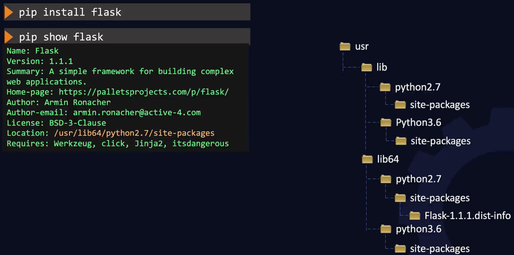

# Application Basics

## Java

Example installation - We wish to install the JDK onto app01 server under /opt:

```bash
ssh app01

sudo curl https://download.java.net/java/GA/jdk13.0.2/d4173c853231432d94f001e99d882ca7/8/GPL/openjdk-13.0.2_linux-x64_bin.tar.gz --output /opt/openjdk-13.0.2_linux-x64_bin.tar.gz

# To uncompress run
sudo tar -xf /opt/openjdk-13.0.2_linux-x64_bin.tar.gz -C /opt/

# To verify run the following on app01 and confirm correct version is installed:
/opt/jdk-13.0.2/bin/java -version

# We need to set java binary path in environment PATH variable to use java binaries. So that you can simply run java instead of the full path:
export PATH=$PATH:/opt/jdk-13.0.2/bin

java -version
```

## NodeJS

A server-side JavaScript environment.

Search for modules with:

```bash
npm search file
```

and install (locally for the current application) with:

```bash
npm install file
```

A module can be installed globally:

```bash
npm install file -g
```

In fact when you **require** a module in code (much like **import**) a search is first made locally then globally, and we can see where these search locations are:

```bash
devops-backwards at ☸️ docker-desktop
➜ node -e "console.log(module.paths)"
[ '/Users/davidainslie/workspace/backwards/devops-backwards/node_modules',
  '/Users/davidainslie/workspace/backwards/node_modules',
  '/Users/davidainslie/workspace/node_modules',
  '/Users/davidainslie/node_modules',
  '/Users/node_modules',
  '/node_modules' ]
```

There are **built-in** modules (on a Linux system, they can be found at **/usr/lib/node_modules/npm/node_modules**) and include:

- **fs** - handle filesystem
- **http** - host a HTTP server
- **os** - work with the operating system
- **events** - to handle events
- **tls** - implement TLS and SSL
- **url** - parse URL strings

And some examples of **external** modules (on Linux at **/usr/lib/node_modules**):

- **express** - fast unopinionated minimalist web framework
- **react** - create user interfaces
- **debug** - to debug applications
- **async** - work with asynchronous JS
- **lodash** - work with arrays, objects, strings etc.

## Python

```bash
➜ python

WARNING: Python 2.7 is not recommended.
This version is included in macOS for compatibility with legacy software.
Future versions of macOS will not include Python 2.7.
Instead, it is recommended that you transition to using 'python3' from within Terminal.

Python 2.7.16 (default, Apr 17 2020, 18:29:03)
[GCC 4.2.1 Compatible Apple LLVM 11.0.3 (clang-1103.0.29.20) (-macos10.15-objc- on darwin
Type "help", "copyright", "credits" or "license" for more information.
>>> quit
Use quit() or Ctrl-D (i.e. EOF) to exit
>>>
```

```bash
➜ python3
Python 3.8.3 (default, Jul  8 2020, 14:27:55)
[Clang 11.0.3 (clang-1103.0.32.62)] on darwin
Type "help", "copyright", "credits" or "license" for more information.
>>>
```

```bash
➜ python -V
Python 2.7.16

➜ python3 -V
Python 3.8.3
```

Python's package manager is **pip**:

```bash
➜ pip3 -V
pip 20.0.2 from /usr/local/lib/python3.8/site-packages/pip (python 3.8)
```

Example package installation:



The packages location of course depends on the OS and version:

```bash
➜ python -c "import sys; print(sys.path)"
['', '/Library/Python/2.7/site-packages/setuptools-1.4.2-py2.7.egg', '/Library/Python/2.7/site-packages/httpie-0.7.2-py2.7.egg', '/Library/Python/2.7/site-packages/Pygments-1.6-py2.7.egg', '/Library/Python/2.7/site-packages/requests-2.1.0-py2.7.egg', '/System/Library/Frameworks/Python.framework/Versions/2.7/lib/python27.zip', '/System/Library/Frameworks/Python.framework/Versions/2.7/lib/python2.7', '/System/Library/Frameworks/Python.framework/Versions/2.7/lib/python2.7/plat-darwin', '/System/Library/Frameworks/Python.framework/Versions/2.7/lib/python2.7/plat-mac', '/System/Library/Frameworks/Python.framework/Versions/2.7/lib/python2.7/plat-mac/lib-scriptpackages', '/System/Library/Frameworks/Python.framework/Versions/2.7/lib/python2.7/lib-tk', '/System/Library/Frameworks/Python.framework/Versions/2.7/lib/python2.7/lib-old', '/System/Library/Frameworks/Python.framework/Versions/2.7/lib/python2.7/lib-dynload', '/Library/Python/2.7/site-packages', '/System/Library/Frameworks/Python.framework/Versions/2.7/Extras/lib/python', '/System/Library/Frameworks/Python.framework/Versions/2.7/Extras/lib/python/PyObjC']
```

```bash
➜ python3 -c "import sys; print(sys.path)"
['', '/usr/local/Cellar/python@3.8/3.8.3_2/Frameworks/Python.framework/Versions/3.8/lib/python38.zip', '/usr/local/Cellar/python@3.8/3.8.3_2/Frameworks/Python.framework/Versions/3.8/lib/python3.8', '/usr/local/Cellar/python@3.8/3.8.3_2/Frameworks/Python.framework/Versions/3.8/lib/python3.8/lib-dynload', '/usr/local/lib/python3.8/site-packages', '/usr/local/Cellar/protobuf/3.12.3/libexec/lib/python3.8/site-packages']
```

When installing packages, instead of the above approach of  **pip install flask jinja2 markupsafe**, we refer to **requirements.txt** e.g. (noting that we can include versions):

```bash
➜ cat reequirements.txt
Flask
Jinja2==2.7.2
MarkupSafe
requests

➜ pip install -r requirements.txt
```

To upgrade:

```bash
➜ pip install flask --upgrade
```

And to uninstall:

```bash
➜ pip uninstall flask
```

