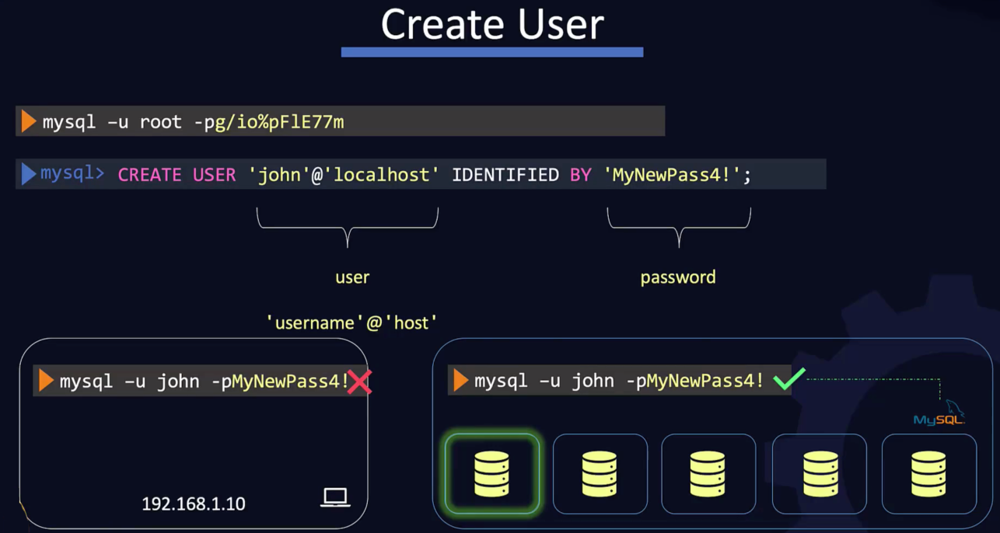

# Databases


```sql
select * from persons where age > 10
```

```json
db.persons.find({ age: { $gt: 10 } })
```

## MySql

Example installation on Linux:


---


If you missed the **temporary password** then:

```bash
sudo grep 'temporary password' /var/log/mysqld.log
2020-07-17T21:17:19.768885Z 1 [Note] A temporary password is generated for root@localhost: _<dwFunVV1ka
```


And then change the **root** password as shown in the following screenshot or:

```bash
mysql -u root -p
(enter password what you got from sudo grep 'temporary password' /var/log/mysqld.log command earlier)
```

and then:

```mysql
mysql> set password = password('P@ssw0rd123');

mysql> flush privileges;
```


---


---



---


To be able to access MySql from any box:

```bash
mysql> create user 'john'@'%' identified by 'MyNewPass4!';
```


## MongoDB


---


---


