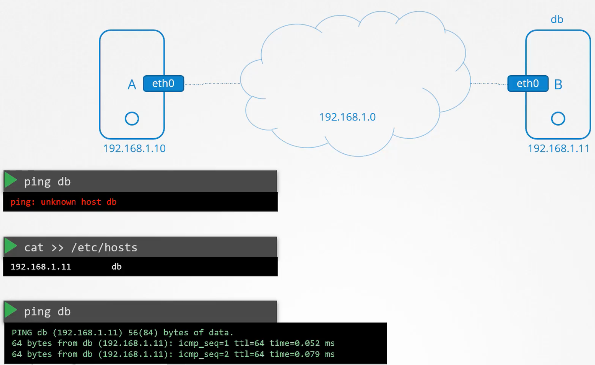
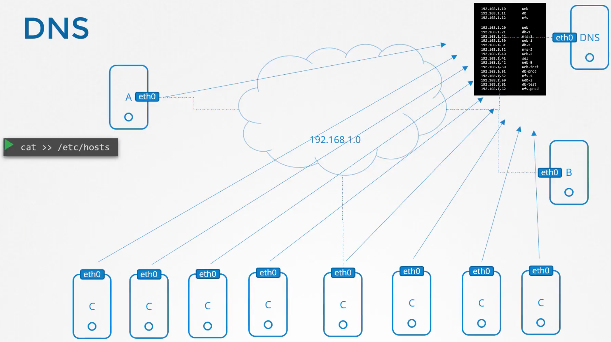
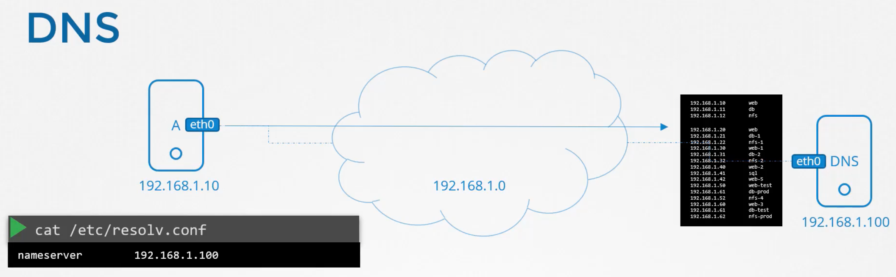
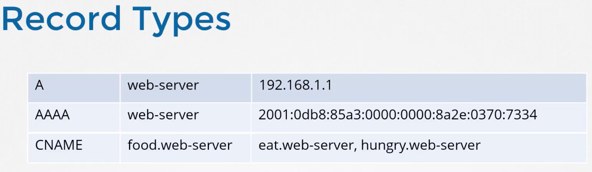

# DNS

The following is **Name Resolution** - which can be thought of as a (simpler) form of DNS:



But managing an ever growing list in the **/etc/hosts** file where the IPs can also change regularly is problematic.

So essentially we can imagine that this **/etc/hosts** file has been moved to a **DNS** server:



Now locally, instead of using **/etc/hosts** we use **/etc/resolv.conf** which configures **nameserver** (basically the DNS server we want to use) mapped to the **IP** of said nameserver:



We can still add host mappings to /etc/hosts. In fact, this file is always checked first, and if there is no mapping then the /etc/resolv.conf file is checked.

One general nameserver is at **8.8.8.8** so as well as your own DNS server, this one is often configured as well e.g.

```bash
cat >> /etc/resolv.conf

nameserver    192.168.1.100

nameserver    8.8.8.8
```

And then there are **domain names**:


And there are **record types**:



where the first is an example of mapping an IP to a name; and the last is mapping multiple names to one name.

Also, if for example your would like to resolve name **news** to **news.yahoo.com** automatically without hard coding its entry in **/etc/hosts** then:

```bash
cat >> /etc/resolv.conf

search yahoo.com
```

As well as **ping** there is **nslookup**, but note that nslookup doesn't first check /etc/hosts. And there is also **dig** for more details e.g.

```bash
➜ nslookup www.google.com
Server:		192.168.1.1
Address:	192.168.1.1#53

Non-authoritative answer:
Name:	www.google.com
Address: 172.217.169.68


➜ dig www.google.com

; <<>> DiG 9.10.6 <<>> www.google.com
;; global options: +cmd
;; Got answer:
;; ->>HEADER<<- opcode: QUERY, status: NOERROR, id: 20206
;; flags: qr rd ra ad; QUERY: 1, ANSWER: 1, AUTHORITY: 0, ADDITIONAL: 0

;; QUESTION SECTION:
;www.google.com.			IN	A

;; ANSWER SECTION:
www.google.com.		69	IN	A	172.217.169.68

;; Query time: 8 msec
;; SERVER: 192.168.1.1#53(192.168.1.1)
;; WHEN: Wed Jul 08 23:16:35 BST 2020
```

