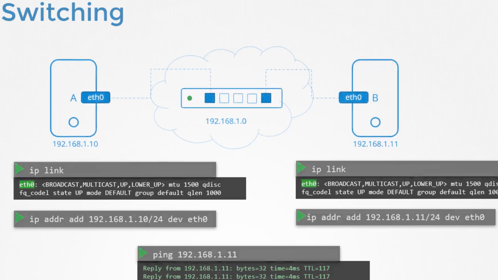
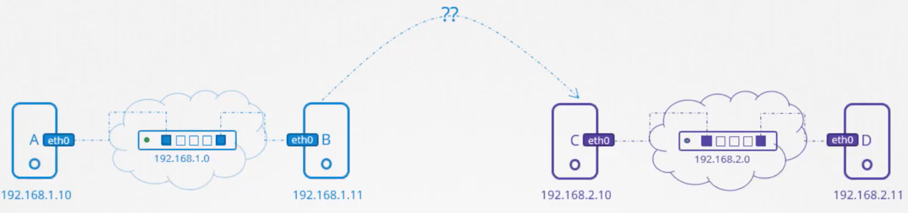
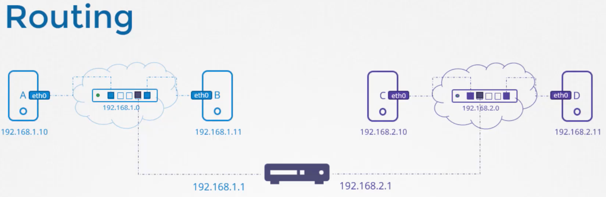
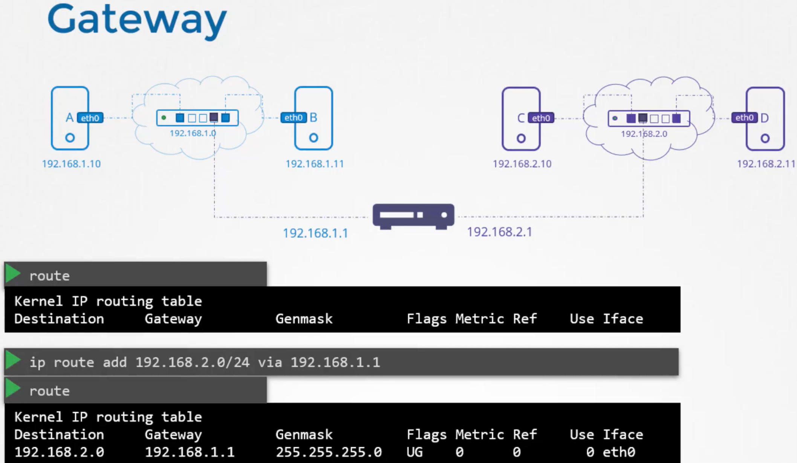
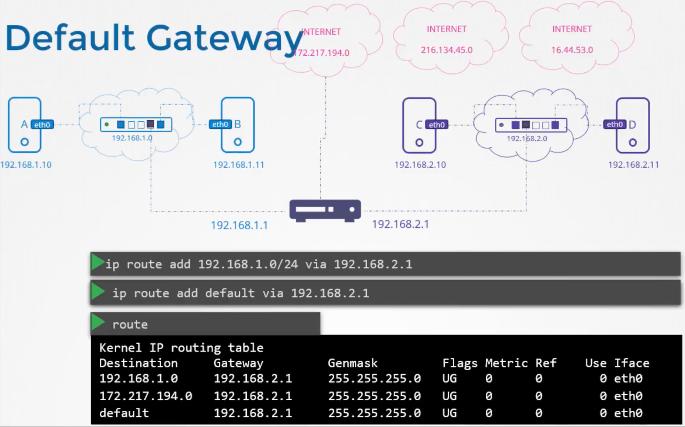
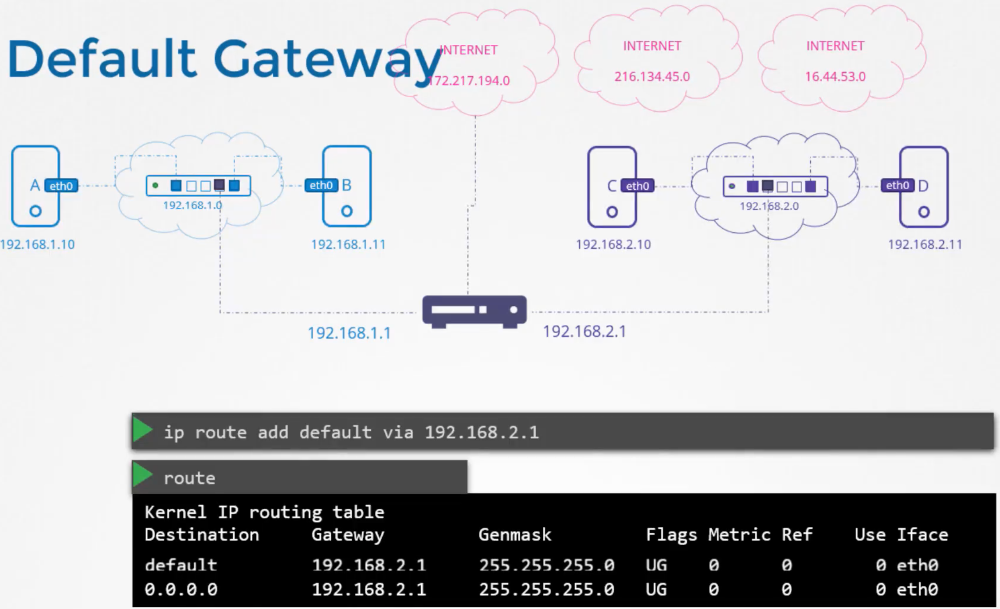

# Networking

---

---

A Gateway, much like a door, allows traffic to go from one network to another. Though without the necessary configuration, computer B still cannot reach computer C as shown with the **route** command:

---

Where **default** and **0.0.0.0** are equivalent, meaning any IP destination, and so:

