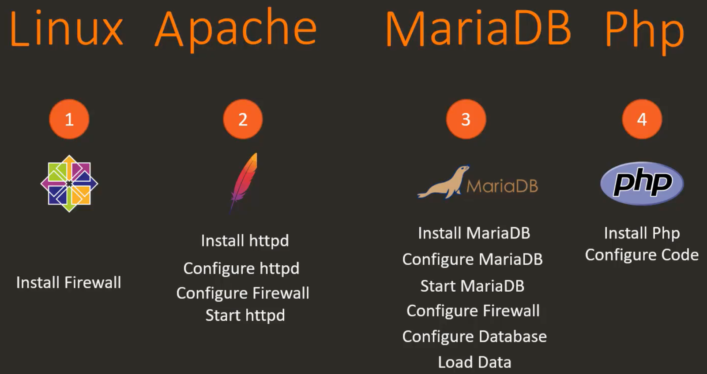
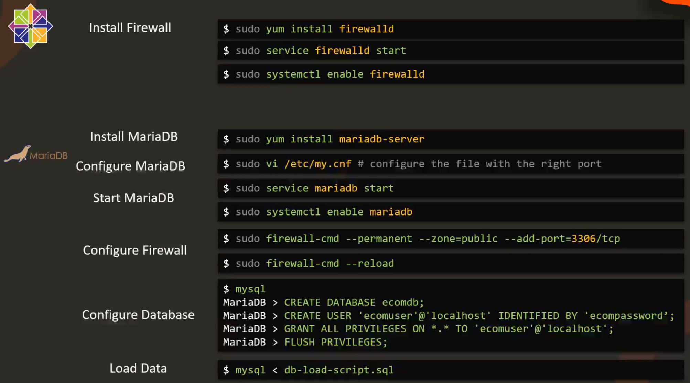
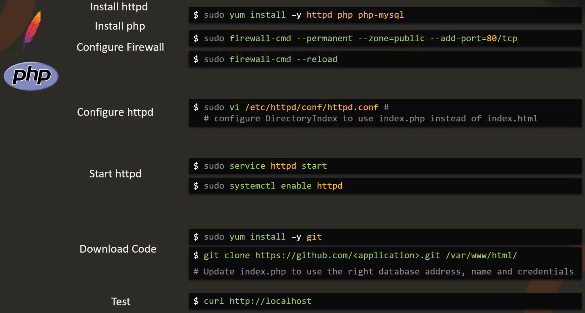
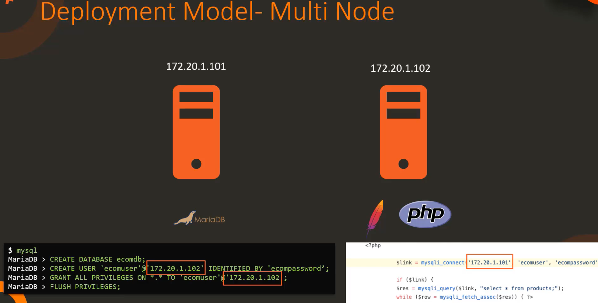

# Tier Applications

Goal:

We do the following:

---

And what if we wanted to distribute the above deployment i.e. not deploy everything onto the same box, but say, have the database on  one machine, and the rest on another? The PHP application would have to be configured to the correct IP of the database, and the database user added, would need the IP of the server that is accessing said database:

