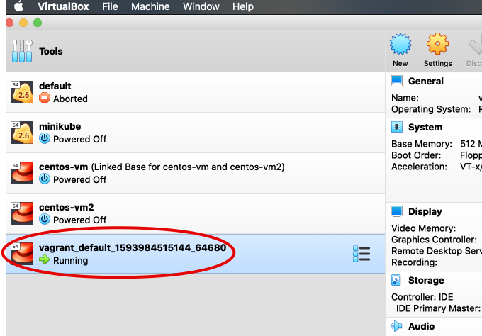

# Vagrant

When using VirtualBox (previously) we had to do the following:

- Download a required image such as Centos VDI
- Create VM
- Create networks
- Configure networks
- Configure port forwarding
- Boot up VM

That's a lot of effort.

**Vagrant** automates the above process to be as simple as command **vagrant up**.

```bash
brew cask install vagrant
brew cask install vagrant-manager
```

## Example

```bash
~/vagrant at ☸️ docker-desktop
➜ vagrant init centos/7
A `Vagrantfile` has been placed in this directory. You are now
ready to `vagrant up` your first virtual environment! Please read
the comments in the Vagrantfile as well as documentation on
`vagrantup.com` for more information on using Vagrant.
```

```bash
~/vagrant at ☸️ docker-desktop
➜ ls
Vagrantfile
```

```bash
~/vagrant at ☸️ docker-desktop
➜ cat Vagrantfile
# -*- mode: ruby -*-
# vi: set ft=ruby :

# All Vagrant configuration is done below. The "2" in Vagrant.configure
# configures the configuration version (we support older styles for
# backwards compatibility). Please don't change it unless you know what
# you're doing.
Vagrant.configure("2") do |config|
...
```

```bash
~/vagrant at ☸️ docker-desktop
➜ vagrant up
Bringing machine 'default' up with 'virtualbox' provider...
==> default: Importing base box 'centos/7'...
```

We can see the VM in VirtualBox:



```bash
~/vagrant at ☸️ docker-desktop
➜ vagrant ssh
[vagrant@10 ~]$
```

```bash
[vagrant@10 ~]$ cat /etc/*release*
CentOS Linux release 7.4.1708 (Core)
```

```bash
~/vagrant at ☸️ docker-desktop
➜ vagrant halt
==> default: Attempting graceful shutdown of VM...
```

