# Virtual VM

## VirtualBox

```bash
brew cask install virtualbox

brew cask install vagrant

brew cask install vagrant-manager
```

We need an OS image to be configured in VirtualBox - OS images can be found at [OS Boxes](www.osboxes.org):


---

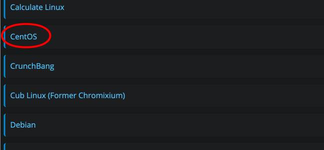

---

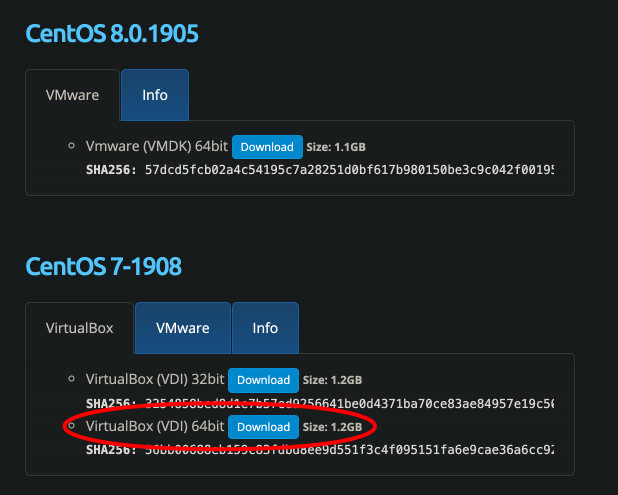

The **Info** tab provides the following:

**Username:** osboxes
**Password:** osboxes.org
**Root Account Password:** osboxes.org

Start VirtualBox and create a new VM:

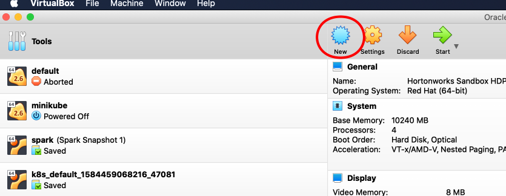

---

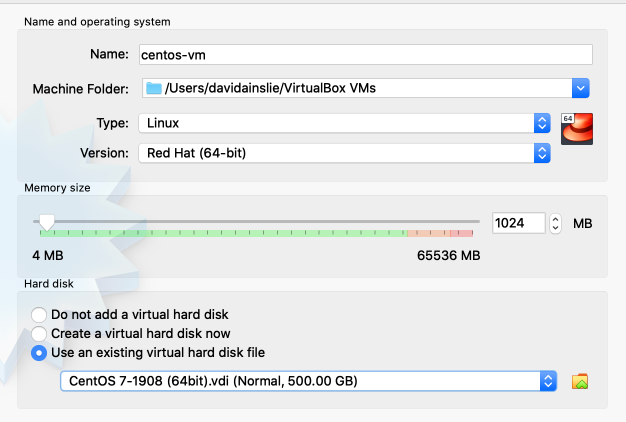

---

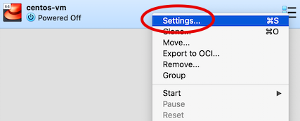

---

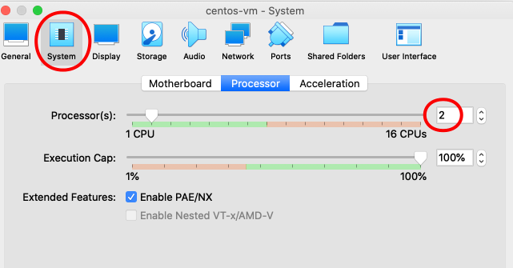

and start the new VM - Note: Once the VM is activated to get your mouse out (back into the host OS) hit the **command** key.

Now if we want to **ssh** from our **host** to the **VM / guest** we must make sure that ssh is running on the vm:

```bash
guest> service sshd status
```

and then we can ssh:

```bash
host> ssh 192.168.1.10 # Whatever the IP of the VM is.
```

But where did this IP come from?

```bash
guest> ip addr show
1: lo: <loopback>
   127.0.0.1/8
2: eth0: <broadcast>
   192.168.1.10/24
```

If **eth0** is not set (or shown) then configure e.g.

```bash
guest> ip addr add 192.168.1.10/24 dev eth0
```

And if **sshd** is not running then:

```bash
guest> service sshd start
```

Ok. So let's give the above a go (as usual on Mac).

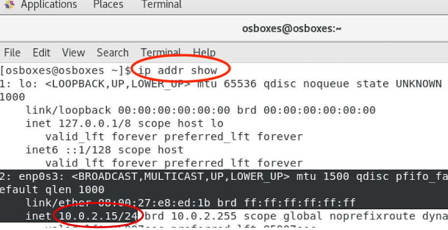

This is a private IP assigned by the **NAT**, the default, which can be seen from the VM's **Settings**:

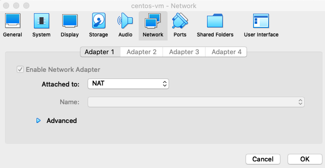

So this IP is actually not reachable from anywhere, not even by the **host** (there is an alternative to instead use a **briged adapter** instead of **NAT**).

Though the VM can still access other non NAT VMs such as external websites:

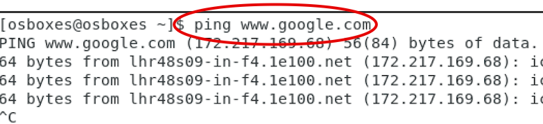

So how do we SSH onto this VM?

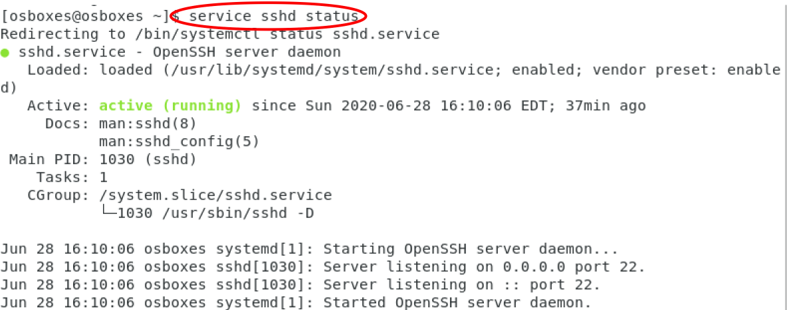

Let's set up **port forwarding** to resolve the conundrum above. Back to VM settings:

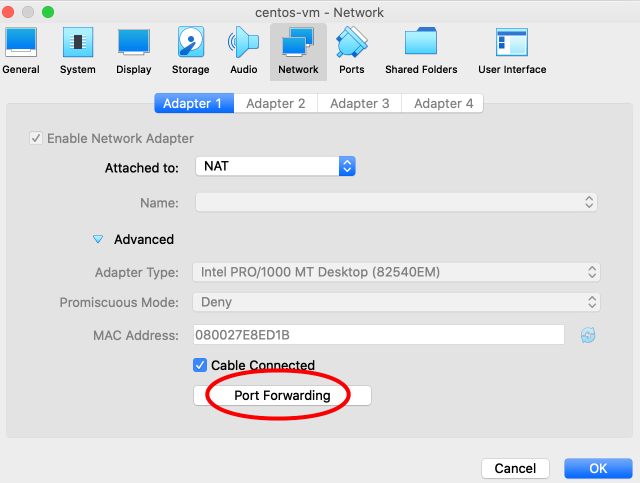

Now since our host already has ssh service running on port 22 we cannot forward that port, so we will choose 2222 to be forwarded to port 22 on the guest:

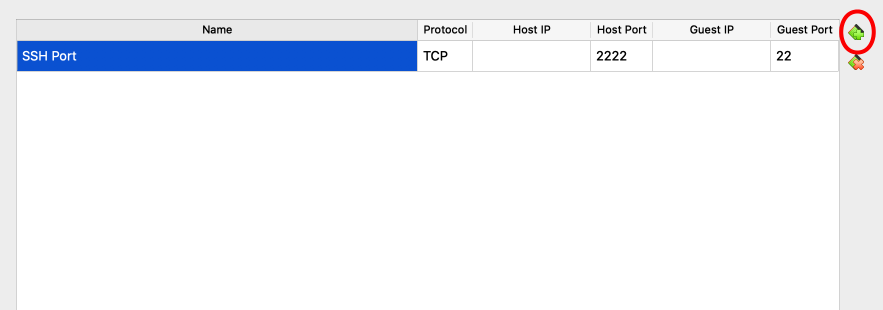

And we can SSH:

```bash
devops-backwards at ☸️ docker-desktop
➜ ssh root@127.0.0.1 -p 2222
The authenticity of host '[127.0.0.1]:2222 ([127.0.0.1]:2222)' can't be established.
ECDSA key fingerprint is SHA256:G3cC7AxGrKHjrjB1ZLCeSKMWh0qKb0jFOenWFFyYnrY.
Are you sure you want to continue connecting (yes/no/[fingerprint])? yes
Warning: Permanently added '[127.0.0.1]:2222' (ECDSA) to the list of known hosts.
root@127.0.0.1's password:
[root@osboxes ~]#
```

Sidebar - If SSH fails because of:

```bash
@@@@@@@@@@@@@@@@@@@@@@@@@@@@@@@@@@@@@@@@@@@@@@@@@@@@@@@@@@@
@    WARNING: REMOTE HOST IDENTIFICATION HAS CHANGED!     @
@@@@@@@@@@@@@@@@@@@@@@@@@@@@@@@@@@@@@@@@@@@@@@@@@@@@@@@@@@@
IT IS POSSIBLE THAT SOMEONE IS DOING SOMETHING NASTY!
...
```

you will have to remove **[127.0.0.1]:2222** from **known_hosts** e.g.

```bash
devops-backwards at ☸️ docker-desktop took 28s
➜ code ~/.ssh/known_hosts
```

(see [this link](https://www.thegeekdiary.com/how-to-fix-the-error-host-key-verification-failed/)).

After a successful SSH, let's perform a sanity check of the guest OS:

```bash
[root@osboxes ~]# cat /etc/*release*
CentOS Linux release 7.7.1908 (Core)
Derived from Red Hat Enterprise Linux 7.7 (Source)
NAME="CentOS Linux"
VERSION="7 (Core)"
ID="centos"
ID_LIKE="rhel fedora"
VERSION_ID="7"
PRETTY_NAME="CentOS Linux 7 (Core)"
ANSI_COLOR="0;31"
CPE_NAME="cpe:/o:centos:centos:7"
HOME_URL="https://www.centos.org/"
BUG_REPORT_URL="https://bugs.centos.org/"

CENTOS_MANTISBT_PROJECT="CentOS-7"
CENTOS_MANTISBT_PROJECT_VERSION="7"
REDHAT_SUPPORT_PRODUCT="centos"
REDHAT_SUPPORT_PRODUCT_VERSION="7"

CentOS Linux release 7.7.1908 (Core)
CentOS Linux release 7.7.1908 (Core)
cpe:/o:centos:centos:7
```

## Multiple VMs

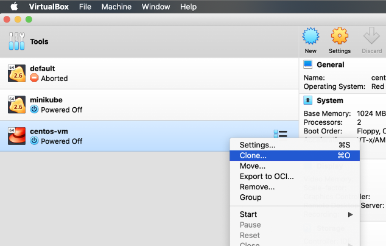

---

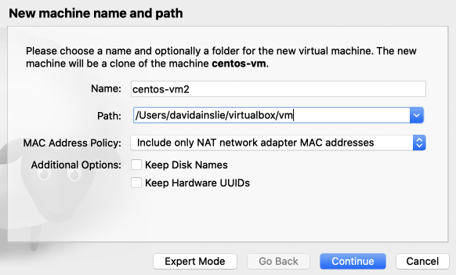

---

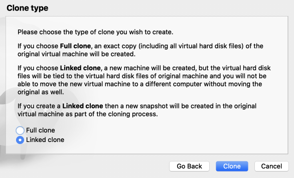

---

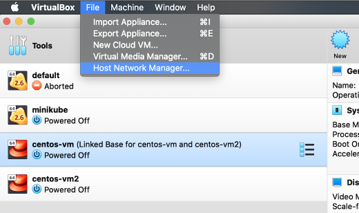

---

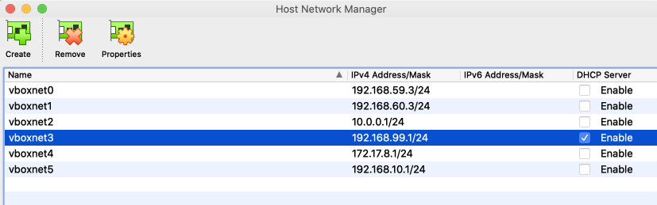

Do the following **Settings** for both VMs (or how every many you have):

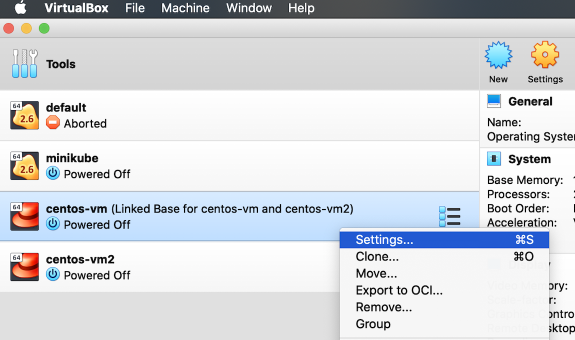

---

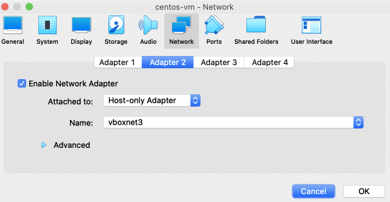

And boot both VMs:

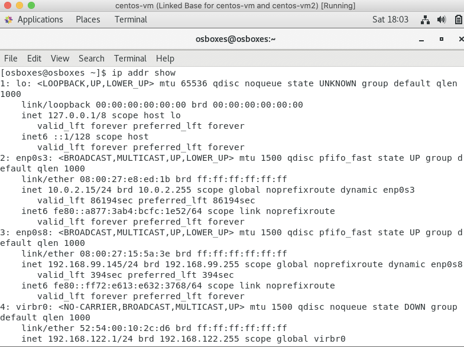

---

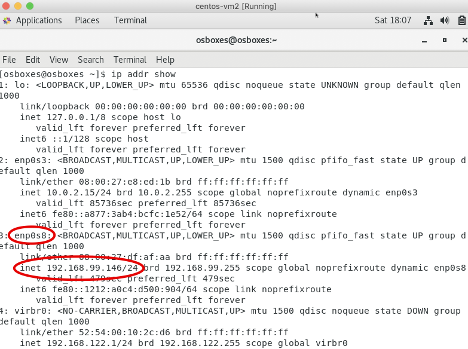

And our **host** is also part of the network:

```bash
devops-backwards at ☸️ docker-desktop
➜ ifconfig
...
vboxnet3: flags=8943<UP,BROADCAST,RUNNING,PROMISC,SIMPLEX,MULTICAST> mtu 1500
	ether 0a:00:27:00:00:03
	inet 192.168.99.1 netmask 0xffffff00 broadcast 192.168.99.255
```

We can now **ping** and **ssh** without **port forwarding**:

```bash
devops-backwards at ☸️ docker-desktop
➜ ping 192.168.99.146
PING 192.168.99.146 (192.168.99.146): 56 data bytes
64 bytes from 192.168.99.146: icmp_seq=0 ttl=64 time=0.331 ms
```

```bash
devops-backwards at ☸️ docker-desktop took 5s
➜ ssh root@192.168.99.146
The authenticity of host '192.168.99.146 (192.168.99.146)' can't be established.
ECDSA key fingerprint is SHA256:G3cC7AxGrKHjrjB1ZLCeSKMWh0qKb0jFOenWFFyYnrY.
Are you sure you want to continue connecting (yes/no/[fingerprint])? yes
Warning: Permanently added '192.168.99.146' (ECDSA) to the list of known hosts.
root@192.168.99.146's password:
Last login: Sun Jun 28 17:59:27 2020 from 10.0.2.2
[root@osboxes ~]#
```

