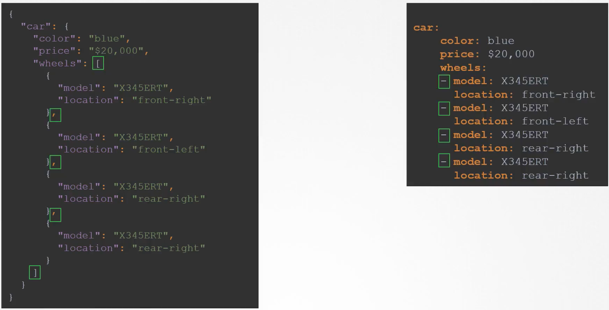
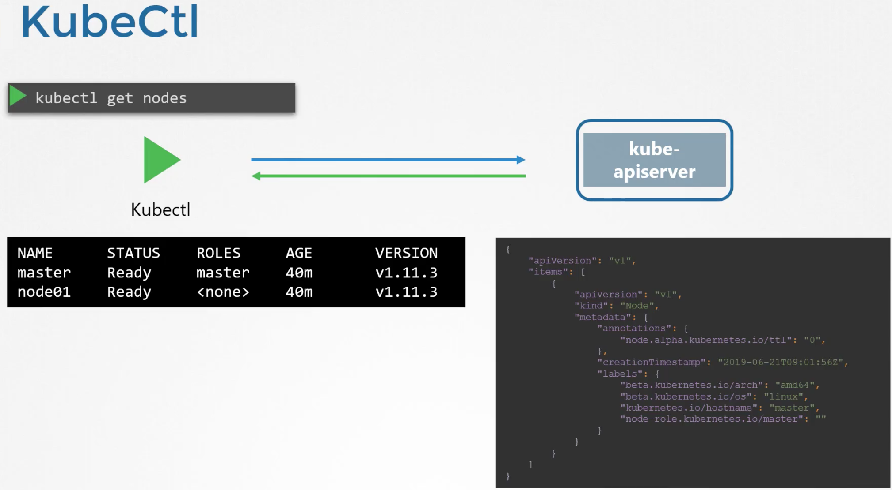

# YAML & JSON & JSON Path

YAML / JSON comparison:

## YAML

## JSON Path

JSON Path is also applicable to YAML, since YAML and JSON are orthogonal:

---

---

---

---

---

---

---

---

---

---

## Kubernetes

The result displayed on the left is essentially a summary. We could include the **-o wide** option for more details, but again, not everything is presented:

---

---

---

And we can combine queries with formatting:

But, we can still do better:

and in conjunction with kubectl:

Or instead of using the above **range** we can use **custom-columns**:

Finally, there is a **--sort-by** e.g.

