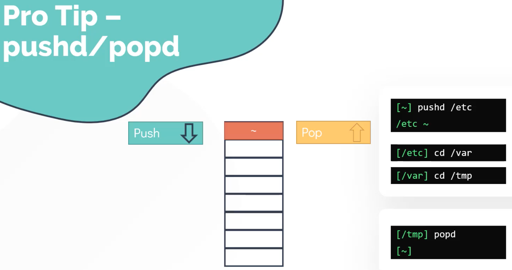
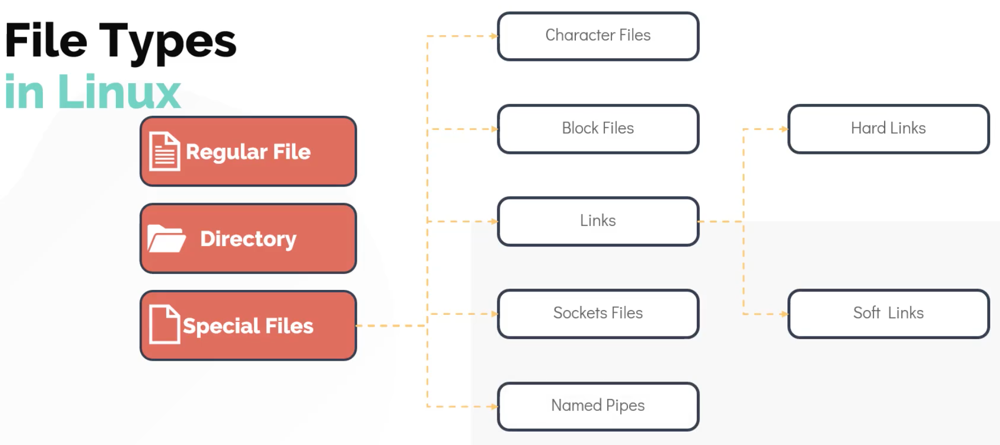

# Introduction

```bash
➜ echo $SHELL
/bin/zsh
```


Change the shell:

```bash
$ cat /etc/shells
# /etc/shells: valid login shells
/bin/sh
/bin/bash
/bin/rbash
/bin/dash
```

```bash
$ chsh
Password:
Changing the login shell for bob
Enter the new value, or press ENTER for the default
        Login Shell [/bin/bash]: /bin/sh
```

Now type in **su -** and your **userid** to relog in to verify that everything works correctly:

```bash
$ su - bob
Password:
$ echo $SHELL
/bin/sh
```

Then there's the **kernel**:

```bash
➜ uname
Darwin

➜ uname -r
19.6.0
```


---


---


---



---


There are also **pagers** such as **more** and **less** - note that **more** will load an entire file into memory, so not good for large files:


---


---


---


---



---


---


---


