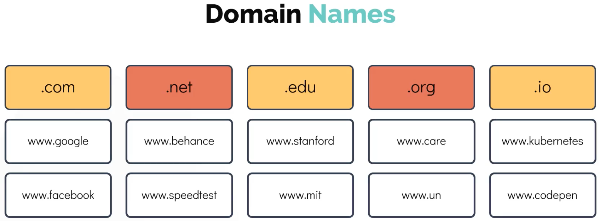
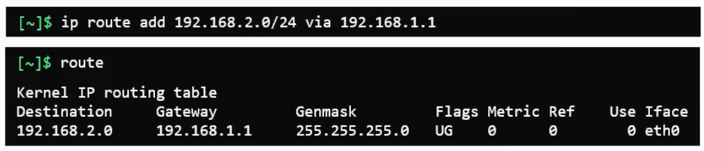
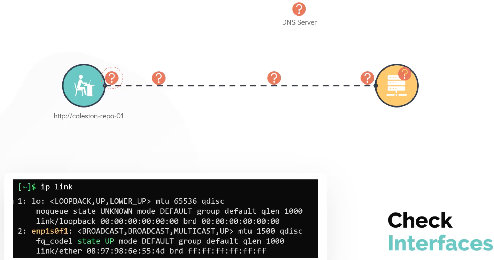

# Networking

## DNS

Two computers on the same network can access each other via their IPs, but initially not by some hostname representing an IP:


So update **/etc/hosts**:


The hostname on **A** is only relevant to **A** e.g. performing a **hostname** command on **B** would reveal a different hostname e.g.

```bash
[B]> hostname
host-2
```

We can even fool **A** into thinking that **B** is google e.g.


And it is the same for other commands which will also use the **/etc/hosts** file e.g.

```bash
[A]> ping db

[A]> ssh db

[A]> curl http://www.google.com
```

The above is known as **name resolution** and is fine for a limited number of computers on the same network (but won't scale):


The other (better) approach, is to move all these entries (from /etc/hosts) to one central server that we call the **DNS server**, pointing all hosts to the DNS server to resolve a hostname (to an IP):


So now we must configure each host to point to said DNS server, which is done in **/etc/resolv.conf**, but you can still use your **/etc/hosts** for specific name resolution such as some test server that only a few are using:


In fact name resolution is done by:

- first check **/etc/hosts** and if the name is not resolved then
- check **/etc/resolv.conf** which checks the host configuration on the **nameserver** i.e the **DNS server**

so you can have duplicate name entries where /etc/hosts takes precedence, where the order is defines in **/etc/nsswitch.conf**:

```bash
$ cat /etc/nsswitch.conf

hosts: files dns
```

There is also a public DNS server managed by Google e.g. facebook is not configured in our DNS server or local /etc/hosts so the public DNS server can also be used for name resolution:


But it would be better to even move that second (public) nameserver onto our network's DNS server once again avoiding configuring every computer on our network to include the public DNS server:


But how does this **www** and **.com** actually work?



---


Going through this hierarchy is via assinged DNS servers essentially at each level and once the IP is acquired your network's DNS server will probably cache it for a short period of time:


And your company's DNS server is probably set up the same way:


To be able to access say **web** which will now be configured according to the domain name hierarchy rules such as **web.mycompany.com** we need an extra entry in **/etc/resolv.conf** as **search** to append **mycompany.com** to **web** meaning we can resolve both **web** and **web.mycompany.com**:


Finally, there are also **record types** for mapping:


## Switching and Routing


---


At this point, B in one network still cannot reach C on another network even with a router in place:


By configuring the **gateway** routing will then work:



And for these networks to access the internet, the easiest way is to add a **default** gateway which is also **0.0.0.0**:


## Example

We have an apache which should be accessible on **devapp01-web** running on port 80 and should be accessible from Bob's laptop.

Let's test the connection:

```bash
bob@caleston-lp10:~$ telnet devapp01-web 80
Trying 172.16.238.10...
telnet: Unable to connect to remote host: No route to host
```

```bash
bob@caleston-lp10:~$ ping devapp01-web
PING devapp01-web (172.16.238.10): 56 data bytes
92 bytes from caleston-lp10 (172.16.238.187): Destination Host Unreachable
```

The web server has two interfaces. Try the second **devapp01**:

```bash
bob@caleston-lp10:~$ ping devapp01
PING devapp01 (172.16.239.10): 56 data bytes
64 bytes from 172.16.239.10: icmp_seq=0 ttl=64 time=0.119 ms
```

Troubleshoot the issue by SSH onto the webserver:

```bash
bob@caleston-lp10:~$ ssh devapp01
Warning: Permanently added the ECDSA host key for IP address '172.16.239.10' to the list of known hosts.
bob@devapp01's password:
bob@devapp01:~$
```

Inspect the interface eth0 on `devapp01`, is it UP? Check the **state** of the interface **eth0**

```bash
bob@devapp01:~$ ip link
1: lo: <LOOPBACK,UP,LOWER_UP> mtu 65536 qdisc noqueue state UNKNOWN mode DEFAULT group default qlen 1000
    link/loopback 00:00:00:00:00:00 brd 00:00:00:00:00:00
8: eth0@if9: <BROADCAST,MULTICAST> mtu 1500 qdisc noqueue state DOWN mode DEFAULT group default
    link/ether 02:42:ac:10:ee:0a brd ff:ff:ff:ff:ff:ff link-netnsid 0
14: eth1@if15: <BROADCAST,MULTICAST,UP,LOWER_UP> mtu 1500 qdisc noqueue state UP mode DEFAULT group default
    link/ether 02:42:ac:10:ef:0a brd ff:ff:ff:ff:ff:ff link-netnsid 0
```

It's DOWN. Bring it up:

```bash
bob@devapp01:~$ sudo ip link set dev eth0 up
```

And let's add the missing **default route**:

```bash
bob@devapp01:~$ sudo ip r add default via 172.16.238.1
```

## Troubleshooting

Why can't we connect?


Is your host primary interface up?



Next check DNS resolution:


Now check connectivity:


There is an issue. Check the route:


We'll have to troubleshoot from the other end as there lies the issue.

Is the http process running on port 80 on the server?


Ok, so the webserver is up and running.

Let's check the interfaces on the server:


Issue resolved.