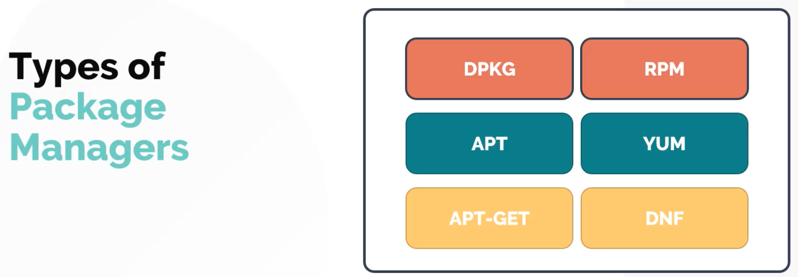
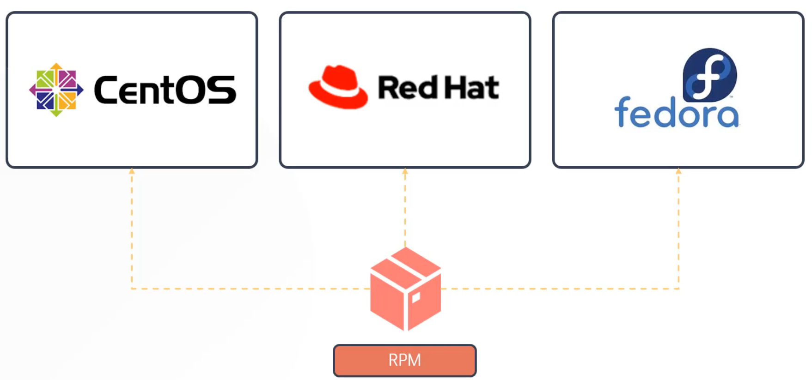
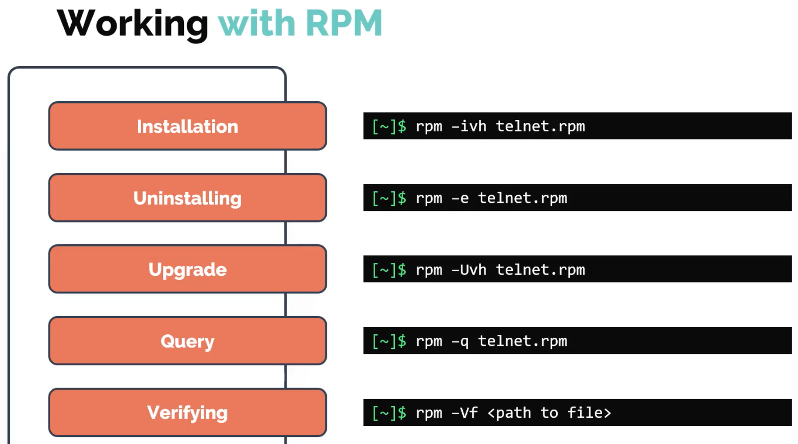
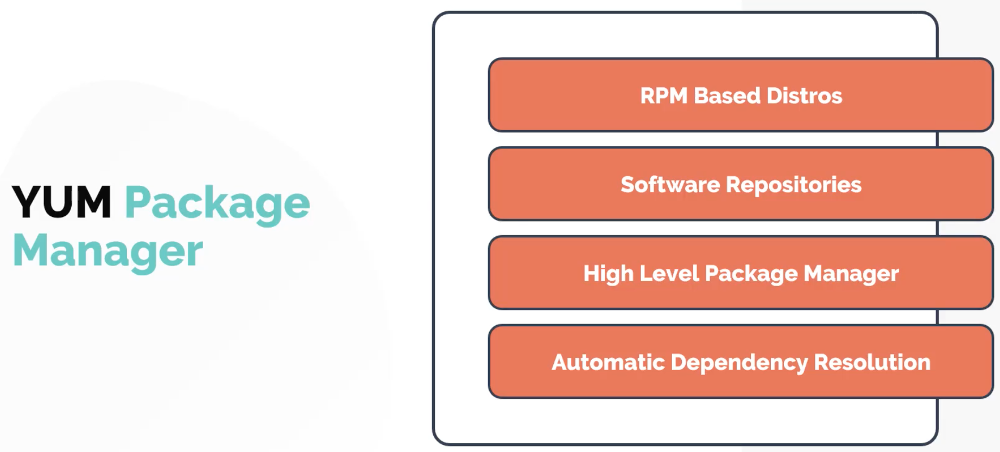
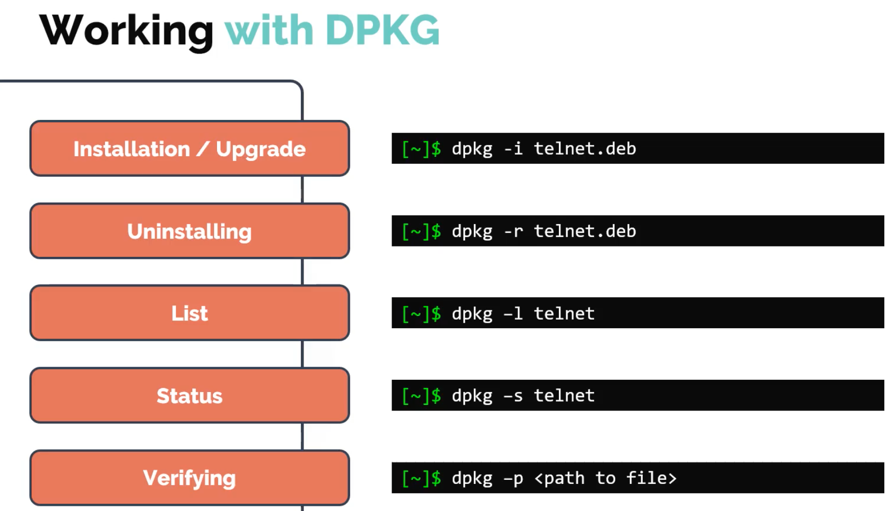
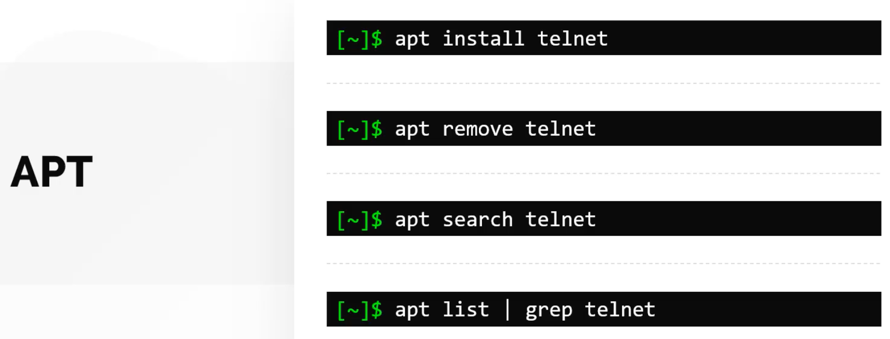

# Package Managers



## RPM and YUM



---



**Note** that **RPM** does not resolve **dependencies** and so you would normally use something at a higher level that does such as **YUM**:



```bash
yum install firefox -y

yum repolist

yum provides tcpdump
```

## DPKG and APT



Similar to RPM, **DPKG** does not resolve dependencies. Use **APT / APT-GET** which is the Debian equivalent to YUM.


---



