# Security and File Permissions

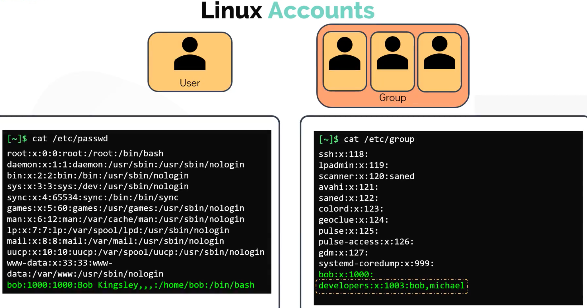

---

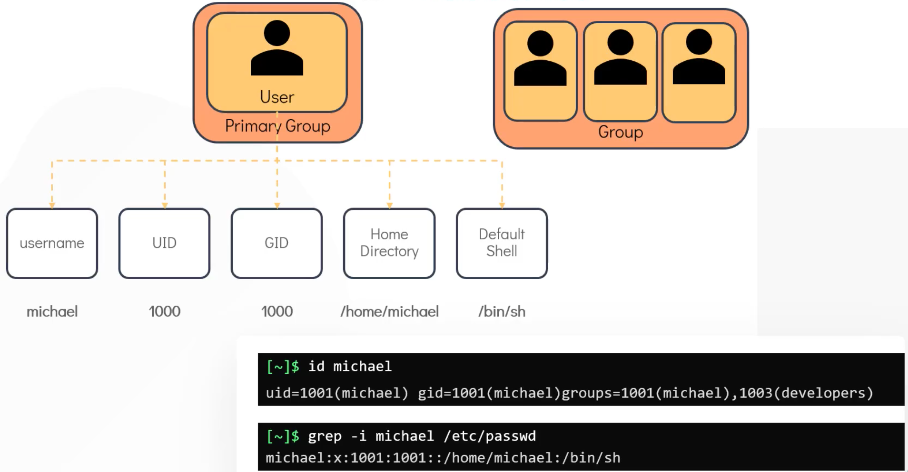

---

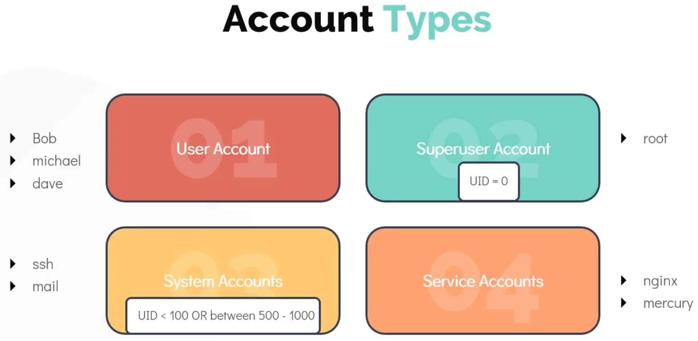

---

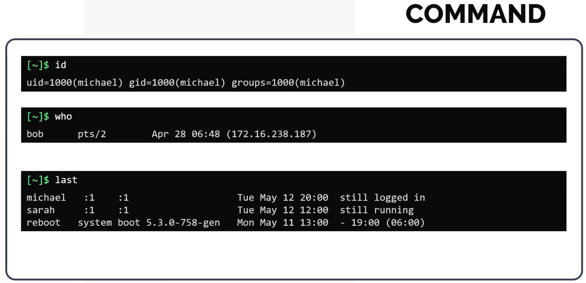

When "switching users", temporarily getting **root** permissions is more convenient because **su** requires the password of the user you are switching over to:

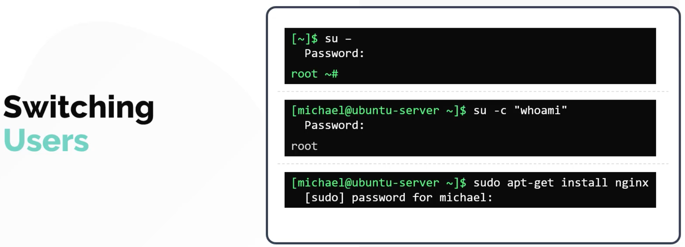

---

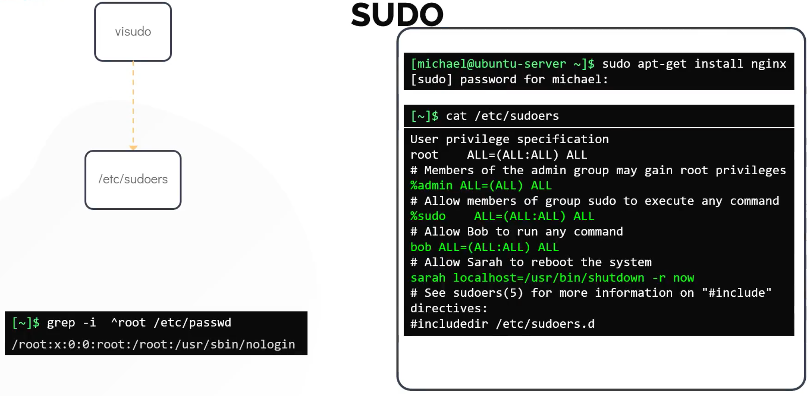

---

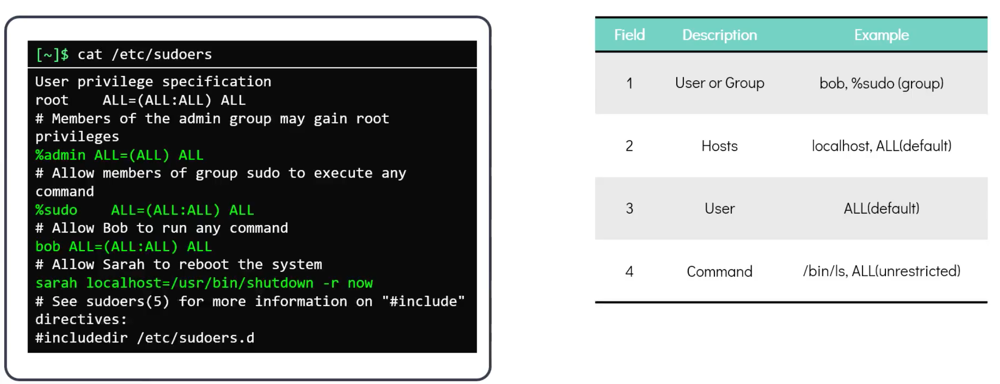

---

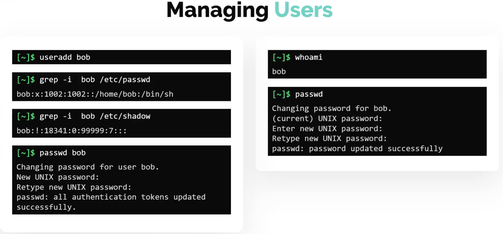

---

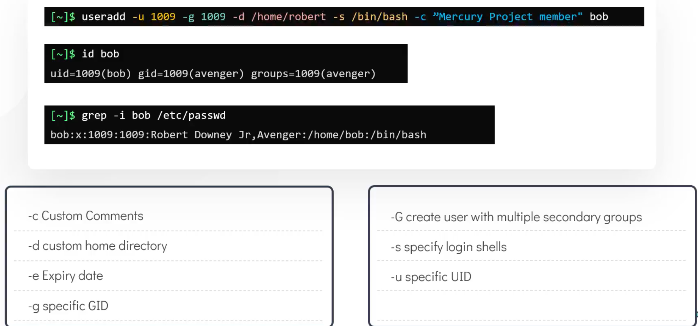

---

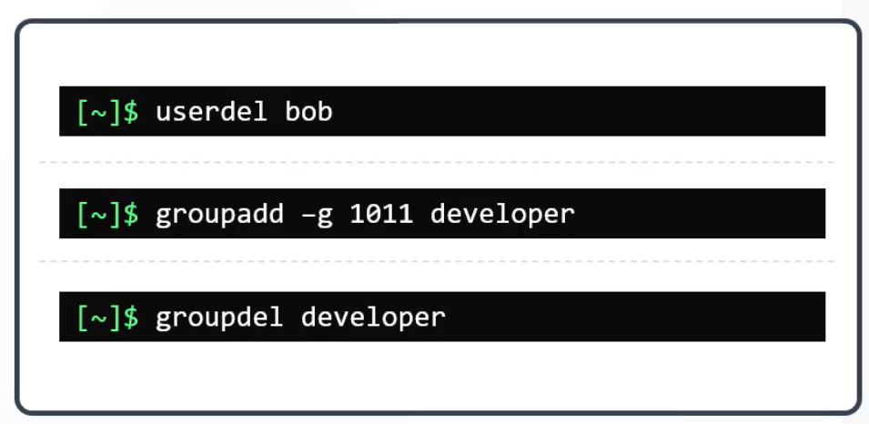

---

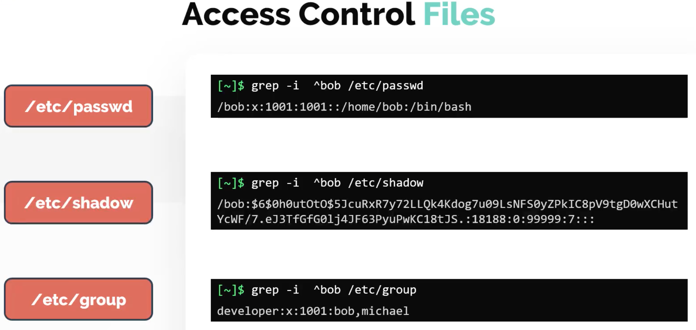

---

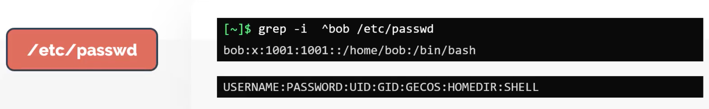

---

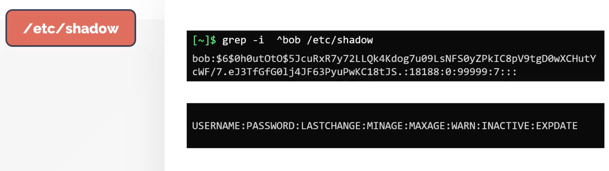

---

---

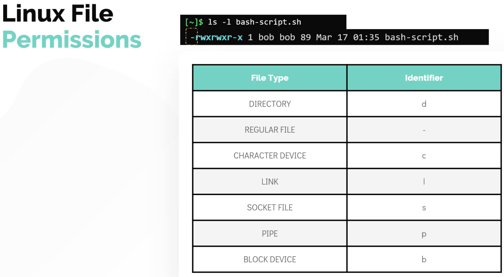

---

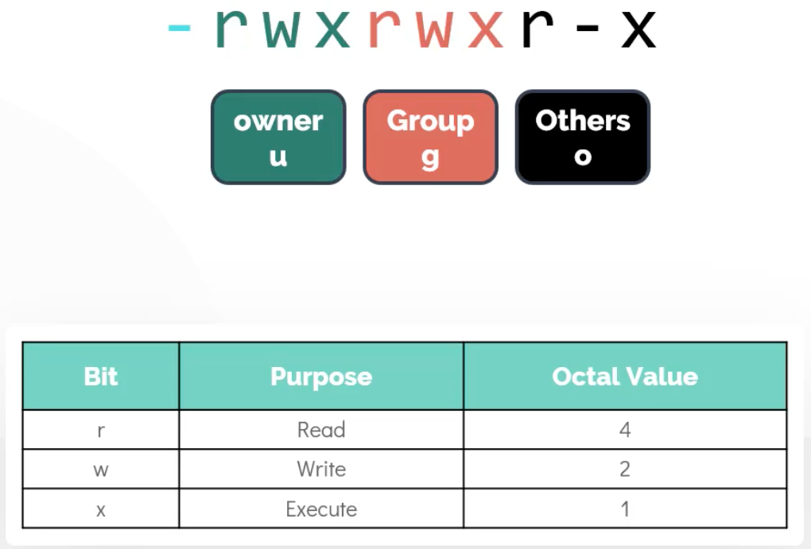

---

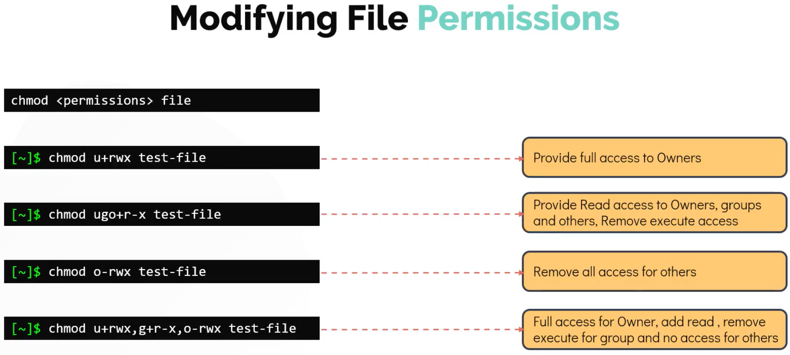

---

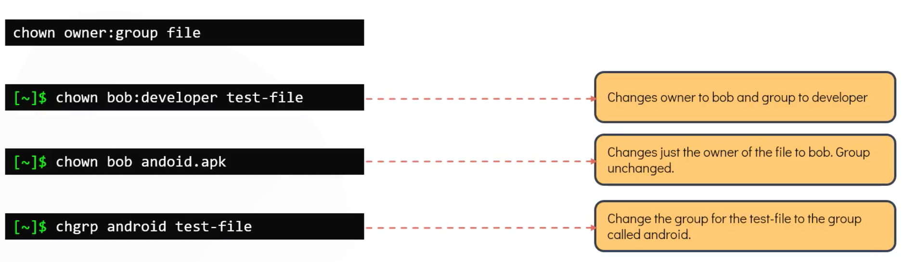

## 

