# Shell

## File size

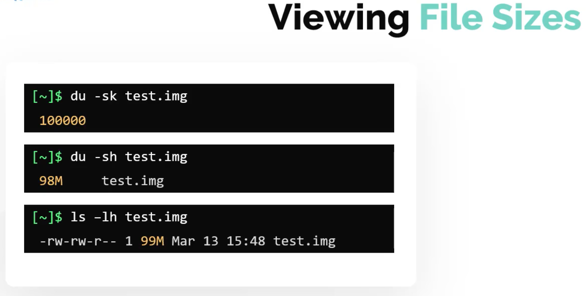

---

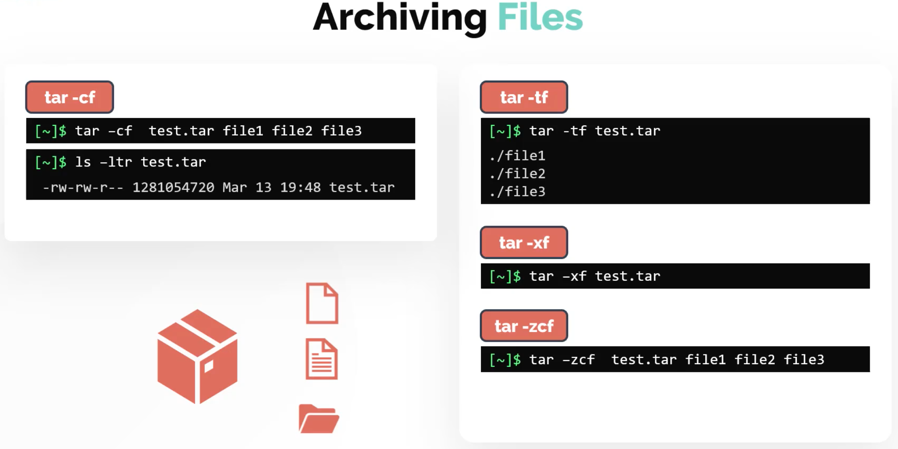

## Compressing

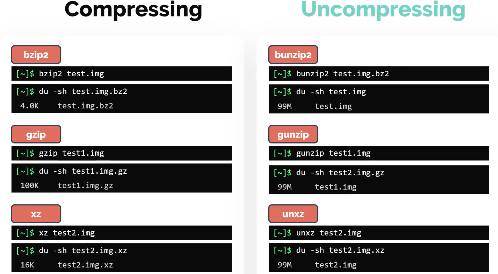

It is possible to view a file without first uncompressing e.g.

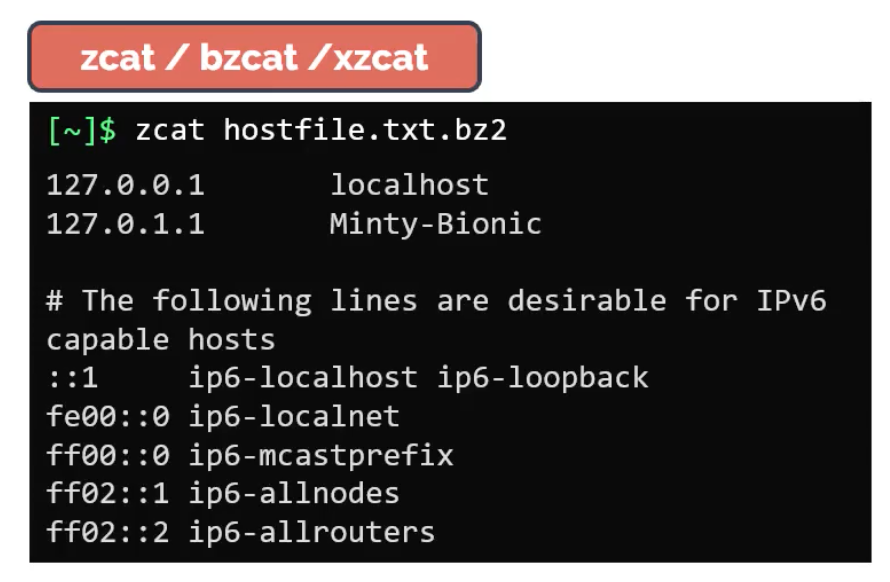

## Searching

**Locate** is simple to use but relies on an up to date **DB** so you may want to run **updatedb** before using **locate**.

Better yet, use **find by name**:

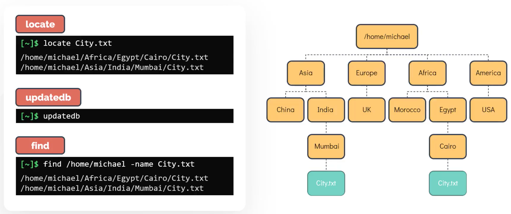

To search within files, use **GREP**:

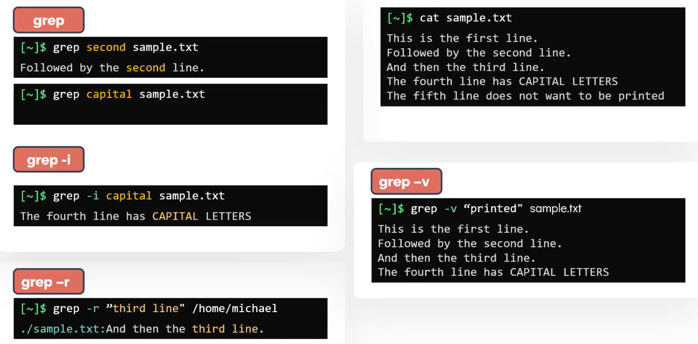

---

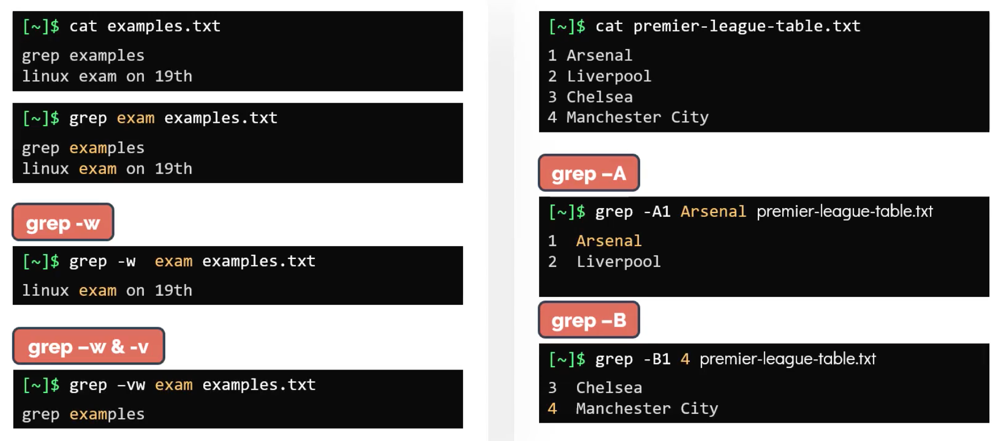

---

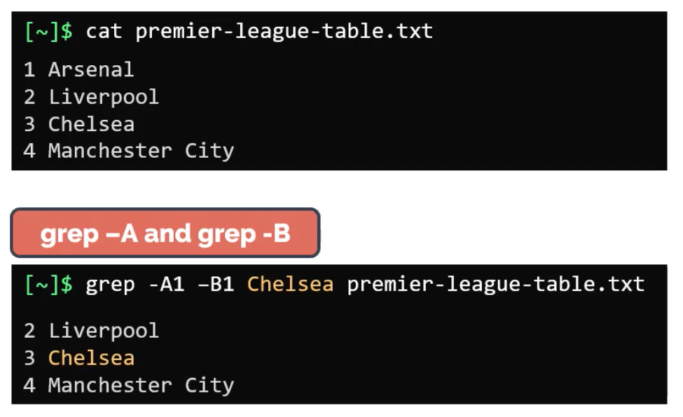

## IO Redirection

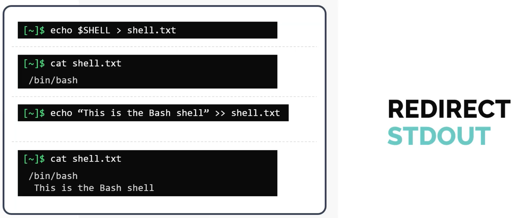

---

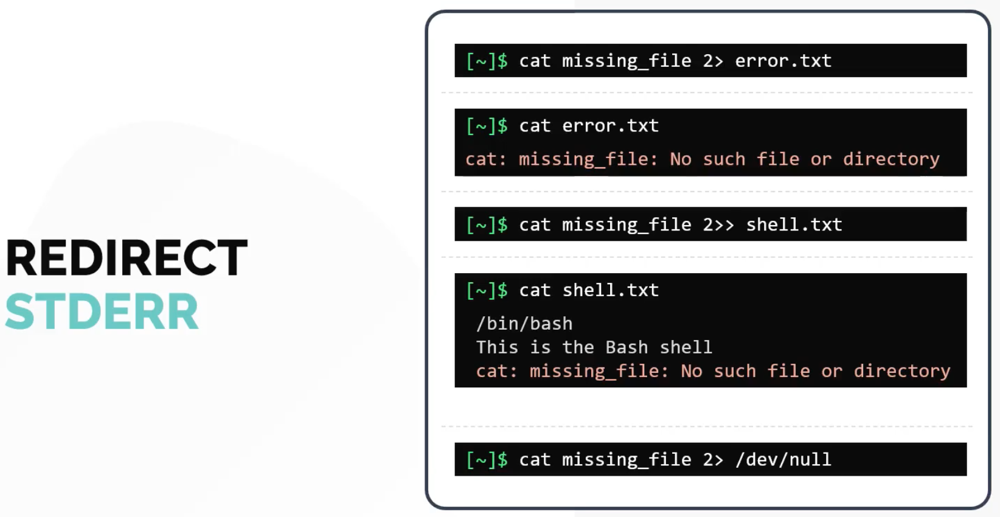

---

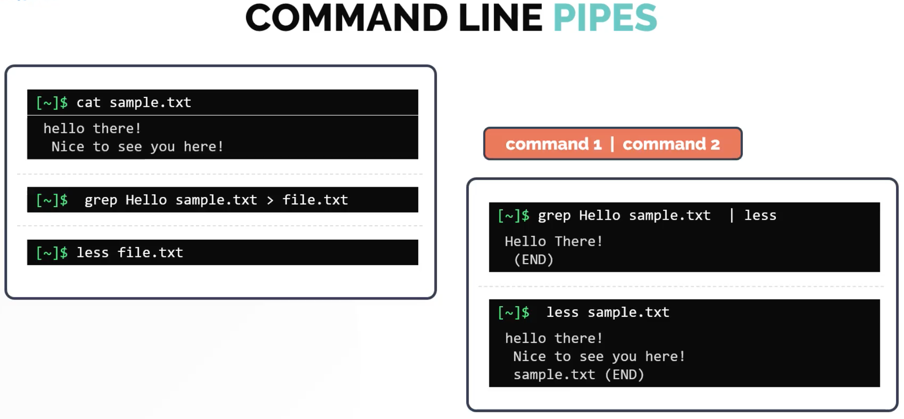

---

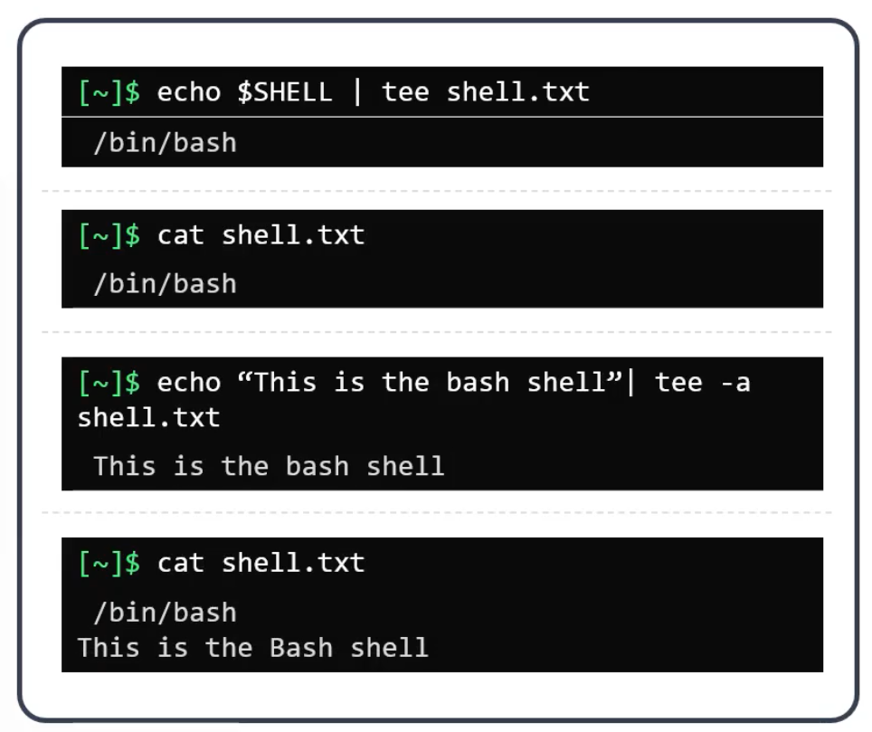

