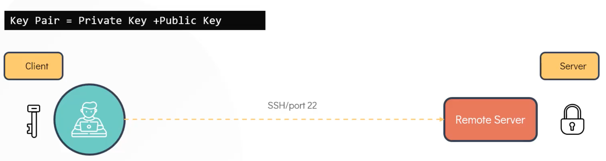
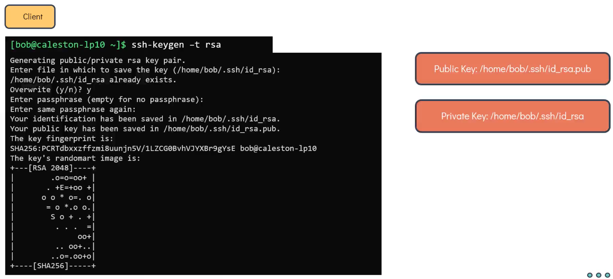
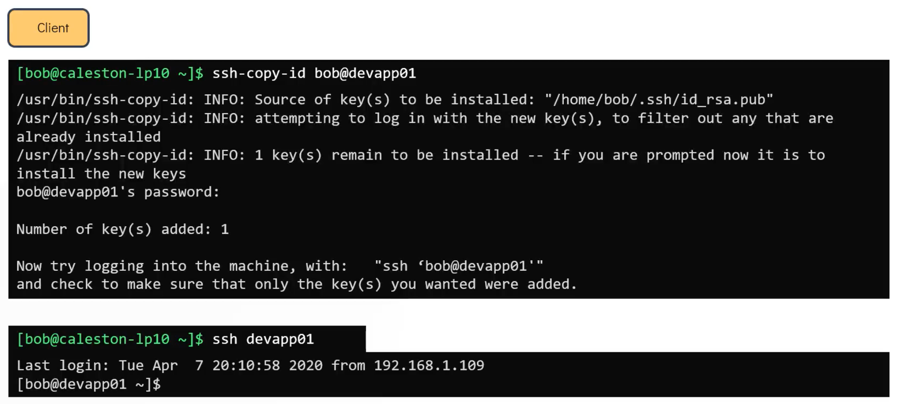
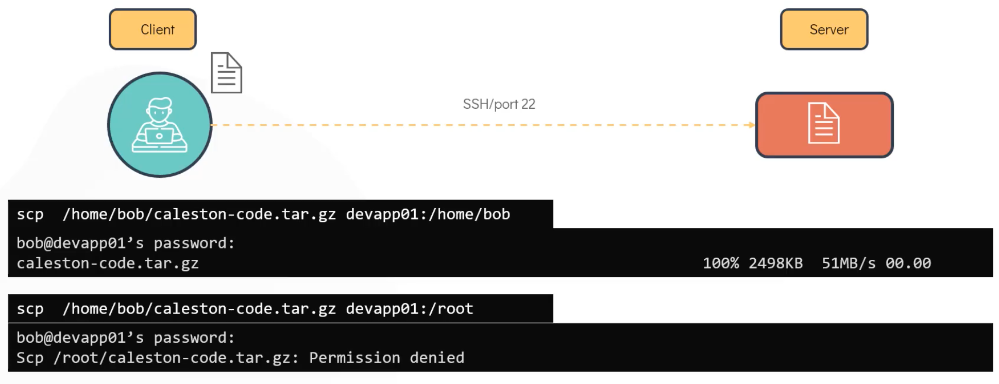
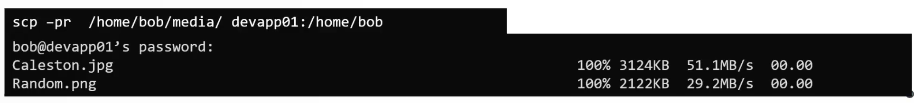

# SSH

Syntax:

```bash
ssh <hostname OR IP address>

ssh <user>@<hostname OR IP address>

ssh -l <user> <hostname OR IP address>
```

e.g. remotely connect to machine with hostname devapp01 from Bob's machine (so we connect as bob when not specifying a user):

```bash
[bob@caleston-lp10 ~]$ ssh devapp01

bab@devapp01's password:
Last login: .....
[bob@devapp01 ~]$
```


## Password-less SSH

First create a key-pair on the client:



---



Now we have to copy the public key to the remote server:



## SCP



To copy a directory instead of just a file, use the **-r** option and use **-p** to maintain the permissions e.g.

