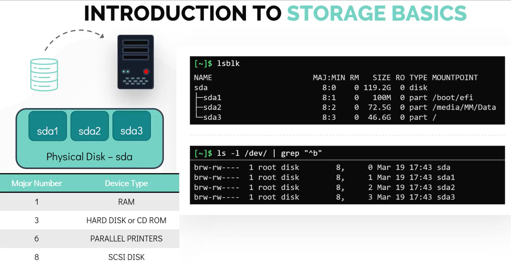
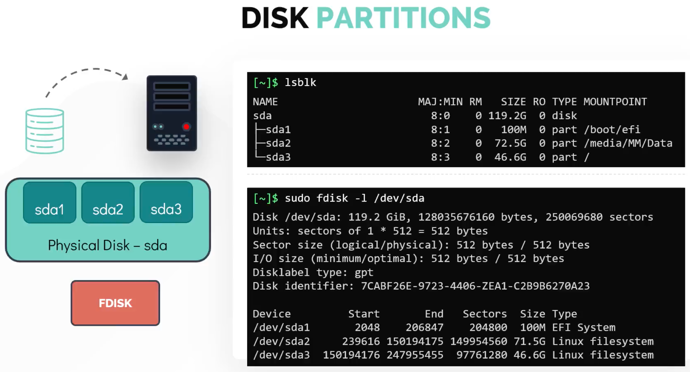
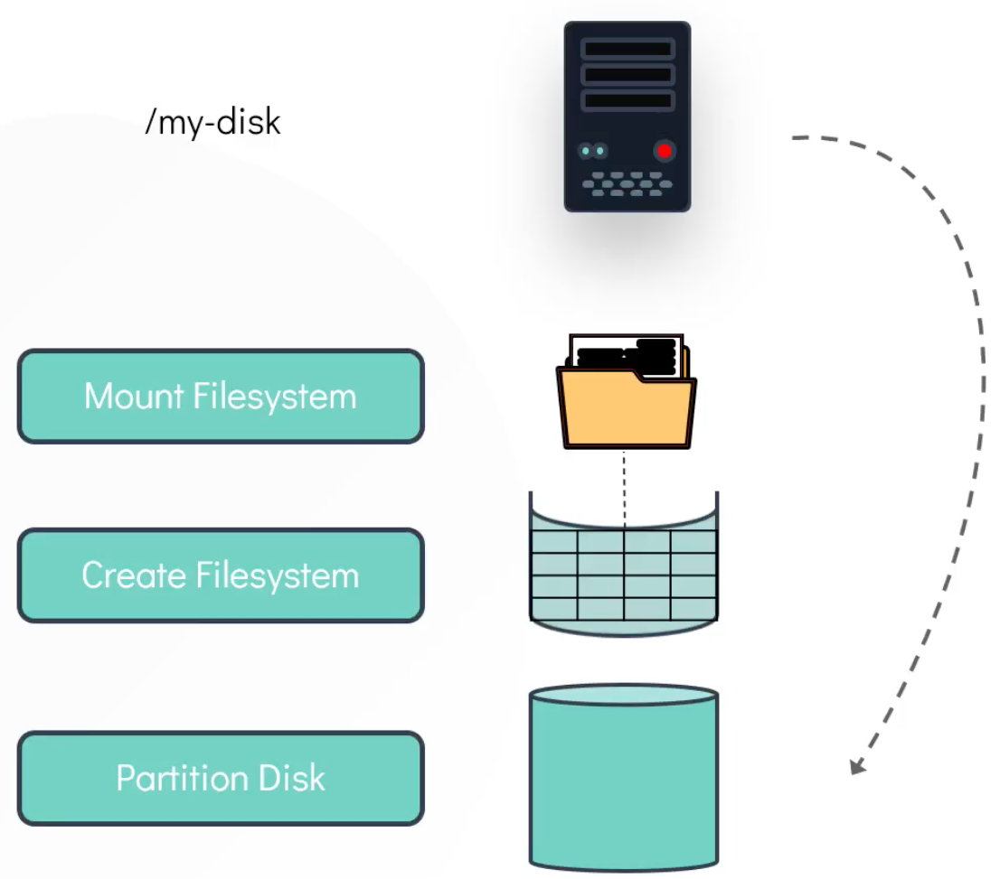
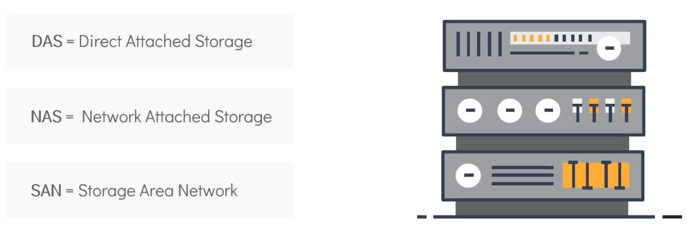
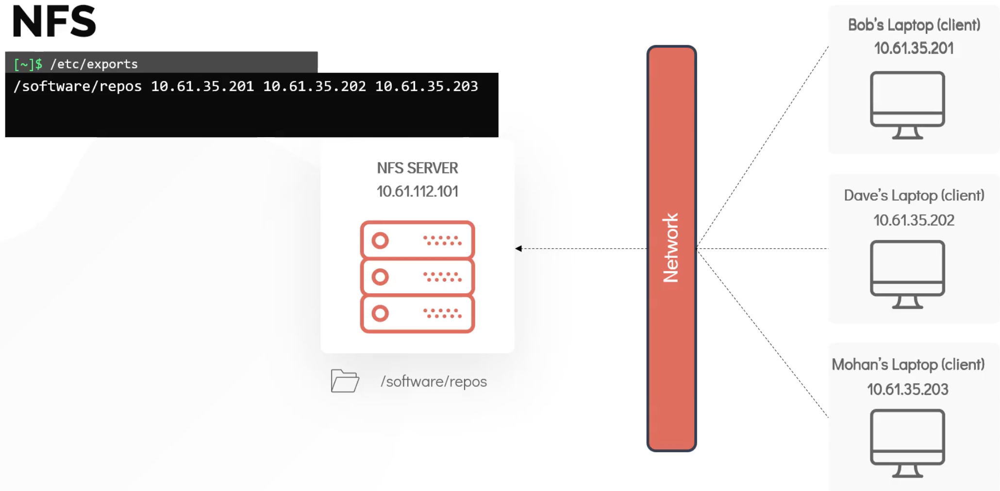
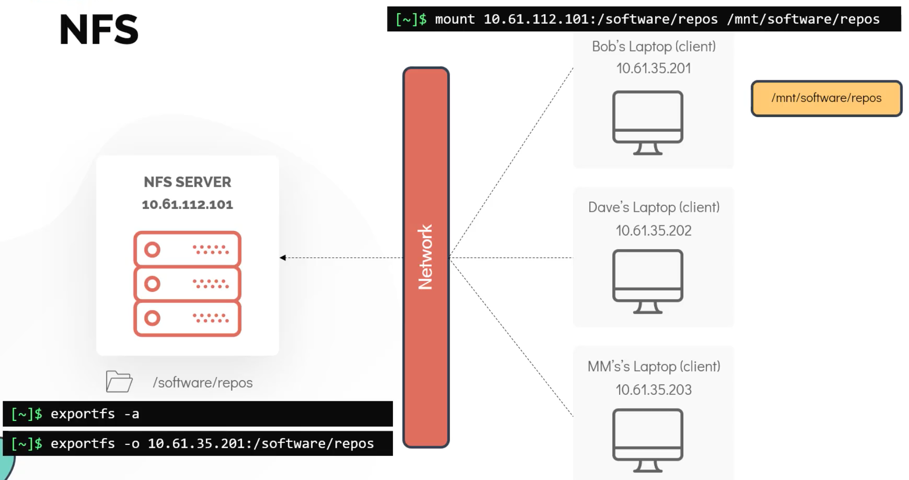

# Storage



---



## File Systems in Linux



Example:

- Create an **ext4** file system on disk **/dev/vdb**
- Mount it at **/mnt/data**

```bash
bob@caleston-lp10:~$ sudo mkfs.ext4 /dev/vdb
mke2fs 1.44.1 (24-Mar-2018)
Creating filesystem with 5242880 4k blocks and 1310720 inodes
Filesystem UUID: 0a51ff22-9ac1-42b6-ad22-1e25cc40e7e3
Superblock backups stored on blocks:
        32768, 98304, 163840, 229376, 294912, 819200, 884736, 1605632, 2654208,
        4096000

Allocating group tables: done
Writing inode tables: done
Creating journal (32768 blocks): done
Writing superblocks and filesystem accounting information: done

bob@caleston-lp10:~$ sudo mkdir /mnt/data

bob@caleston-lp10:~$ sudo mount /dev/vdb /mnt/data
```

NOTE The mount is not persistent in FSTAB yet. If the system is rebooted, the filesystem will not be mounted.

So, make the mount persistent across reboot:

```bash
bob@caleston-lp10:~$ sudo vi /etc/fstab
```

adding the line:

```yaml
/dev/vdb /mnt/data ext4 rw 0 0
```

## External Storage



and then there's **NFS**:



---



## 

