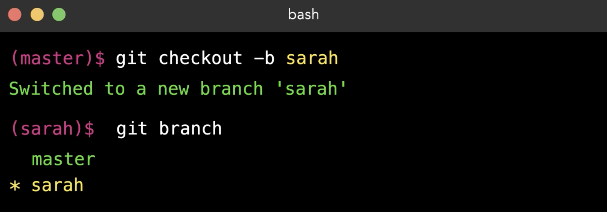
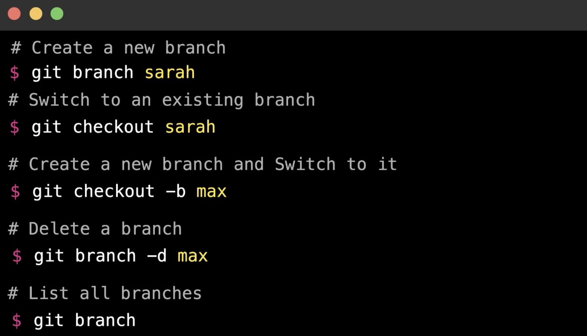
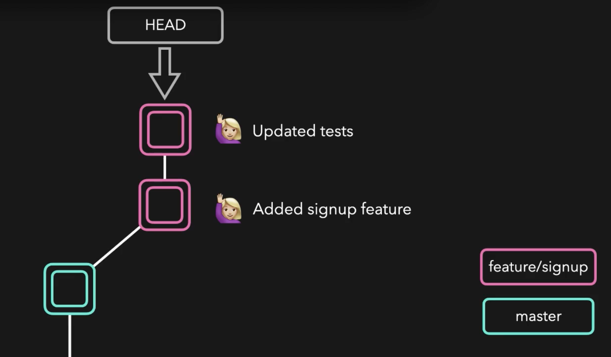
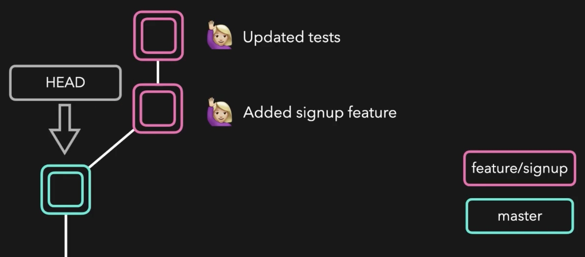
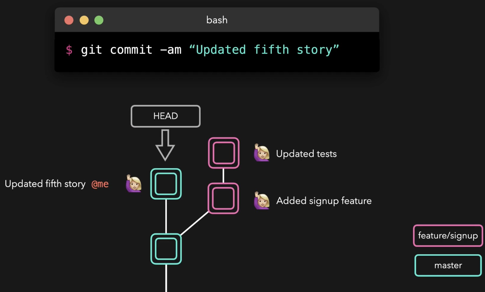
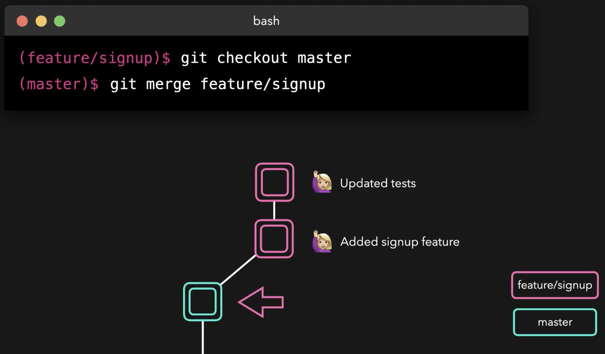

# Branches



---



**HEAD** is where you are right now in the git repository.

**HEAD** points to the last commit on the branch you are currently on.



---



When you switch branches, the **HEAD** moves with you.



Branch info e.g. which branch was current branch created from:

```bash
sarah (master)$ git checkout feature/signout
Switched to branch 'feature/signout'

sarah (feature/signout)$ git log --graph --decorate
* commit 190f61af6650f6248e16345d4fe5bdac26805862 (HEAD -> feature/signout)
| Author: sarah <sarah@example.com>
| Date:   Sun Aug 30 21:03:12 2020 +0000
|
|     Add signout page
|
* commit a8b67573effee0fb1e8f5d388c69926f0f63bd7b (feature/signup)
| Author: sarah <sarah@example.com>
| Date:   Sun Aug 30 21:03:12 2020 +0000
|
|     Add signup page
|
* commit 8fc819f20a7b8bee0958aafec5f9881539d43f6b (master)
  Author: sarah <sarah@example.com>
  Date:   Sun Aug 30 21:03:12 2020 +0000

      Added main page
```

## Merge

Merge receives the name of the branch we want to merge into our current branch e.g. to merge a branch "feature/signup" into "master", we should be on the "master" branch to issue the "merge" command:

