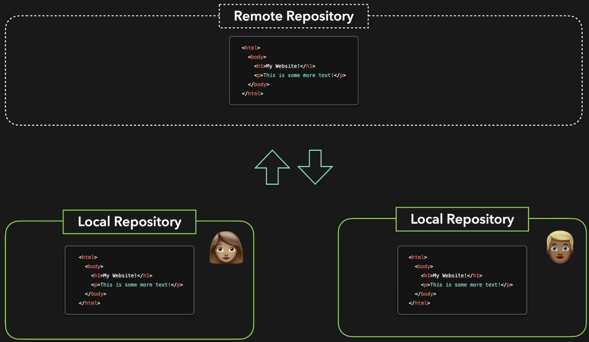

# Introduction



---


## Install GIT

```bash
$ cat /etc/*release*
DISTRIB_ID=Ubuntu

$ sudo apt update

$ sudo apt install git -y

$ git --version
git version 2.17.1
```

## Git Log


There are many options to **git log** - you may wish to list the changed files e.g.

```bash
sarah (master)$ git log --name-only
commit 8fc8b99743d3e328d255b7f8bf9f71d5c6acb607 (HEAD -> master)
Author: sarah <sarah@example.com>
Date:   Sat Aug 29 22:26:42 2020 +0000

    Added the lion and mouse story

lion-and-mouse.txt
```

View the last 3 commits:

```bash
sarah (master)$ git log -n 3
commit 1f5ab2a7d4b1344b01b26eddf0150a3422ee2893 (HEAD -> master)
Author: tej <tej@example.com>
Date:   Sat Aug 29 22:24:32 2020 +0000

    Update color from red to green

commit 948916e6716e332d69673fd069e87eda3fb5b419
Author: sarah <sarah@example.com>
Date:   Sat Aug 29 22:24:32 2020 +0000

    Add instructions to verify application

commit f6174d1daf3f1fccb1add3ab0d44e261ae2f3464
Author: max <max@example.com>
Date:   Sat Aug 29 22:24:32 2020 +0000

    Increase interval time to 500
```

or

```bash
sarah (master)$ git log --max-count 3
commit 1f5ab2a7d4b1344b01b26eddf0150a3422ee2893 (HEAD -> master)
Author: tej <tej@example.com>
Date:   Sat Aug 29 22:24:32 2020 +0000

    Update color from red to green

commit 948916e6716e332d69673fd069e87eda3fb5b419
Author: sarah <sarah@example.com>
Date:   Sat Aug 29 22:24:32 2020 +0000

    Add instructions to verify application

commit f6174d1daf3f1fccb1add3ab0d44e261ae2f3464
Author: max <max@example.com>
Date:   Sat Aug 29 22:24:32 2020 +0000

    Increase interval time to 500
```

