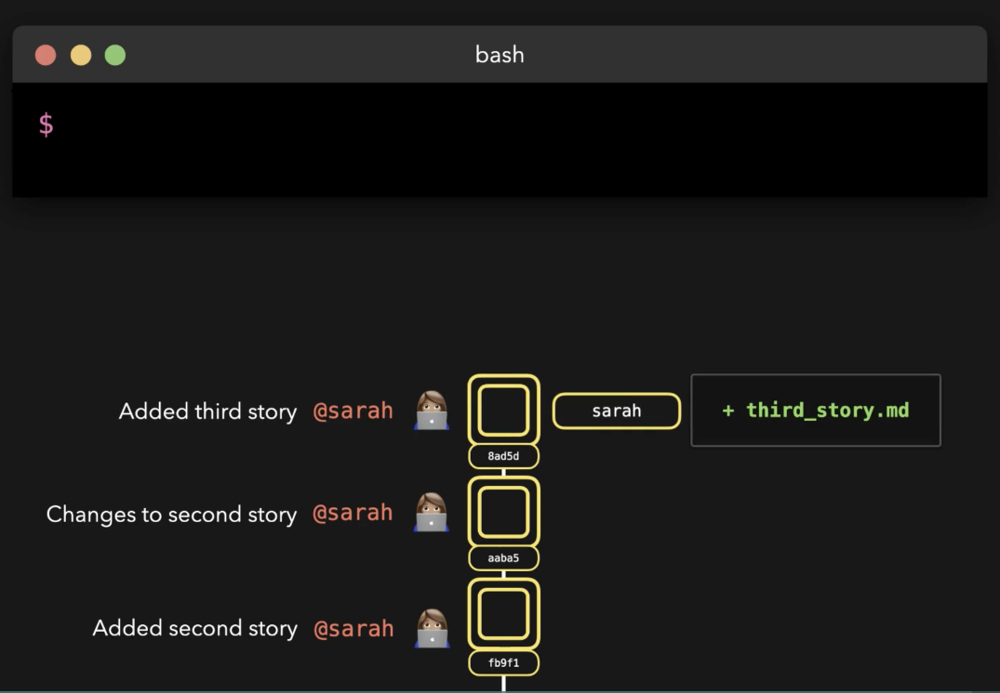
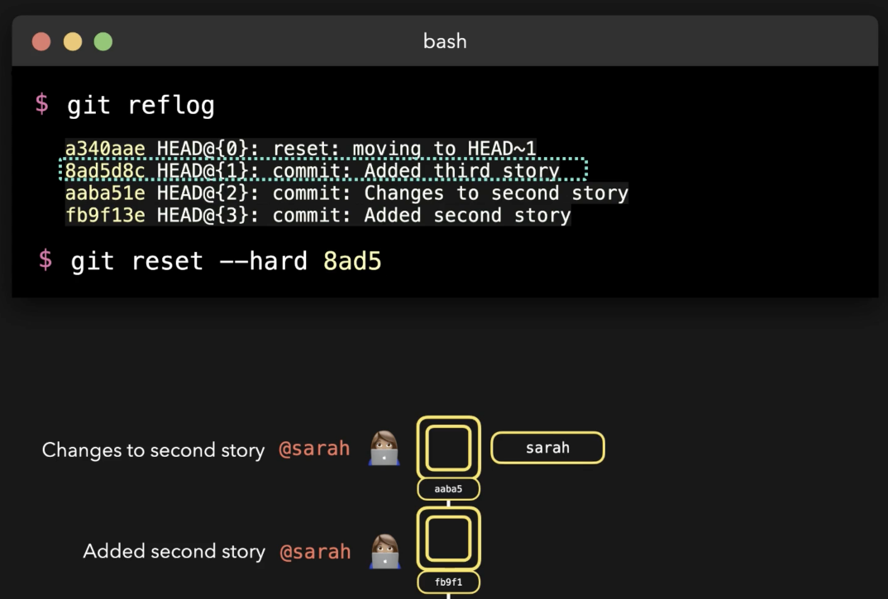
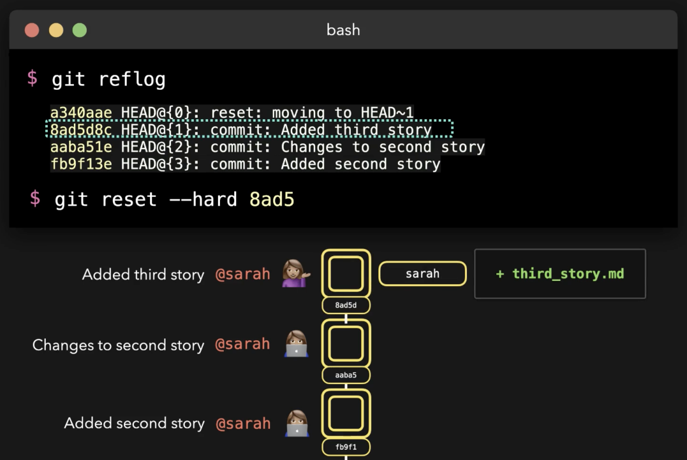

# Reflog

What if you did a **reset --hard** and lost a commit that was actually required?

Before our "reset --hard":

And then whoops!

This is when we need **reflog**:

and we get back what we accidentally removed:

