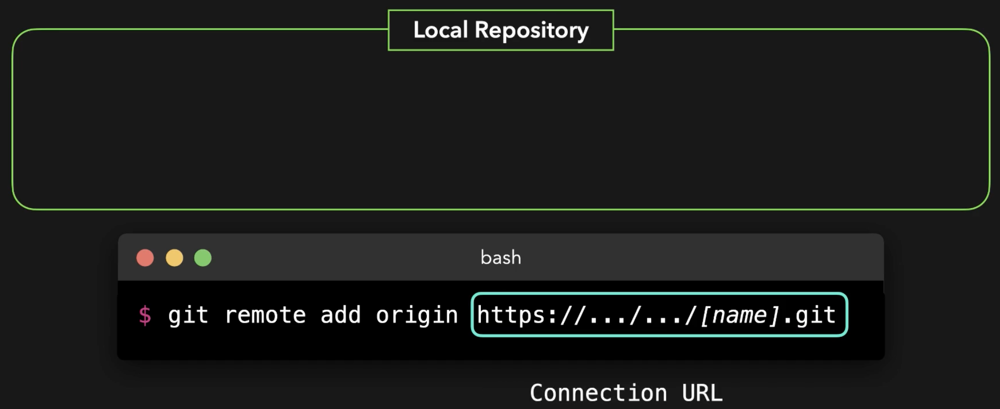
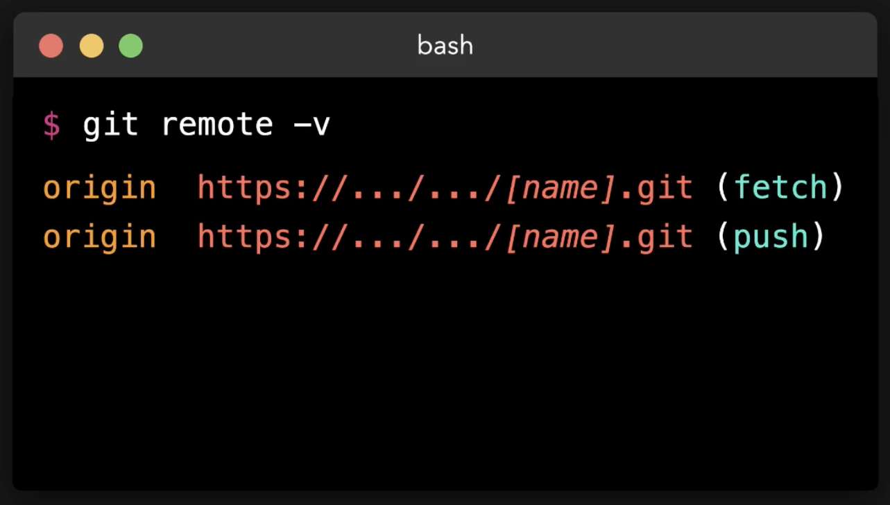
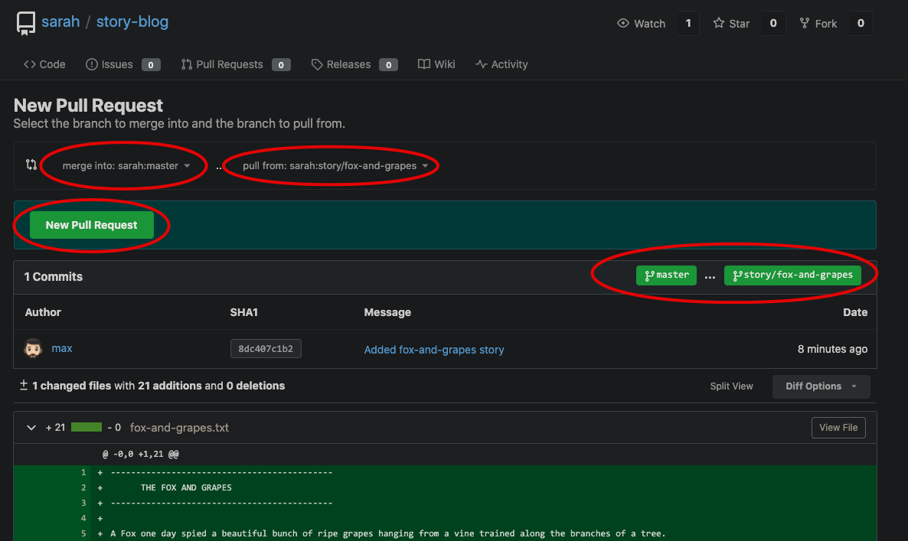
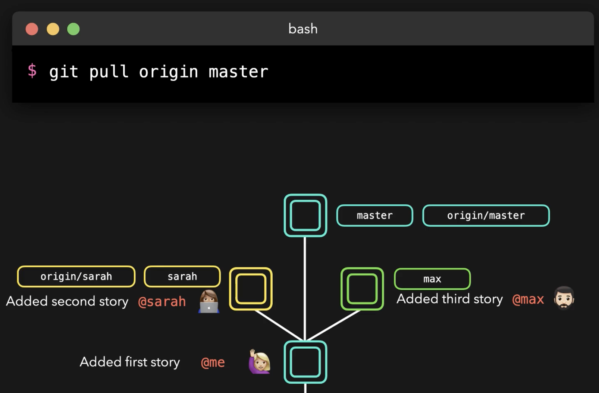
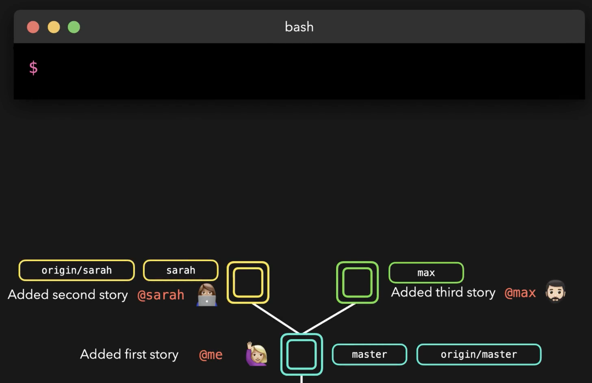
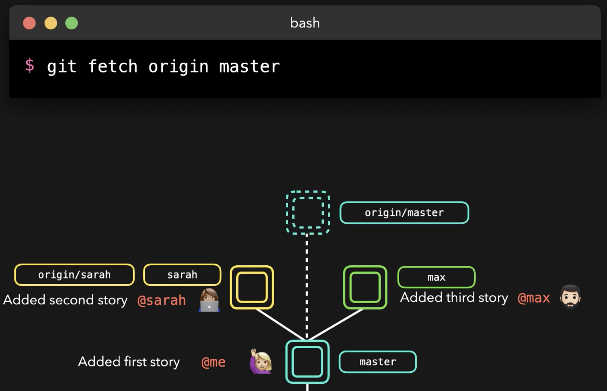
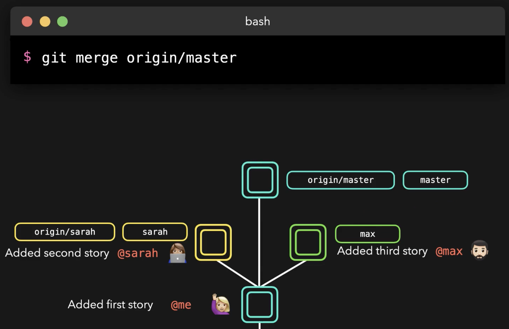

# Repositories



---



Push to remote by giving its **alias** in our case **origin** is the alias for the remote repository:


Remote repository example:

After creating a remote repository (on e.g. Github), we navigate to our local repository and add the connection string with an alias:

```bash
sarah (master)$ pwd
/home/sarah/story-blog
sarah (master)$ git remote add origin http://git.example.com/sarah/story-blog.git
```

With remote repo alias of **origin** and remote branch **master** to push:

```bash
sarah (master)$ git push origin master
```

i.e. **git push <remote repo alias> <remote branch>**

## Pull Request


**Example**

Max created a new file and wants to get it into master:

```bash
max (master)$ git status
On branch master
Your branch is up-to-date with 'origin/master'.
Untracked files:
  (use "git add <file>..." to include in what will be committed)

        fox-and-grapes.txt

nothing added to commit but untracked files present (use "git add" to track)

max (master)$ git checkout -b story/fox-and-grapes
Switched to a new branch 'story/fox-and-grapes'

max (story/fox-and-grapes)$ git add .

max (story/fox-and-grapes)$ git commit -m "Added fox-and-grapes story"
[story/fox-and-grapes 8dc407c] Added fox-and-grapes story
 1 file changed, 21 insertions(+)
 create mode 100644 fox-and-grapes.txt
 
max (story/fox-and-grapes)$ git push origin story/fox-and-grapes
Username for 'http://git.example.com': max
Password for 'http://max@git.example.com':
Counting objects: 3, done.
Delta compression using up to 2 threads.
Compressing objects: 100% (3/3), done.
Writing objects: 100% (3/3), 742 bytes | 0 bytes/s, done.
Total 3 (delta 0), reused 0 (delta 0)
remote:
remote: Create a new pull request for 'story/fox-and-grapes':
remote:   http://git.example.com/sarah/story-blog/compare/master...story/fox-and-grapes
remote:
remote: . Processing 1 references
remote: Processed 1 references in total
To http://git.example.com/sarah/story-blog.git
 * [new branch]      story/fox-and-grapes -> story/fox-and-grapes
```


---



Once the PR is merged, we can update locally:



Git pull is actually equivalent to **fetch and merge**:



---



---



To view all branches, both local and remote:

```bash
sarah (master)$ git branch -a
* master
  story/frogs-and-ox
  remotes/origin/master
```

Now that we’ve fetched the origin `master` branch, we can update our local `master` branch with the latest changes made on **origin/master**` branch. Merge the remote `master` branch to local `master:

```bash
sarah (master)$ git merge origin/master
Updating ec9d7eb..77255b5
Fast-forward
 fox-and-grapes.txt | 21 +++++++++++++++++++++
 1 file changed, 21 insertions(+)
 create mode 100644 fox-and-grapes.txt
```

