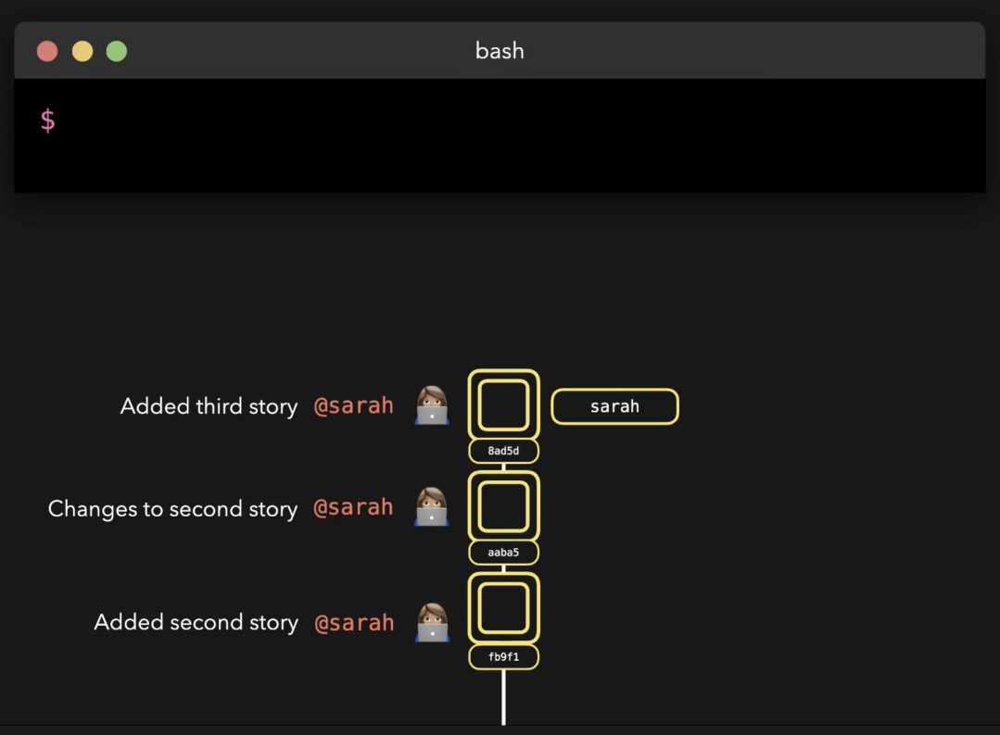
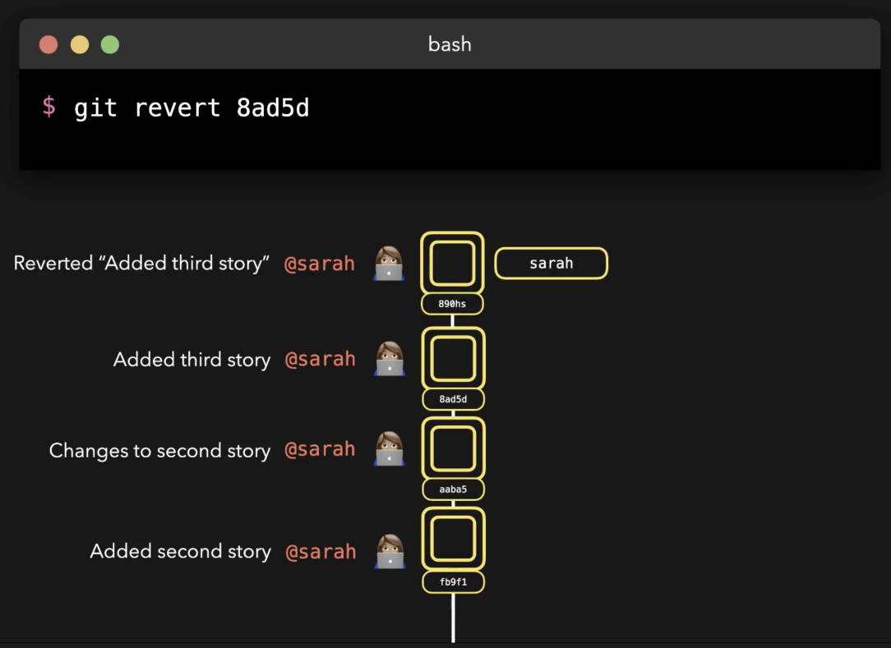
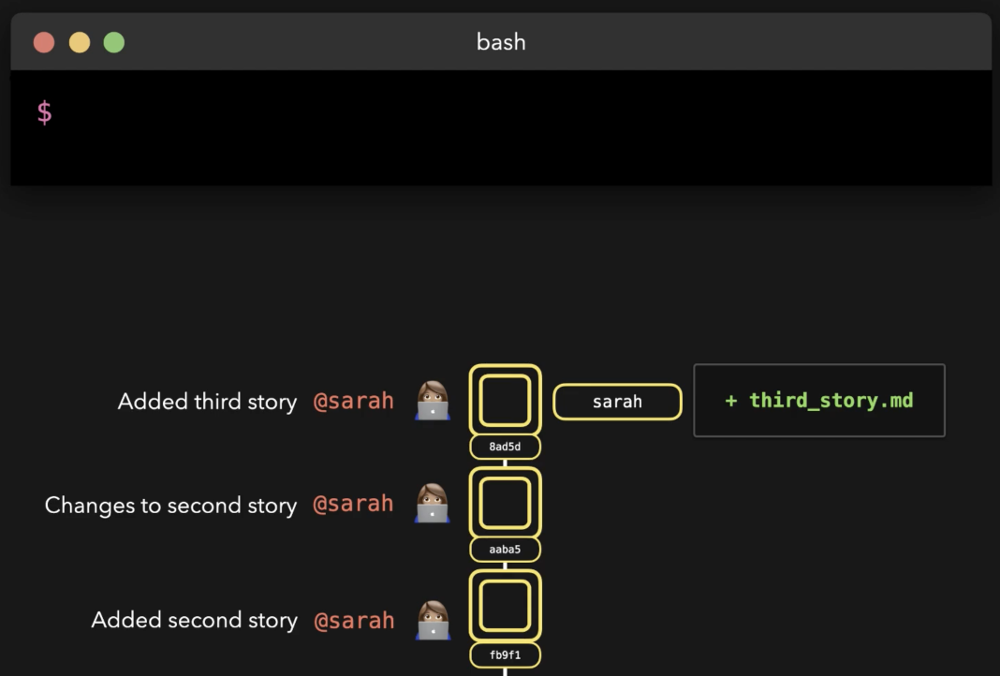
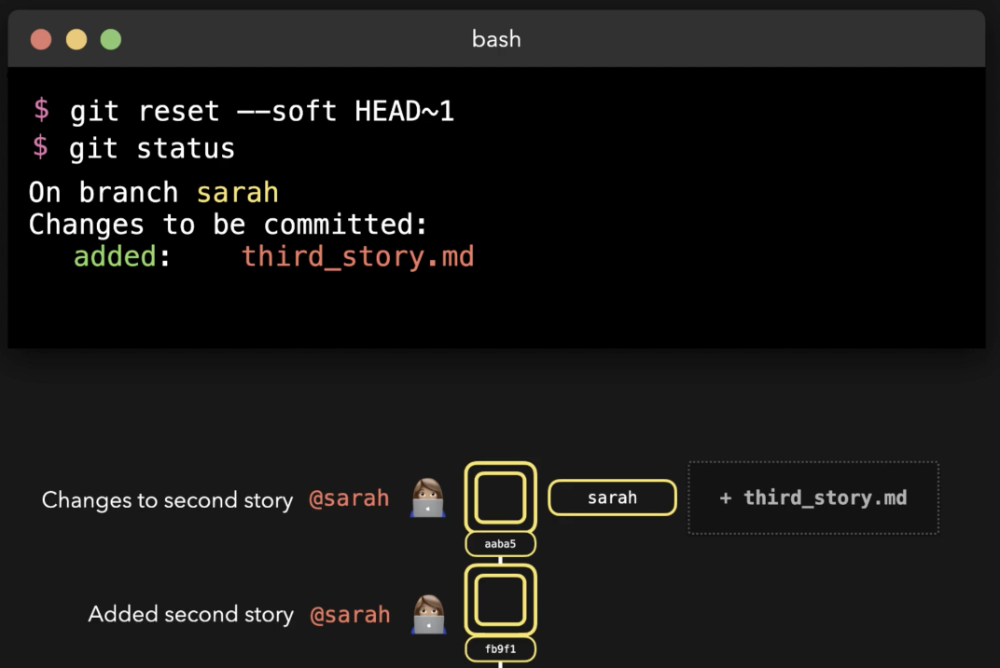
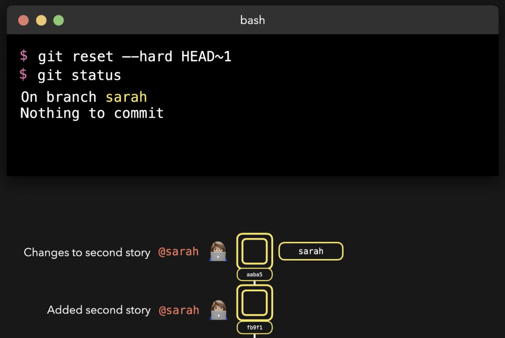

# Resetting and Reverting

## Revert

Let's revert the last commit (Added third story) which will actually add a new commit basically reverting said last:



---



Let's say we want to see which files were affected by a commit:

```bash
sarah (master)$ git log --name-only

commit b75ac420d59b26e2b9c9dab1ddd0f8e4e9581407 (HEAD -> master)
Author: sarah <sarah@example.com>
Date:   Tue Sep 15 20:02:43 2020 +0000

    Add author info to stories

fox-and-grapes.txt
frogs-and-ox.txt
hare-and-tortoise.txt
lion-and-mouse.txt
wolf-and-goat.txt
```

To revert that last commit we can do either:

```bash
git revert HEAD~0
```

or

```bash
git revert b75ac420d59b26e2b9c9dab1ddd0f8e4e9581407
```

## Reset

Instead of reverting we can **reset**:



We can either reset **soft**, keeping the original changes (in this case going back 1 commit):



A reset **hard** will blitz changes so we basically can not change our mind about said reset:



