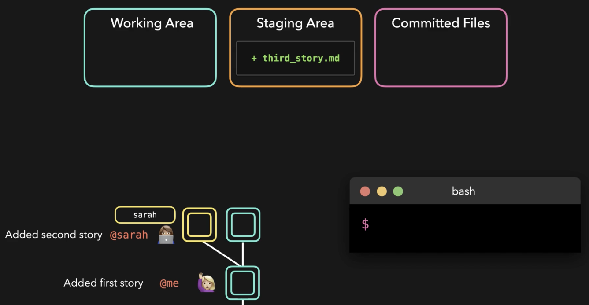
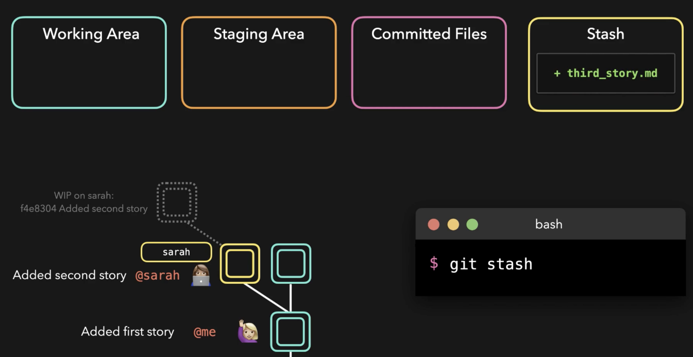
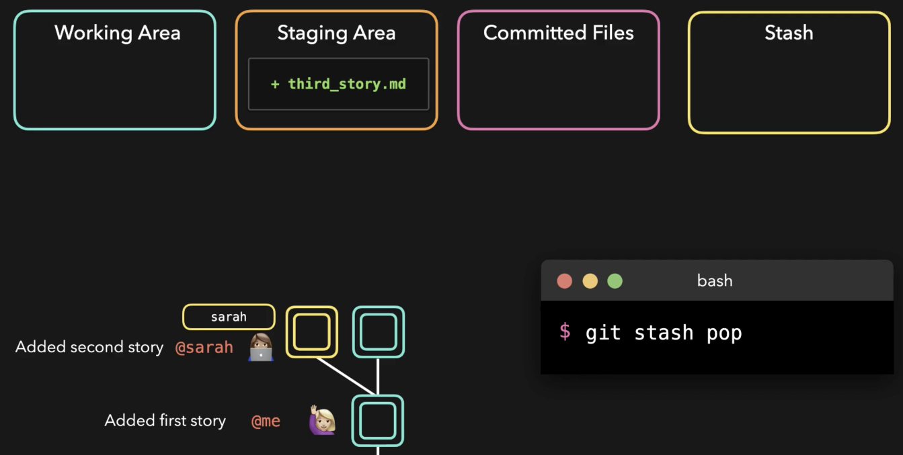
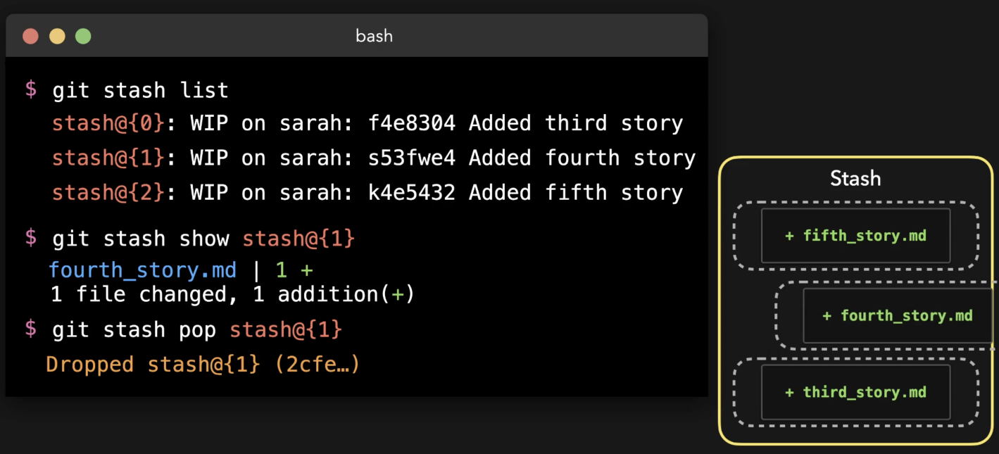

# Stashing

We are working on the "third story", but there is an issue on master that needs fixing.

So we **stash** our uncommitted work:

When we want to get our changes back, we **pop**:

We can stash as many times as we want and see (**list**) all that has been stashed:

