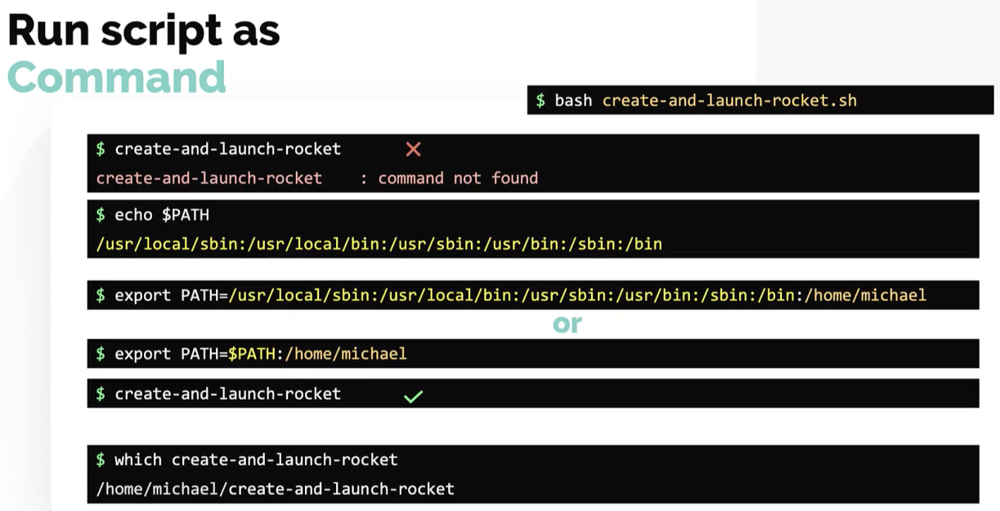
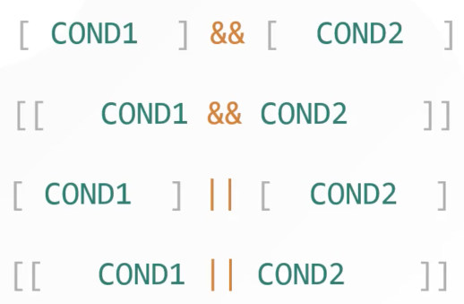

# Introduction



---


## Variables


## Command Line Arguments


and we can now replace **jupiter-mission** in the script with **$1** (our first command line argument, where **$0** refers to the script name):


## Input

Instead of the above, we could prompt a user from within a script to provide the required argument (in this case the mission name) instead of handing this in via a command line argument.


## Arithmetic Operations

e.g.

```bash
➜ expr 6 + 3
9
```

```bash
➜ expr 6 \* 3
18
```

```bash
➜ A=6

➜ B=3

➜ expr $A + $B
9
```

```bash
➜ echo $((A * B))
18
```

## Flow Control


---


and some Bash enhancements:


Finally we have **&&** and **||**:




Other useful operators:


Example script with control flow (just using basic **if/else**, though **case** would be better):

```bash
month_number=$1

if [ -z $month_number ]
then
  echo "No month number given. Please enter a month number as a command line argument."
  echo "eg: ./print-month-number 5"
  exit
fi

if [[ $month_number -lt 1 || $month_number -gt 12 ]]
then
  echo "Invalid month number given. Please enter a valid number - 1 to 12."
  exit
fi

if [ $month_number -eq 1 ]
then
  echo "January"
elif [ $month_number -eq 2 ]
then
  echo "February"
elif [ $month_number -eq 3 ]
then
  echo "March"
elif [ $month_number -eq 4 ]
then
  echo "April"
elif [ $month_number -eq 5 ]
then
  echo "May"
elif [ $month_number -eq 6 ]
then
  echo "June"
elif [ $month_number -eq 7 ]
then
  echo "July"
elif [ $month_number -eq 8 ]
then
  echo "August"
elif [ $month_number -eq 9 ]
then
  echo "September"
elif [ $month_number -eq 10 ]
then
  echo "October"
elif [ $month_number -eq 11 ]
then
  echo "November"
elif [ $month_number -eq 12 ]
then
  echo "December"
fi
```

## Loops


If the list (to loop over) becomes too large, you could place said items into a file:


and instead of **backticks** you can use **$(...)**:


and yet another way:


Also, we could iterate over a list of files:


Or get "handy":


How about checking the **uptime** or each server by **ssh** onto each server:


There is also the **while loop**:


And here is a more in depth example:

```bash
while true
do
  echo "1. Add"
  echo "2. Subsctract"
  echo "3. Multiply"
  echo "4. Divide"
  echo "5. Quit"

  read -p "Enter your choice: " choice

  if [ $choice -eq 1 ]
  then
        read -p "Enter Number1: " number1
        read -p "Enter Number2: " number2
        echo Answer=$(( $number1 + $number2 ))
  elif [ $choice -eq 2 ]
  then
        read -p "Enter Number1: " number1
        read -p "Enter Number2: " number2
        echo Answer=$(( $number1 - $number2 ))
  elif [ $choice -eq 3 ]
  then
        read -p "Enter Number1: " number1
        read -p "Enter Number2: " number2
        echo Answer=$(( $number1 * $number2 ))
  elif [ $choice -eq 4 ]
  then
        read -p "Enter Number1: " number1
        read -p "Enter Number2: " number2
        echo Answer=$(( $number1 / $number2 ))
  elif [ $choice -eq 5 ]
  then
    break
  fi
done  
```

## Case

The above **if / elif** etc isn't very nice. An improvement is **case** e.g.


## Shebang

Shebang instructs a script which shell is required e.g. if a user is only using  **sh** (Bourne Shell), they can still run a script that needs **bash**:


## Exit Codes

**$?** gives you the last exit code:


---


## Functions

