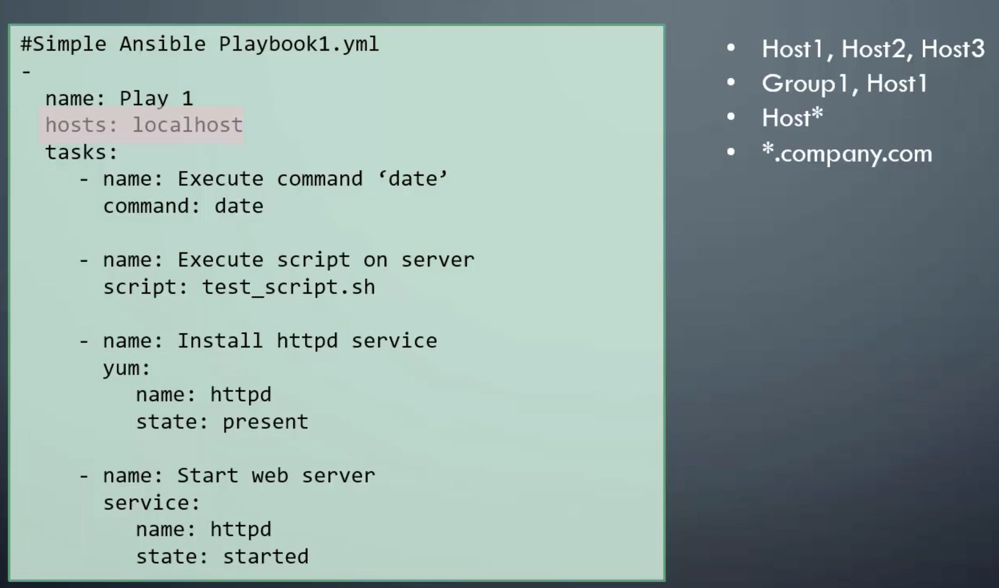
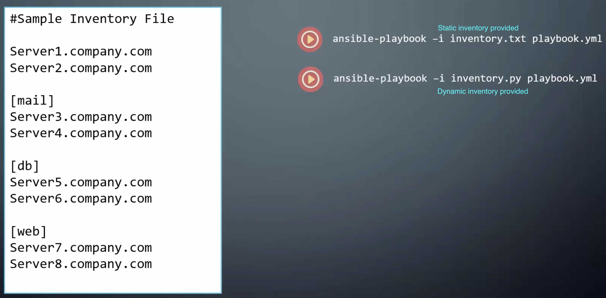

# Advanced Topics

A quick note - **Ansible Control Machine** can only be **Linux** (not **Windows**). Windows machines can be targets of Ansible and thus be part of automation. Ansible connects to a Windows machine using **winrm**.

## Ansible Galaxy

[Galaxy](https://galaxy.ansible.com) is a hub for finding, reusing and sharing Ansible content.

## Patterns

## Dynamic and Static Inventory

