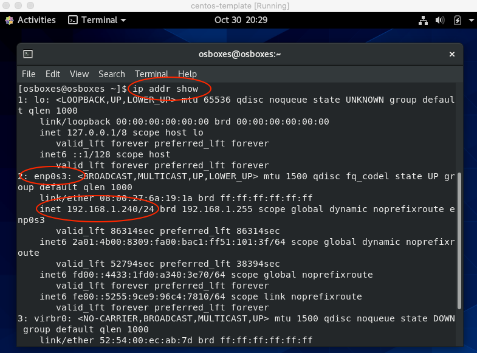
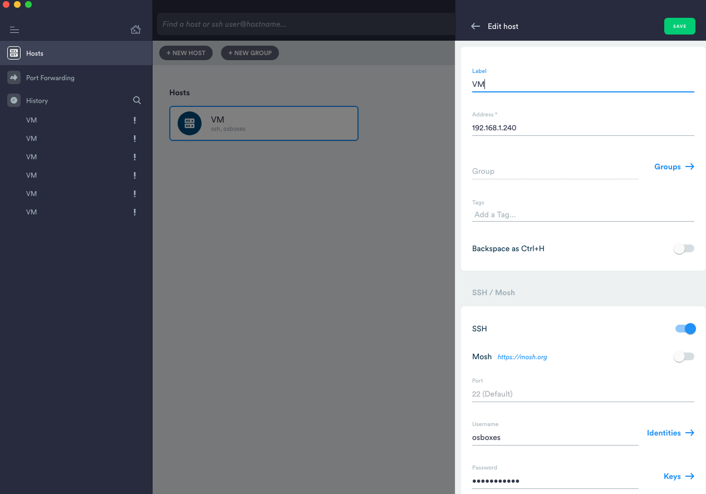
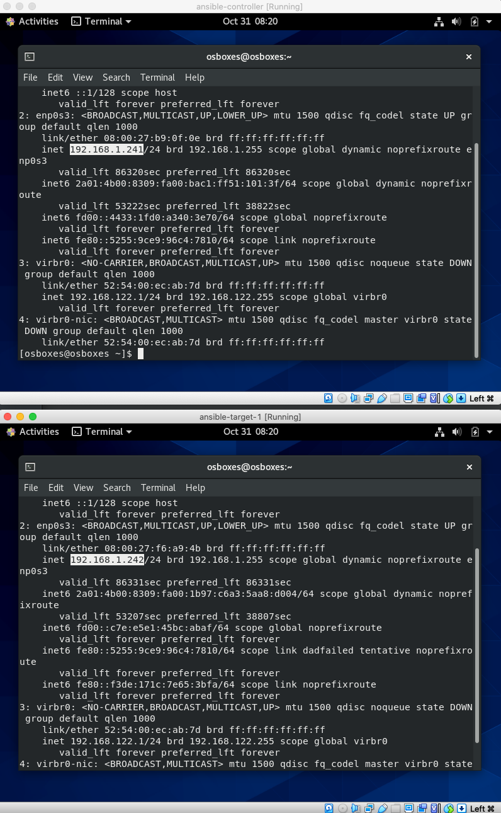
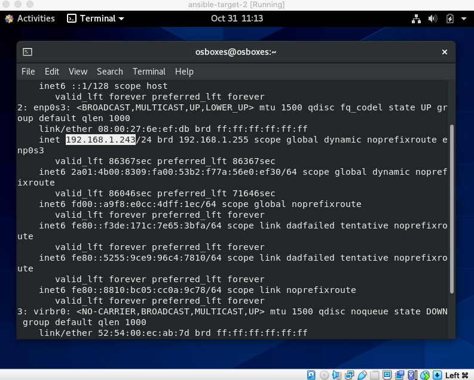

# Ansible Local Environment - Using VirtualBox

Goal:


## VM (Template)

We'll use a readymade OS from [OSBoxes](https://www.osboxes.org/):


---


---


Now in VirtualBox select **New**:


and complete the details:


Go into the settings of our new VM and increase the CPU to 2:


Next change to **Bridge Adapter** giving our VM an IP address and will be able to connect to the internet to download packages:


Now power up and login with details:

Username: osboxes

Password: osboxes.org



If there is no **inet** then:

```bash
[osboxes@osboxes ~]$ sudo yum install openssh openssh-server openssh-clients openssl-libs
```

and

```bash
[osboxes@osboxes ~]$ sudo dhclient -v
```

and

```bash
[osboxes@osboxes ~]$ sudo vi /etc/sysconfig/network-scripts/ifcfg-enp0s3
-- 
DEVICE=enp0s3 
BOOTPROTO=dhcp  
ONBOOT=yes
-- 
$reboot
```

Back on your host:

```bash
ssh osboxes@192.168.1.240
```

Or use a SSH user friendly client e.g Mac's Termius:



Now kill the VM to clone the template:


## Ansible Controller and Target

First clone an **Ansible master**:


---


Next clone for **Ansible Target 1**, and again select **Linked clone**:


Now boot the **Ansible controller** and **Ansible target**:



SSH to the **controller** and **target**. Let's first rename the hosts as both are currently **osboxes** e.g. on controller we change 2 files:

```bash
➜ ssh osboxes@192.168.1.241
The authenticity of host '192.168.1.241 (192.168.1.241)' can't be established.
ECDSA key fingerprint is SHA256:QYhfRimq4gvWwsjg+kul52yjv48WfbcRHaaKgSuUQeE.
Are you sure you want to continue connecting (yes/no/[fingerprint])? yes
Warning: Permanently added '192.168.1.241' (ECDSA) to the list of known hosts.
osboxes@192.168.1.241's password:
Activate the web console with: systemctl enable --now cockpit.socket

[osboxes@osboxes ~]$ sudo vi /etc/hostname

[osboxes@osboxes ~]$ sudo vi /etc/hosts
```

The first file we change to:

```bash
ansiblecontroller
```

the second:

```bash
127.0.0.1   localhost ansiblecontroller
::1         localhost ansiblecontroller
```

and repeat for target naming as **target1**. We then need to restart the VMs:

```bash
[osboxes@osboxes ~]$ sudo shutdown now -r
```

SSH again... Nice:

```bash
➜ ssh osboxes@192.168.1.241
osboxes@192.168.1.241's password:
Activate the web console with: systemctl enable --now cockpit.socket

Last login: Sat Oct 31 08:40:11 2020
[osboxes@ansiblecontroller ~]$
```

```bash
➜ ssh osboxes@192.168.1.242
osboxes@192.168.1.242's password:
Activate the web console with: systemctl enable --now cockpit.socket

Last login: Sat Oct 31 08:40:43 2020
[osboxes@target1 ~]$
```

## Install Ansible on the Ansible Controller

The following should work (according the documentation):

```bash
[osboxes@ansiblecontroller ~]$ sudo yum install epel-release

[osboxes@ansiblecontroller ~]$ sudo yum install ansible
```

> Just in case, if the above does not work, there is another way:
>
> ```bash
> [osboxes@ansiblecontroller ~]$ sudo yum install python3 python3-pip
> 
> [osboxes@ansiblecontroller ~]$ sudo pip3 install ansible
> ```

```bash
[osboxes@ansiblecontroller ~]$ ansible --version
ansible 2.10.2
```

Now let's check the connectivity between Ansible and the target node. From the controller, ssh onto the target:

```bash
[osboxes@ansiblecontroller ~]$ ssh osboxes@192.168.1.242
The authenticity of host '192.168.1.242 (192.168.1.242)' can't be established.
ECDSA key fingerprint is SHA256:QYhfRimq4gvWwsjg+kul52yjv48WfbcRHaaKgSuUQeE.
Are you sure you want to continue connecting (yes/no/[fingerprint])? yes
Warning: Permanently added '192.168.1.242' (ECDSA) to the list of known hosts.
osboxes@192.168.1.242's password:
Activate the web console with: systemctl enable --now cockpit.socket

[osboxes@target1 ~]$ exit
logout
Connection to 192.168.1.242 closed.
[osboxes@ansiblecontroller ~]$
```

So far so good. Now to test Ansible. We generate a test project:

```bash
[osboxes@ansiblecontroller ~]$ mkdir test-project
[osboxes@ansiblecontroller ~]$ cd test-project/
[osboxes@ansiblecontroller test-project]$ cat > inventory.txt
target1 ansible_host=192.168.1.242 ansible_ssh_pass=osboxes.org
^C
```

Then test:

```bash
[osboxes@ansiblecontroller test-project]$ ansible target1 -m ping -i inventory.txt
target1 | FAILED! => {
    "msg": "to use the 'ssh' connection type with passwords, you must install the sshpass program"
}
```

Whoops. Missing package. So install:

```bash
[osboxes@ansiblecontroller test-project]$ sudo yum install sshpass
[sudo] password for osboxes:
Last metadata expiration check: 2:20:59 ago on Sat 31 Oct 2020 08:28:50 EDT.
No match for argument: sshpass
Error: Unable to find a match: sshpass
```

Whoops again. Again we have another way:

```bash
[osboxes@ansiblecontroller test-project]$ wget http://download.fedoraproject.org/pub/epel/6/x86_64/epel-release-6-8.noarch.rpm

[osboxes@ansiblecontroller test-project]$ sudo rpm -ivh epel-release-6-8.noarch.rpm

[osboxes@ansiblecontroller test-project]$ sudo yum --enablerepo=epel -y install sshpass
```

A bit round the houses but now our test will work:

```bash
[osboxes@ansiblecontroller test-project]$ ansible target1 -m ping -i inventory.txt
target1 | SUCCESS => {
    "ansible_facts": {
        "discovered_interpreter_python": "/usr/libexec/platform-python"
    },
    "changed": false,
    "ping": "pong"
}
```

## A Second Target Node

Clone the template again for **target 2** repeating the steps above for **target 1**. Boot this new target and acquire its IP:



SSH onto this new node and again update **/etc/hostname** and **/etc/hosts**:

```bash
[osboxes@osboxes ~]$ sudo vi /etc/hostname
```

```bash
target2
```

```bash
[osboxes@osboxes ~]$ sudo vi /etc/hosts
```

```bash
127.0.0.1   localhost target2
::1         localhost target2
```

```bash
[osboxes@osboxes ~]$ sudo shutdown now -r
```

Modify our **Ansible inventory** file to include this seconds node:

```bash
[osboxes@ansiblecontroller test-project]$ vi inventory.txt
```

```bash
target1 ansible_host=192.168.1.242 ansible_ssh_pass=osboxes.org
target2 ansible_host=192.168.1.243 ansible_ssh_pass=osboxes.org
```

Now we can ping each target:

```bash
[osboxes@ansiblecontroller test-project]$ ansible target1 -m ping -i inventory.txt
target1 | SUCCESS => {
    "ansible_facts": {
        "discovered_interpreter_python": "/usr/libexec/platform-python"
    },
    "changed": false,
    "ping": "pong"
}

[osboxes@ansiblecontroller test-project]$ ansible target2 -m ping -i inventory.txt
target2 | FAILED! => {
    "msg": "Using a SSH password instead of a key is not possible because Host Key checking is enabled and sshpass does not support this.  Please add this host's fingerprint to your known_hosts file to manage this host."
}
```

Interesting. Ping against target 2 failed.

When we performed this test the first time, just before, we did perform a manual SSH connection and at that time we accepted the:

**ECDSA key fingerprint is ....**

**Are you sure you want to continue connecting (yes/no)? yes**

which we accepted. This time we have not done a manual connection to target 2 in order to accept the fingerprint, and that is basically want the error message is implying. The manual intervention added the **key** to the **known hosts list**. The following is not recommended, but we could work around this by amending **ansible.cfg**:

```bash
[osboxes@ansiblecontroller test-project]$ sudo vi /etc/ansible/ansible.cfg
```

and uncomment the line: **host_key_checking = False**, and the ping to target 2 will work:

```bash
[osboxes@ansiblecontroller test-project]$ ansible target2 -m ping -i inventory.txt
target2 | SUCCESS => {
    "ansible_facts": {
        "discovered_interpreter_python": "/usr/libexec/platform-python"
    },
    "changed": false,
    "ping": "pong"
}
```

NOTE - What we should be using is **ssh keys**.

