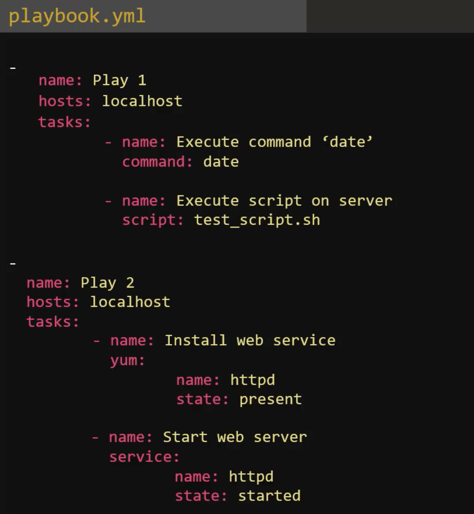
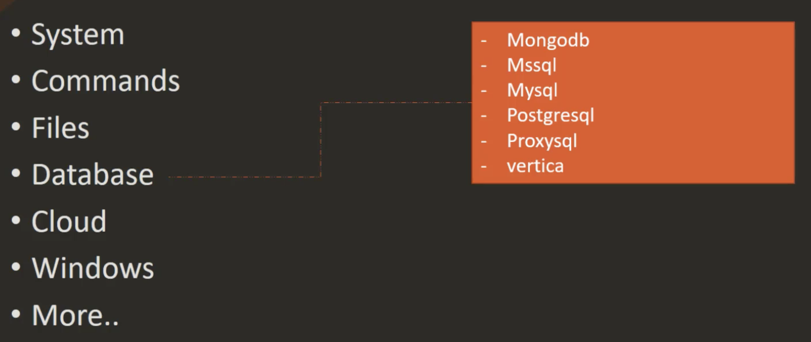

# Ansible Concepts

## Inventory


An **inventory** takes on an **ini** format. Example:


Note that Linux and Windows machine have slight different parameters e.g.

```ini
# Web Servers
web1 ansible_host=svr1.com ansible_connection=ssh ansible_user=root ansible_ssh_pass=Password123!
web2 ansible_host=svr2.com ansible_connection=ssh ansible_user=root ansible_ssh_pass=Password123!
web3 ansible_host=svr3.com ansible_connection=ssh ansible_user=root ansible_ssh_pass=Password123!

# Database Servers
db1 ansible_host=svr4.com ansible_connection=winrm ansible_user=administrator ansible_password=Password123!

[web_servers]
web1
web2
web3

[db_servers]
db1

[all_servers:children]
web_servers
db_servers
```

## Playbooks


---


Let's now have a list of dictionaries with two plays:



Hosts defined in the **inventory** file must match those in the **playbook**:


Finally, to run a playbook:

```bash
ansible-playbook playbook.yml
```

And a more complete example; first the inventory:

```yaml
# Servers
sql_db1 ansible_host=sql01.xyz.com ansible_connection=ssh ansible_user=root ansible_ssh_pass=Lin$Pass
sql_db2 ansible_host=sql02.xyz.com ansible_connection=ssh ansible_user=root ansible_ssh_pass=Lin$Pass
web_node1 ansible_host=web01.xyz.com ansible_connection=ssh ansible_user=administrator ansible_ssh_pass=Win$Pass
web_node2 ansible_host=web02.xyz.com ansible_connection=ssh ansible_user=administrator ansible_ssh_pass=Win$Pass
web_node3 ansible_host=web03.xyz.com ansible_connection=ssh ansible_user=administrator ansible_ssh_pass=Win$Pass

[db_nodes]
sql_db1
sql_db2

[web_nodes]
web_node1
web_node2
web_node3

[all_nodes:children]
db_nodes
web_nodes
```

and associated playbook:

```yaml
-
    name: 'Stop the web services on web server nodes'
    hosts: web_nodes
    tasks:
        -
            name: 'Stop the web services on web server nodes'
            command: service httpd stop
-
    name: 'Shutdown the database services on db server nodes'
    hosts: db_nodes
    tasks:
        -
            name: 'Shutdown the database services on db server nodes'
            command: service mysql stop
-
    name: 'Restart all servers (web and db) at once'
    hosts: all_nodes
    tasks:
        -
            name: 'Restart all servers (web and db) at once'
            command: /sbin/shutdown -r
-
    name: 'Start the database services on db server nodes'
    hosts: db_nodes
    tasks:
        -
            name: 'Start the database services on db server nodes'
            command: service mysql start
-
    name: 'Start the web services on web server nodes'
    hosts: web_nodes
    tasks:
        -
            name: 'Start the web services on web server nodes'
            command: service httpd start
```

## Modules


---


---


---



---


---


Example of **script**:


Example of **service**:


Example of **lineinfile** which also shows off Ansibles **idempotency** because running a script would keep incorrectly adding lines:

