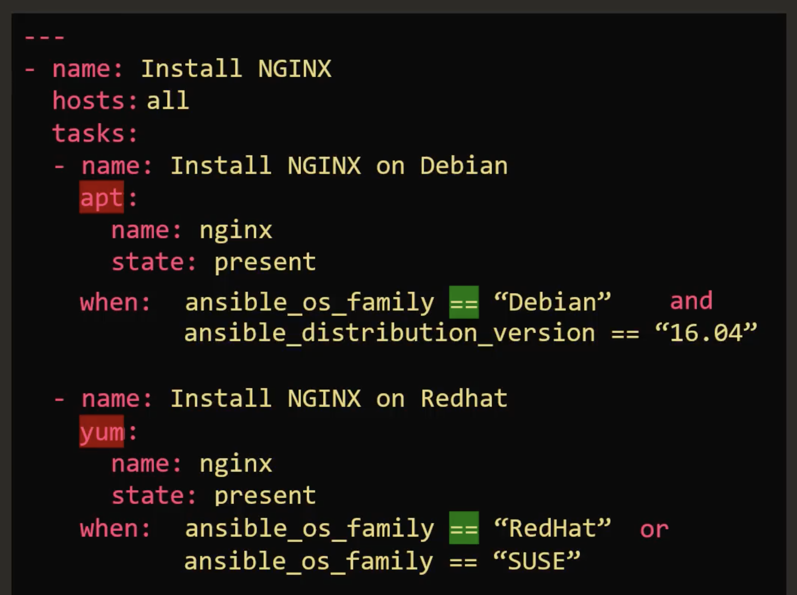
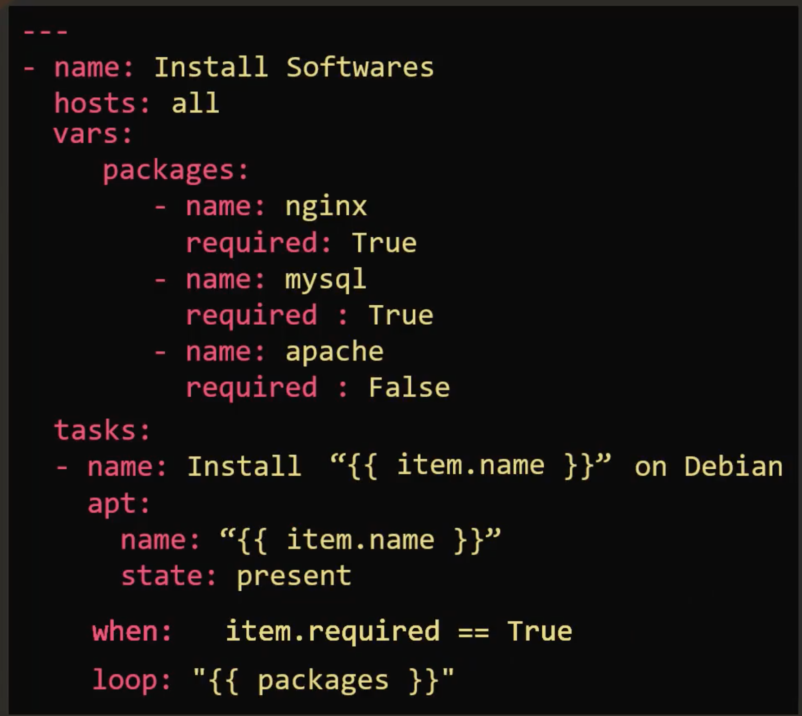
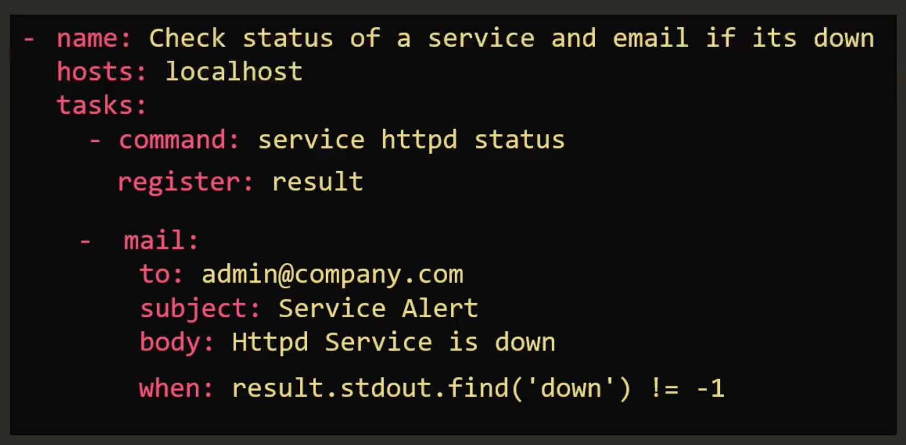
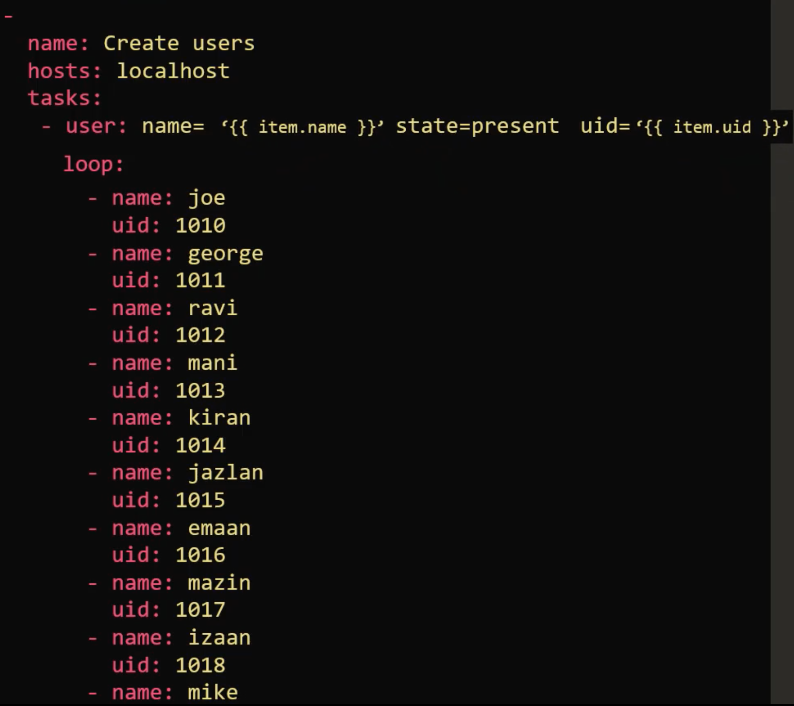
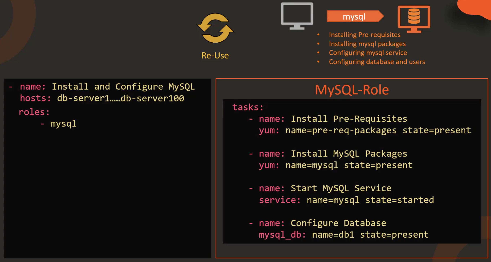
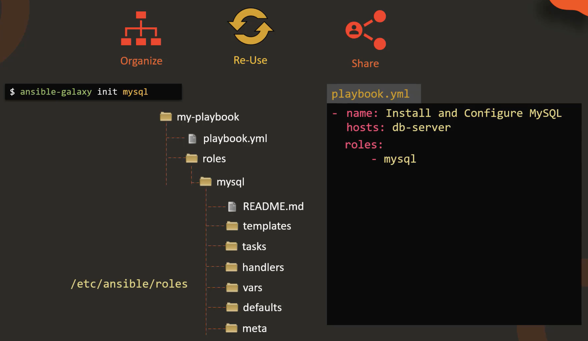
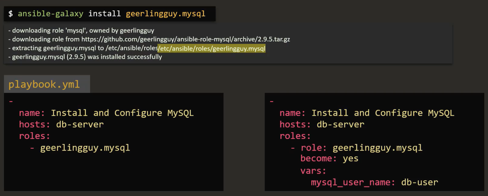
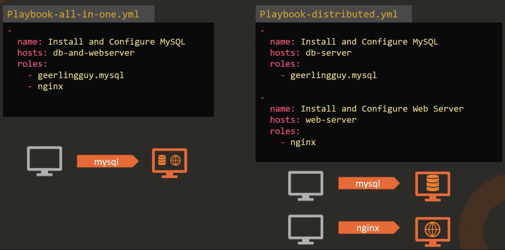

# Conditionals, Loops & Roles

## when

We want our playbook to install nginx on all machines. However, some machines are **Debian** (uses **apt** package manager) and some are **Redhat** (uses **yum** package manager):

## loop

## register

## Loops

## Roles

We can create a role using **ansible-galaxy init** to layout a directory structure. We can have this structure either under **roles** within our playbook directory structure, or under the default **/etc/ansible/roles**.

We can install a **role** from **galaxy** instead of defining our own, and then use it via **roles**:

and another example with two different approaches:

