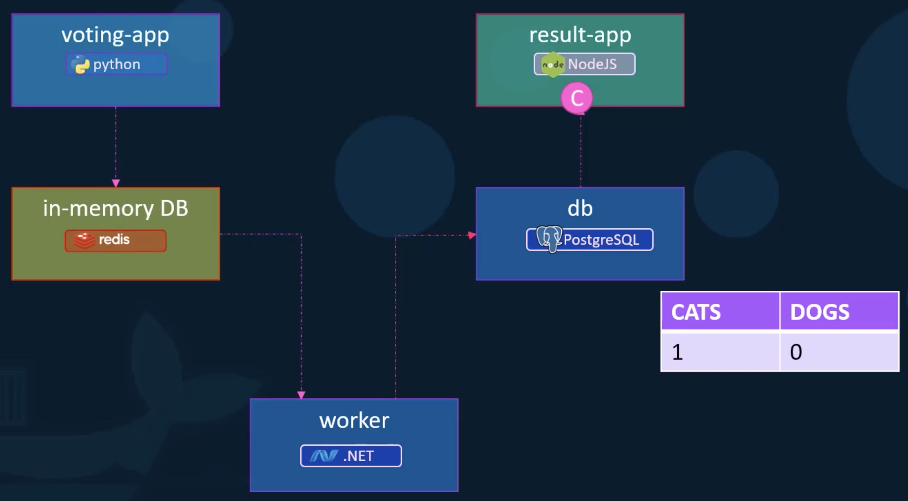
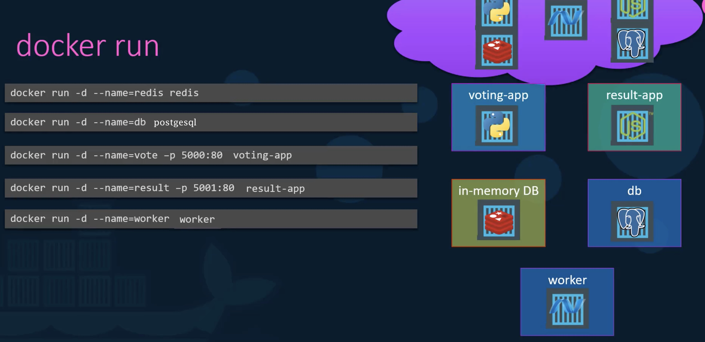
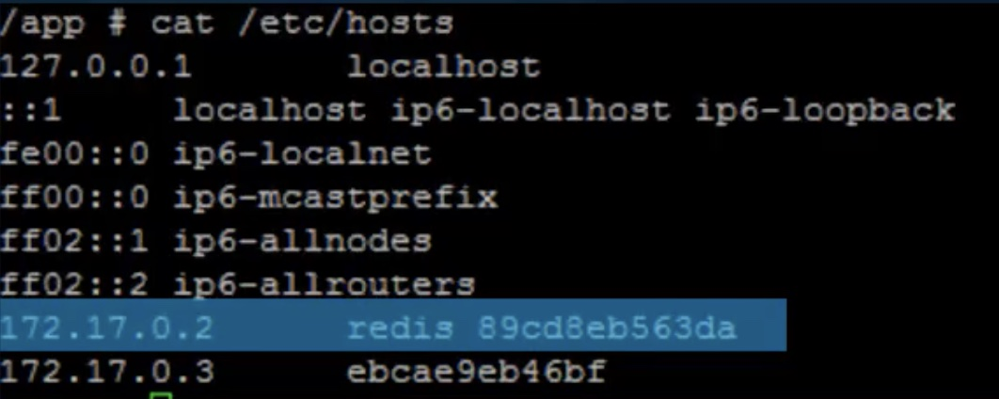
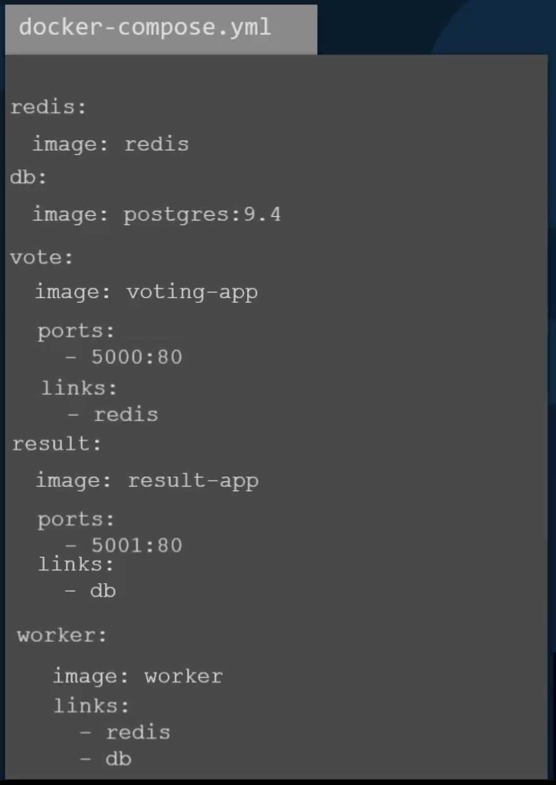
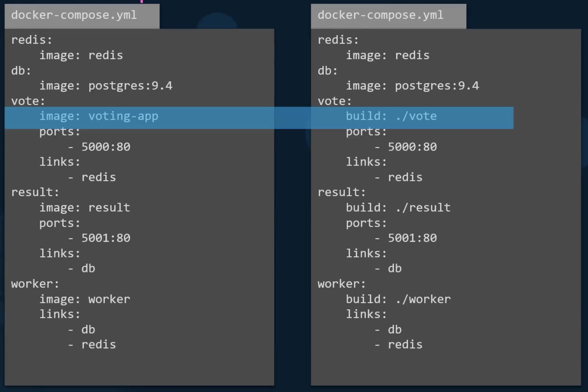
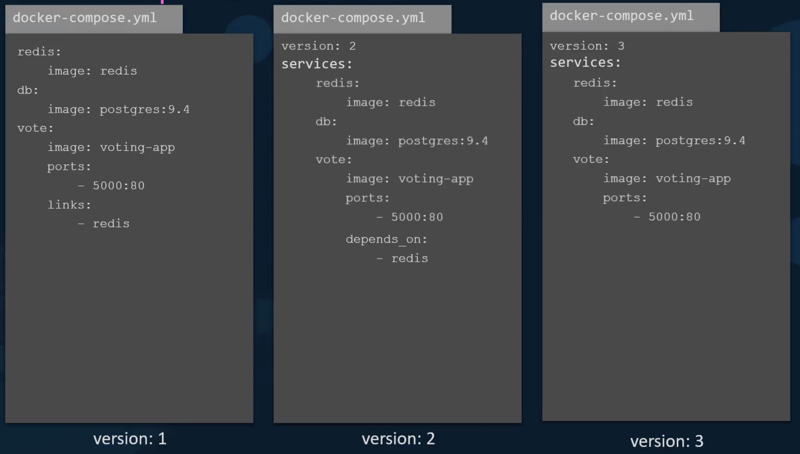
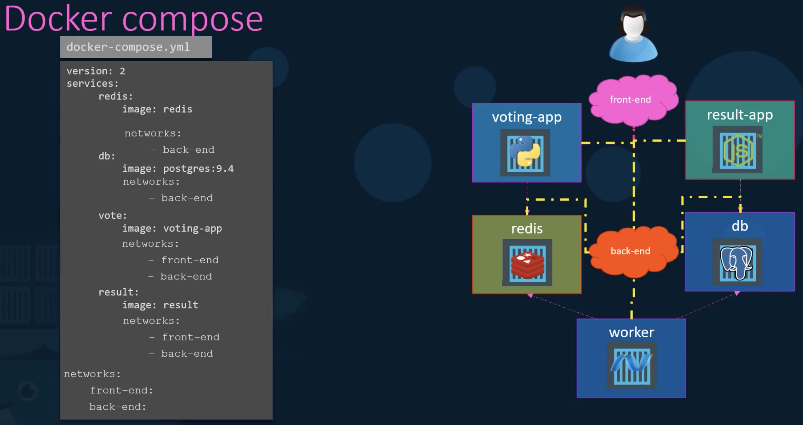

# Docker Compose

Take a look at an application stack - voting application:



Without Docker Compose we could do something like:



Alas, it does not work. When we access the web interface of the `voting-app` we see:


We have successfully started all the services, but we've not actually linked them together.
We should have used the option `--links` to link containers.

e.g. the voting-application has the following code:


so we would need:

```bash
docker run -d --name=vote -p 5000:80 --link redis:redis voting-app
```

Essentially this link creates an entry in the `/etc/hosts` file in the voting-application Docker container:



The equivalent using Docker Compose is much easier:



For our own application we can have the image built:



Docker Compose versions have advanced:



**What about networks?** We would like the UI apps to be on a `front-end network` and the rest on a `back-end network`.

For example:

