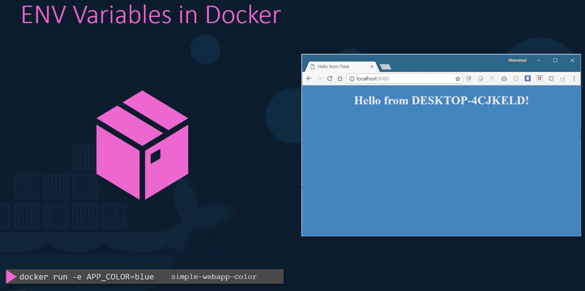
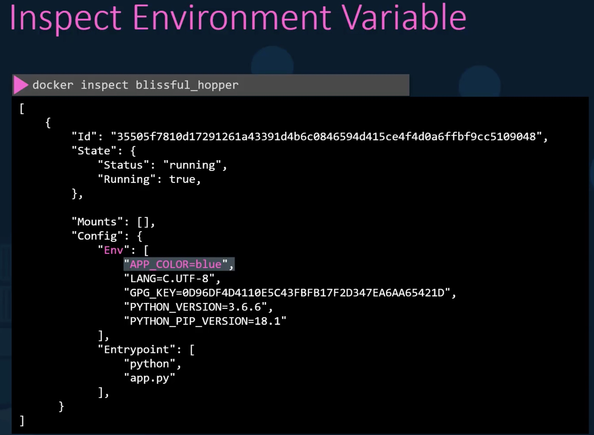

# Images

## Create Our Own Image

We'll create a Python web app image. Now without Docker, the steps maybe something like:

- OS - Ubuntu
- Update apt repo
- Install dependencies using apt
- Install Python dependencies using pip
- Copy source code to /opt folder
- Run the web server using "flask" command

With Docker, we would take steps similar to the following:

- Create a Dockerfile e.g.

```dockerfile
FROM ubuntu

RUN apt-get update
RUN apt-get install python

RUN pip install flask
RUN pip install flask-mysql

COPY . /opt/source-code

ENTRYPOINT FLASK_APP=/opt/source-code/app.py flask run
```

- Build your image giving a tag e.g.

```bash
docker build Dockerfile -t davidainslie/my-custom-app
```

- Push the created image e.g.

```bash
docker push davidainslie/my-custom-app
```

## Environment Variables



When a container is running, we can view (inspect) the environment variables e.g.



For example - boot a container providing: name; port mapping; environment variable:

```bash
docker run --name blue-app -p 38282:8080 -e APP_COLOR=blue kodekloud/simple-webapp
```

## Command vs Entrypoint

```bash
docker run ubuntu
```

This will launch a container and then exit. Why?
The Dockerfile **CMD** is **bash**, but if we do not "provide" a terminal then bash cannot attach to one and so terminates, and since this is the main container process then the container itself will also terminate.

```bash
➜ docker run ubuntu

# and nothing - the container has terminated
➜ docker container ls
CONTAINER ID   IMAGE     COMMAND   CREATED   STATUS    PORTS     NAMES

➜ docker container ls -a
CONTAINER ID   IMAGE     COMMAND       CREATED          STATUS                      PORTS     NAMES
c42ea2c633bd   ubuntu    "/bin/bash"   11 seconds ago   Exited (0) 10 seconds ago             cool_sinoussi

➜ docker run -it ubuntu
root@1b5a03088acc:/#
```

CMD can be declared in several forms e.g.

```dockerfile
CMD command param1
# e.g.
CMD sleep 5

CMD ["command", "param1"]
# e.g.
CMD ["sleep", "5"]
```

So instead of doing (everytime):

```bash
docker run ubuntu sleep 5
```

We can build our own image:

```dockerfile
FROM ubuntu

CMD sleep 5
```

```bash
docker build -t ubuntu-sleeper .

docker run ubuntu-sleeper
```

But we have hardcoded the time i.e. 5 seconds.
Let's instead pass in the number of seconds, and this is where we can use **ENTRYPOINT** instead e.g.

```dockerfile
FROM ubuntu

ENTRYPOINT ["sleep"]
```

Now the entrypoint will prefix whatever we pass into the **run** e.g.

```bash
docker run ubuntu-sleeper 10
```

but because of the entry point, it is as if we submitted: **docker run ubuntu-sleeper sleep 10**

This now begs the question, can we have a **default** if we don't pass in 10?
In this case we provide back the CMD but only with the parameter(s) e.g.

```dockerfile
FROM ubuntu

ENTRYPOINT ["sleep"]

CMD ["5"]
```

and when we submit:

```bash
docker run ubuntu-sleeper
```

the entrypoint prefixes "sleep" and cmd bolts-on "5" giving us again: **docker run ubuntu-sleeper sleep 10**

If you wish to override the ENTRYPOINT, there is the option **--entrypoint** e.g.

```bash
docker run --entrypoint newSleep ubuntu-sleeper 10
```

then newSleep is prefixed instead giving: **docker run ubuntu-sleeper newSleep 10**