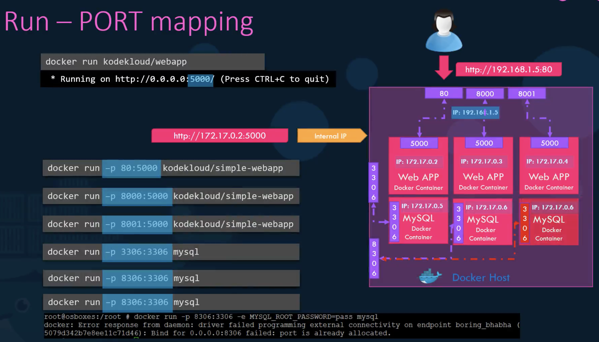
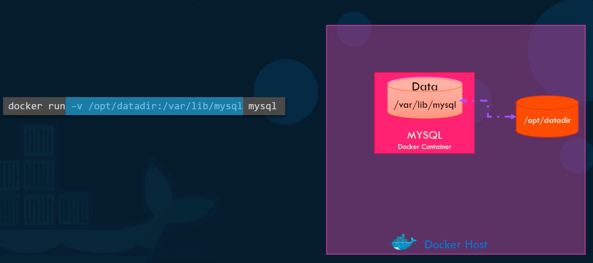
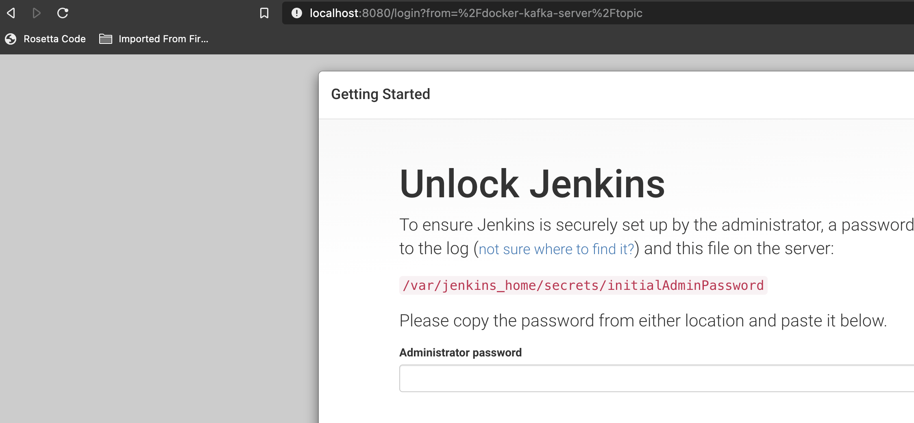

# Run

## Tag

We can run a specific version of an image, where the version that follows **:** is an image **tag** e.g.

```bash
➜ docker run redis:4.0
```

i.e. the version (tag) is 4.0. Note that **latest** is the default tag and so we don't have to specify it (but you can).

## stdin

Let's say we have an app that when run will ask for your name and then print e.g.

```bash
➜ ./app.sh
Enter your name: David

Hello David!
```

If we dockerise and run, the prompt won't wait and we'll see:

```
➜ docker run simple-prompt

Hello !
```

By default, a Docker container does not listen to standard input.

In order to overcome this, we must **map the stdin on your host to the Docker container using -i** (where **i** is for **interactive mode**):

```bash
➜ docker run -i simple-prompt
David

Hello David!
```

But wait... where is the prompt? We also need **-t** (for psuedo terminal):

```bash
➜ docker run -it simple-prompt
Enter your name: David

Hello David!
```

## Port Mapping



## Volume Mapping



## Inspect

```bash
➜ docker container run -d ubuntu sleep 200
27f6a9ad958a19ca760d6cfe1f1ef8a822ad9d11e2358cae7d2dcd298bafd5ad

➜ docker container inspect 27f6
[
    {
        "Id": "27f6a9ad958a19ca760d6cfe1f1ef8a822ad9d11e2358cae7d2dcd298bafd5ad",
        "Created": "2020-11-27T20:30:46.5806521Z",
        ...
```

## Logs

```bash
➜ docker container ls
CONTAINER ID   IMAGE    COMMAND        CREATED              STATUS              PORTS     NAMES
27f6a9ad958a   ubuntu   "sleep 200"    About a minute ago   Up About a minute             relaxed_pascal

➜ docker container logs relaxed_pascal
```

## Examples

- Container OS version:

```bash
➜ docker container run ubuntu cat /etc/os-release
NAME="Ubuntu"
VERSION="20.04.1 LTS (Focal Fossa)"
...
```

- Access a running Jenkins:

```bash
➜ docker container run jenkins
Unable to find image 'jenkins:latest' locally
latest: Pulling from library/jenkins
...
```

```bash
➜ docker container ls
CONTAINER ID   IMAGE      COMMAND                 STATUS         PORTS                 NAMES
d88a01d5afad   jenkins   "/bin/tini -- /usr/l…"   Up 4 minutes   8080/tcp, 50000/tcp   gifted_kirch
```

```bash
➜ docker container inspect gifted_kirch
[
    {
        "Id": "d88a01d5afad6263e1e3960f8062036bbba13ff714f2a0cd8c18818fdfd4c8b2",
        ...
            "Networks": {
                "bridge": {
                    "IPAMConfig": null,
                    "Links": null,
                    "Aliases": null,
                    "NetworkID": "09d63cca52fbf44323e2c80c788b70af3ace0ac4d5dfc43772e01828f8fea59d",
                    "EndpointID": "e711a44ae631535e0d749f2323f2773d9abbd8d77d14daa5ae44fe8a385ced83",
                    "Gateway": "172.17.0.1",
                    "IPAddress": "172.17.0.2",
                    "IPPrefixLen": 16,
                    "IPv6Gateway": "",
                    "GlobalIPv6Address": "",
                    "GlobalIPv6PrefixLen": 0,
                    "MacAddress": "02:42:ac:11:00:02",
                    "DriverOpts": null
                }
            }
        }
    }
]
```

Note the IP and jump onto our container.

```bash
➜ docker container exec -it gifted_kirch /bin/bash

jenkins@d88a01d5afad:/$ curl 172.17.0.2:8080
<html><head><meta http-equiv='refresh' content='1;url=/login?from=%2F'/><script>window.location.replace('/login?from=%2F');</script></head><body style='background-color:white; color:white;'>

Authentication required
```

Let's access externally.

```bash
➜ docker container run -p 8080:8080 jenkins
Running from: /usr/share/jenkins/jenkins.war
...
```

and now at [localhost:8080](http://localhost:8080)



Often we need persistence e.g.

```bash
➜ docker container run -p 8080:8080 -v /root/my-jenkins-data:/var/jenkins_home jenkins
Running from: /usr/share/jenkins/jenkins.war
...
```

