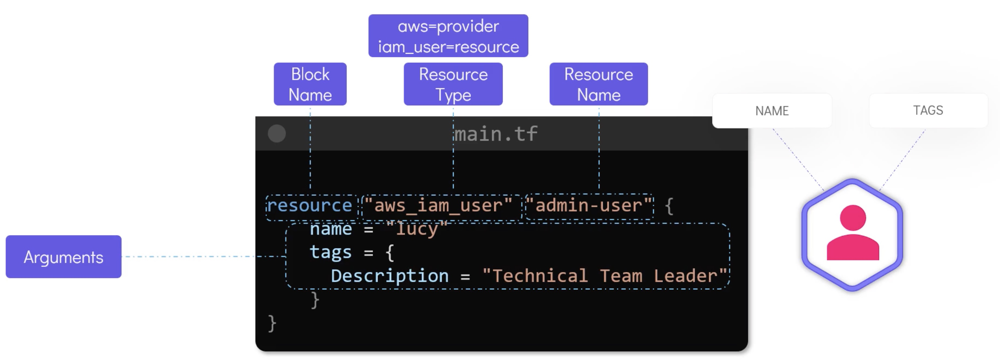
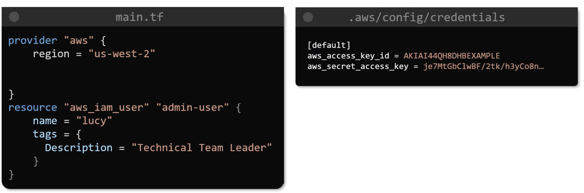
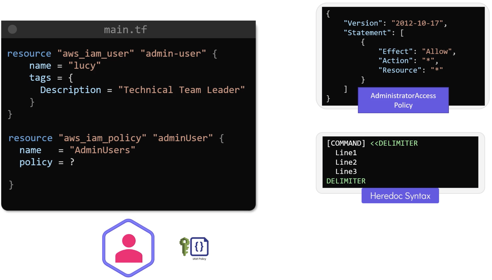

# AWS and Terraform

## IAM

[Create a user](../src/aws/iam/main.tf):



Our file includes an AWS profile:
```terraform
provider "aws" {
  profile = "david"
  region = "eu-west-2"
}

resource "aws_iam_user" "admin-user" {
  name = "lucy"

  tags = {
    Description = "Technical Team Leader"
  }
}
```

Regarding the `provider` section, we could do the following, but this is not recommended as you would probably push credentials to your `git` respository:
```terraform
provider "aws" {
  region = "eu-west-2"
  access_key = "whoops"
  secret_key = "whoops"
}
```

Without a `profile` the `default` credentials can be picked up from `~/.aws/config/credentials`:



Finally, we could export the following environment variables:
```bash
export AWS_ACCESS_KEY_ID=blah
export AWS_SECRET_ACCESS_KEY_ID=blah
export AWS_REGION=eu-west-2
```

Run:
```bash
➜ terraform init

➜ terraform plan
```

```terraform
➜ terraform apply
```

## IAM Policies with Terraform

Initially a user has no permissions - let's attach a policy to grant access. Our end goal is:



There are several ways to refer to a JSON policy.

- Inline by using the same concept as `heredoc` syntax

```terraform
provider "aws" {
  profile = "david"
  region = "eu-west-2"
}

resource "aws_iam_user" "admin-user" {
  name = "lucy"

  tags = {
    Description = "Technical Team Leader"
  }
}

resource "aws_iam_policy" "adminUser" {
  name = "AdminUser"
  policy = <<EOF
{
  "Version": "2012-10-17",
  "Statement": [
    {
      "Effect": "Allow",
      "Action": "*",
      "Resource": "*"
    }
  ]
}
EOF
}
```

Mind you, it's a tad ugly - large policies will be an issue, and you have to line up the `heredoc` syntax with no margin.

Instead, let's put the policy in [admin-policy.json](../src/aws/iam/admin-policy.json):
```json
{
  "Version": "2012-10-17",
  "Statement": [
    {
      "Effect": "Allow",
      "Action": "*",
      "Resource": "*"
    }
  ]
}
```

And now our `main.tf` looks like:
```terraform
provider "aws" {
  profile = "david"
  region = "eu-west-2"
}

resource "aws_iam_user" "admin-user" {
  name = "lucy"

  tags = {
    Description = "Technical Team Leader"
  }
}

resource "aws_iam_policy" "adminUser" {
  name = "AdminUser"
  policy = file("admin-policy.json")
}

resource "aws_iam_user_policy_attachment" "lucy-admin-access" {
  user = aws_iam_user.admin-user.name
  policy_arn = aws_iam_policy.adminUser.arn
}
```

Once again run:
```bash
➜ terraform init
➜ terraform plan
➜ terraform apply
```