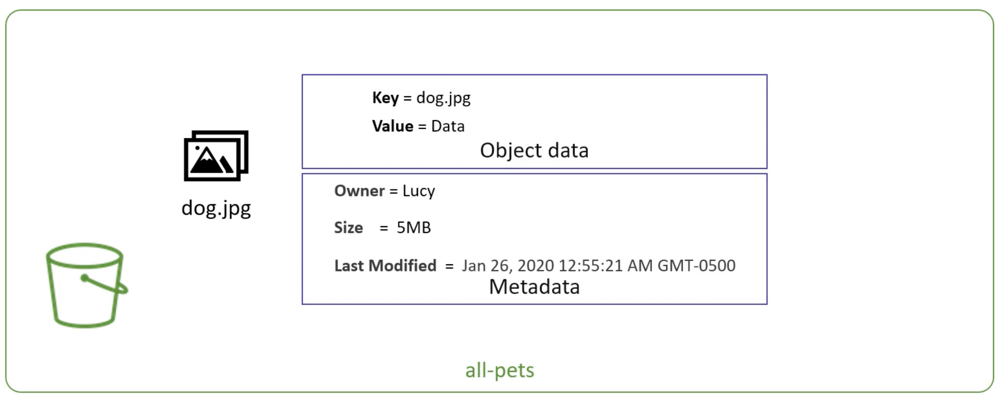
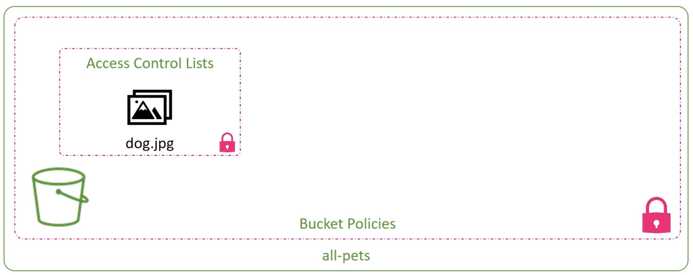
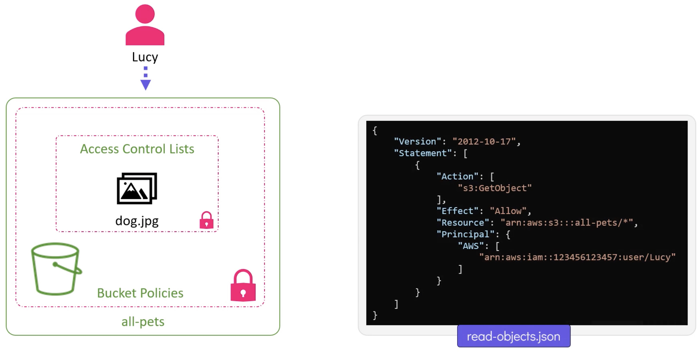

# AWS and Terraform

## IAM

[Create a user](../src/aws/iam/main.tf):


Our file includes an AWS profile:
```terraform
provider "aws" {
  profile = "david"
  region = "eu-west-2"
}

resource "aws_iam_user" "admin-user" {
  name = "lucy"

  tags = {
    Description = "Technical Team Leader"
  }
}
```

Regarding the `provider` section, we could do the following, but this is not recommended as you would probably push credentials to your `git` respository:
```terraform
provider "aws" {
  region = "eu-west-2"
  access_key = "whoops"
  secret_key = "whoops"
}
```

Without a `profile` the `default` credentials can be picked up from `~/.aws/config/credentials`:


Finally, we could export the following environment variables:
```bash
export AWS_ACCESS_KEY_ID=blah
export AWS_SECRET_ACCESS_KEY_ID=blah
export AWS_REGION=eu-west-2
```

Run:
```bash
➜ terraform init

➜ terraform plan
```

```terraform
➜ terraform apply
```

## IAM Policies with Terraform

Initially a user has no permissions - let's attach a policy to grant access. Our end goal is:


There are several ways to refer to a JSON policy.

- Inline by using the same concept as `heredoc` syntax

```terraform
provider "aws" {
  profile = "david"
  region = "eu-west-2"
}

resource "aws_iam_user" "admin-user" {
  name = "lucy"

  tags = {
    Description = "Technical Team Leader"
  }
}

resource "aws_iam_policy" "adminUser" {
  name = "AdminUser"
  policy = <<EOF
{
  "Version": "2012-10-17",
  "Statement": [
    {
      "Effect": "Allow",
      "Action": "*",
      "Resource": "*"
    }
  ]
}
EOF
}
```

Mind you, it's a tad ugly - large policies will be an issue, and you have to line up the `heredoc` syntax with no margin.

Instead, let's put the policy in [admin-policy.json](../src/aws/iam/admin-policy.json):
```json
{
  "Version": "2012-10-17",
  "Statement": [
    {
      "Effect": "Allow",
      "Action": "*",
      "Resource": "*"
    }
  ]
}
```

And now our `main.tf` looks like:
```terraform
provider "aws" {
  profile = "david"
  region = "eu-west-2"
}

resource "aws_iam_user" "admin-user" {
  name = "lucy"

  tags = {
    Description = "Technical Team Leader"
  }
}

resource "aws_iam_policy" "adminUser" {
  name = "AdminUser"
  policy = file("admin-policy.json")
}

resource "aws_iam_user_policy_attachment" "lucy-admin-access" {
  user = aws_iam_user.admin-user.name
  policy_arn = aws_iam_policy.adminUser.arn
}
```

Once again run:
```bash
➜ terraform init
➜ terraform plan
➜ terraform apply
```

## S3

Access a bucket with a DNS compliant name:
```bash
https://<bucket-name>.<region>.amazonaws.com
```

e.g. we create a bucket named "all-pets" in the region "us-west-1":
```bash
https://all-pets.us-west-1.amazonaws.com
```

Some more examples:


An object, in a S3 bucket, consists of data and metadat:



There are bucket policies, at the bucket level - granting permissions, and at a more granular level, there are ACLs on objects:



To grant user `lucy` access to `dog.jpg`:



## S3 and Terraform

Let's create a bucket with [main.tf](../src/aws/s3/main.tf):
```terraform
provider "aws" {
  profile = "david"
  region = "eu-west-2"
}

resource "aws_s3_bucket" "finance" {
  bucket = "finance-21092020"
  
  tags = {
    Description = "Finance and Payroll"
  }
}
```

```bash
➜ terraform init

➜ terraform apply
```

Let's now upload some data:
```terraform
resource "aws_s3_bucket_object" "finance-2020" {
  bucket = aws_s3_bucket.finance.id
  key = "data.txt"
  content = "data.txt"
}
```

```bash
➜ terraform apply
```

Let's attach a policy to our bucket and associated a group, which was manually created but terraform can reference as a `data source`:
```terraform
data "aws_iam_group" "finance-data"{
  group_name = "finance-analysts"
}

resource "aws_s3_bucket_policy" "finance-policy" {
  bucket = aws_s3_bucket.finance.id
  policy = <<EOF
{
  "Version": "2012-10-17,
  "Statement": [
    {
      "Action": "*",
      "Effect": "Allow",
      "Resource": "arn:aws:s3:::${aws_s3_bucket.finance.id}/*",
      "Principal": {
        "AWS": [
          "${data.aws_iam_group.finance-data.arn}"
        ]
      }
    }
  ]
}
EOF
}
```

```bash
➜ terraform apply
```

## DynamoDB