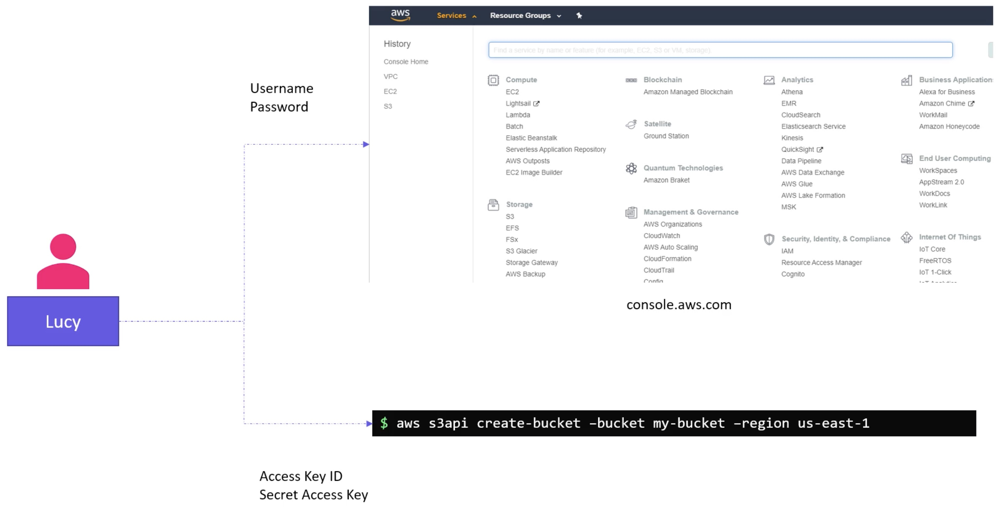
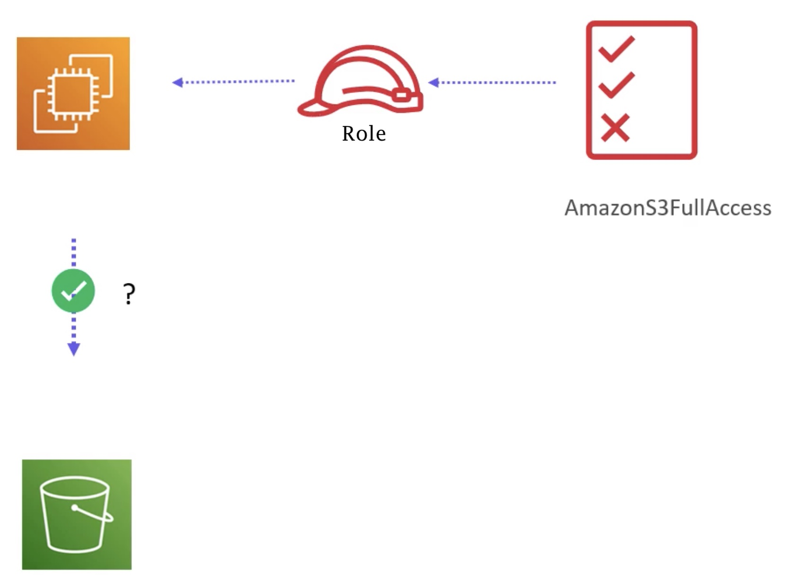

# AWS


## IAM

Use the `root` account to create IAM users (and don't use the root account thereafter):


For each user that is created, we can configure permissions to the `management console` and `programmatic access`:



What a user can (and cannot do) are decided by an `IAM Policy` - defined in a JSON format.

Lucy (the tech lead) needs admin access:


Max, Abdul and Lee are Developers. They need access to `EC2` and `S3`.
We could set up each by attaching two policies at a time, but this is repetitive.
So we set up an `IAM Group`. An IAM group is a collection of users.
Now we can attach the (two) policies to a group (rather than individual users).
NOTE we can still attach individual policies to specific users regardless of them being a member of a group.


We can also attach policies to resources (systems) e.g. an (instantiated) EC2 instance can be given permisions, via a policy, when it comes to accessing a S3 bucket.
And by default, like users, initially a resource cannot access other resources until granted via policies.

But with resources, unlike users, we cannot directly attach a policy - we have to create a `Role`.



Finally, we can create our own (custom) policies e.g. one that grants creating and deleting tags of an EC2 instance:


## Create User


Accept all other defaults and finally save the generated `access key id` and `secret access key`.

Now attach a policy granting admin permission:


## Create User Adding to Group


## Programmatic Access

```bash
➜ aws --version
aws-cli/2.1.26 Python/3.9.1 Darwin/20.3.0 source/x86_64 prompt/off
```


Issuing an AWS command:

```bash
aws <command> <subcommand> [options and parameters]
```

Previously we create the user "lucy" via the console - now let's do it from the command line:

```bash
➜ aws --profile david iam create-user --user-name lucy
{
    "User": {
        "Path": "/",
        "UserName": "lucy",
        "UserId": "AIDA464H6KM4YLJ6WSPBK",
        "Arn": "arn:aws:iam::890953945913:user/lucy",
        "CreateDate": "2021-02-18T18:27:41+00:00"
    }
}
```

ARN = Amazon Resource Name, a unique name assigned to every resource in AWS.

To practice AWS commands there is `localstack`, where you have to provide the `endpoint` option with each command such as:
```bash
--endpoint http://aws:4566
```

so we can:
```bash
aws --endpoint http://aws:4566 iam list-users
{
    "Users": [
        {
            "Path": "/",
            "UserName": "jill",
            "UserId": "42u0ut9ammfkr2i7pdtt",
            "Arn": "arn:aws:iam::000000000000:user/jill",
            "CreateDate": "2021-02-18T18:41:40.834000+00:00"
        },
        {
            "Path": "/",
            "UserName": "jack",
            "UserId": "bxwo7nfdo2f2c1b08t7z",
            "Arn": "arn:aws:iam::000000000000:user/jack",
            "CreateDate": "2021-02-18T18:41:41.476000+00:00"
        }
    ]
}
```

Grant `administrator` access to `jill` with the policy `AdministratorAccess`:
```bash
aws --endpoint http://aws:4566 iam attach-user-policy --user-name jill --policy-arn arn:aws:iam::aws:policy/AdministratorAccess
```

`jack` and `jill` are developers and are part of a project called project-sapphire.
Create a new IAM Group called `project-sapphire-developers`:
```bash
aws --endpoint http://aws:4566 iam create-group --group-name project-sapphire-developers
{
    "Group": {
        "Path": "/",
        "GroupName": "project-sapphire-developers",
        "GroupId": "x5d3hxu1kdijkgnr8stg",
        "Arn": "arn:aws:iam::000000000000:group/project-sapphire-developers",
        "CreateDate": "2021-02-18T21:23:15.591000+00:00"
    }
}
```

Add the IAM users called `jack` and `jill`, who are developers to the new IAM Group called `project-sapphire-developers`:
```bash
aws --endpoint http://aws:4566 iam add-user-to-group --user-name jack --group-name project-sapphire-developers
```

```bash
aws --endpoint http://aws:4566 iam add-user-to-group --user-name jill --group-name project-sapphire-developers
```

Both jack and jill need complete access to the EC2 service.

Attach the `AmazonEC2FullAccess` policy with the ARN: `arn:aws:iam::aws:policy/AmazonEC2FullAccess` to the group `project-sapphire-developers`:
```bash
aws --endpoint http://aws:4566 iam attach-group-policy --group-name project-sapphire-developers --policy-arn arn:aws:iam::aws:policy/AmazonEC2FullAccess
```