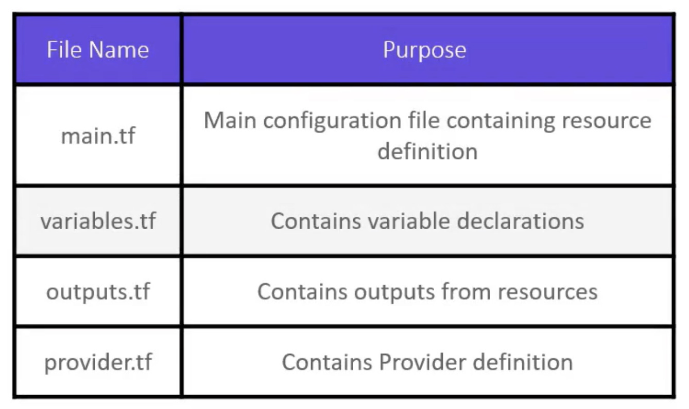
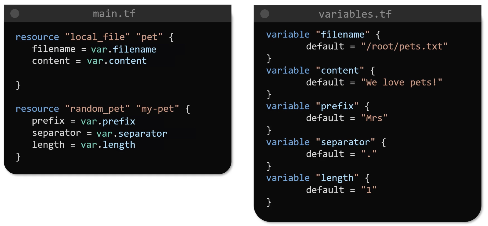
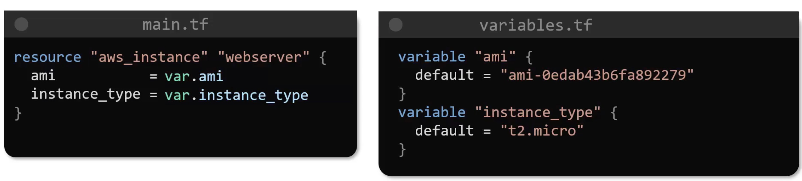
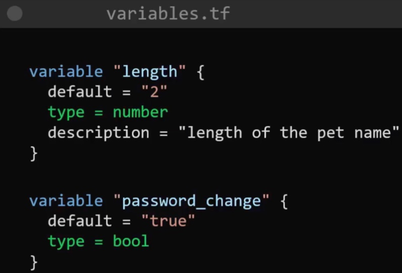
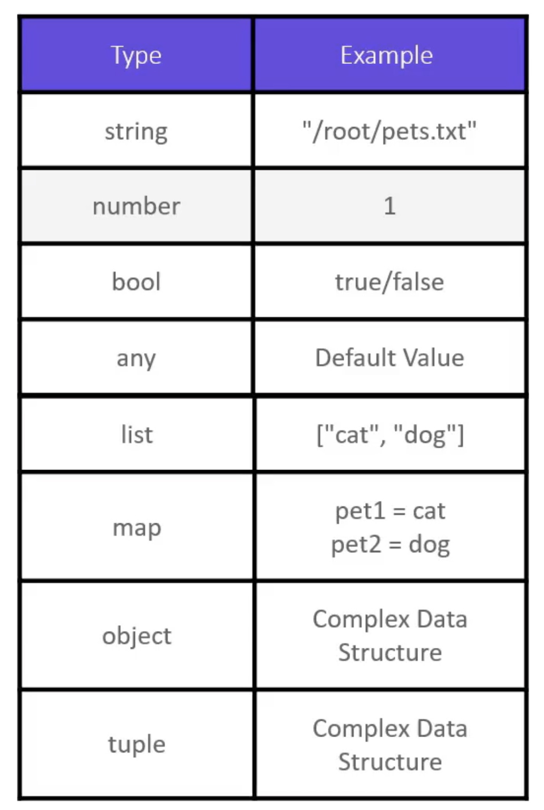
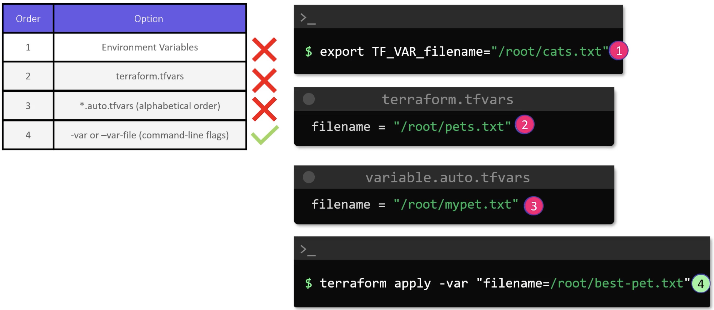
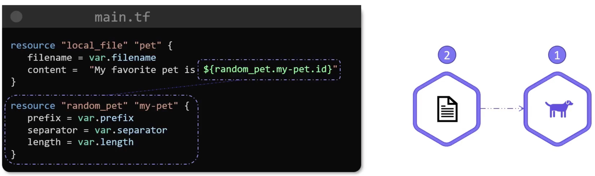

# Terraform Basics

## Providers

See provider plugins at [Terraform registry](https://registry.terraform.io).
Plugins are download to the `.terraform` directory.

## Directory

Within a directory we can have many `.tf` files - we could pack everything into just one file. Some naming conventions are:



## Using Input Variables

E.g.



Another example:







Various examples of variables.

<ins>**List**</ins>

```terraform
variable "prefix" {
  type = list
  default = ["Mr", "Mrs", "Sir"] # Mr is at index 0
}
```
To access this variable e.g.
```terraform
resource "random_pet" "my-pet" {
  prefix = var.prefix[0]
}
```

We should improve the above by being a bit more type safe:
```terraform
variable "prefix" {
  type = list(string)
  default = ["Mr", "Mrs", "Sir"]
}
```

and another example:
```terraform
variable "prefix" {
  type = list(number)
  default = ["1", "2", "3"]
}
```

<ins>**Set**</ins>

```terraform
variable "age" {
  type = set(number)
  default = ["10", "12", "15"]
}
```

<ins>**Tuple**</ins>

```terraform
variable "kitty" {
  type = tuple([string, number, bool])
  default = ["cat", 7, true]
}
```

<ins>**Map**</ins>

```terraform
variable "file-content" {
  type = map
  default = {
    "statement1" = "We love pets!"
    "statement2" = "We love animals!"
  }
}
```
To access this variable e.g.
```terraform
resource "local_file" "my-pet" {
  filename = "/root/pets.txt"
  content = var.file-content["statement2"]
}
```

Let's improve the type safety:
```terraform
variable "cats" {
  type = map(string)
  default = {
    "colour" = "brown"
    "name" = "bella"
  }
}
```

and another:
```terraform
variable "pet-count" {
  type = map(number)
  default = {
    "dogs" = "3"
    "cats" = "1"
    "goldfish" = "2"
  }
}
```

<ins>**Object**</ins>

```terraform
variable "bella" {
  type = object({
    name = string
    colour = string
    age = number
    food = list(string)
    favourite-pet = bool
  })
  
  default = {
    name = "bella"
    colour = "brown"
    age = 7
    food = ["fish", "chicken", "turkey"]
    favourite-pet = true
  }
}
```

## Using variables

Up until now, default values have been supplied to variables. However, these can be omitted and then you will be prompted to provide when running `terraform apply`.
We can also supply the missing variables, or indeed override on the command line e.g.

```bash
terraform apply -var "filename=/root/pets.txt" -var "content=We love pets" -var "prefix=Mrs" -var "separator=." -var "length=2"
```

Or use `environment variables` that are prefixed with `TF_VAR_` e.g.

```bash
export TF_VAR_filename="/root/pets.txt"
export TF_VAR_content="We love pets"

terraform apply
```

Or use `variable definition files` e.g.

A file named `terraform.tfvars` (or any name but must end in either `.tfvars` or `tfvars.json`):
```terraform
filename = "/root/pets.txt"
content = "We love pets"
prefix = "Mrs"
separator = "."
length = "2"
```

NOTE that files named `terraform.tfvars` and `terraform.tfvars.json` will be automatically loaded.
And also any files ending in `*.auto.tfvars` and `*.auto.tfvars.json` will also be automatically loaded.

If you don't follow these names, then explicitly pass them in on the command line e.g.
```bash
terraform apply -var-file variables.tfvars
```

There is the following variable definition precedence:



## Resource Attributes

Let's have a resource content to be set by another resource.

The following resource generates a random `id`:
```terraform
resource "random_pet" "my-pet" {
  prefix = var.prefix
  separator = var.separator
  length = var.length
}
```

e.g. the generated `id` might be "Mr.bull" which would be used in the following:
```terraform
resource "local_file" "pet" {
  filename = var.filename
  content = "My favourite pet is ${random_pet.my-pet.id}"
}
```

## Resource Dependencies

In the following "my-pet" resource will be (have to be) created before "pet" as an `implicit dependency``:



To order dependencies, use `depends_on` as an `explicit dependency` e.g.
```terraform
resource "local_file" "pet" {
  filename = var.filename
  content = "My favourite pet is Mr.Cat"
  
  depends_on = [
    random_pet.my-pet
  ]
}

resource "random_pet" "my-pet" {
  prefix = var.prefix
  separator = var.separator
  length = var.length
}
```

## Output Variables

As well as input variables, we can set an `output` variable e.g.
```terraform
resource "local_file" "pet" {
  filename = var.filename
  content = "My favourite pet is ${random_pet.my-pet.id}"
}

resource "random_pet" "my-pet" {
  prefix = var.prefix
  separator = var.separator
  length = var.length
}

output "pet-name" {
  value = random_pet.my-pet.id
  description = "Record the value of pet id generated by the random_pet resource"
}
```

```bash
terraform output

pet-name = Mrs.gibbon
```
or
```bash
terraform output pet-name

Mrs.gibbon
```