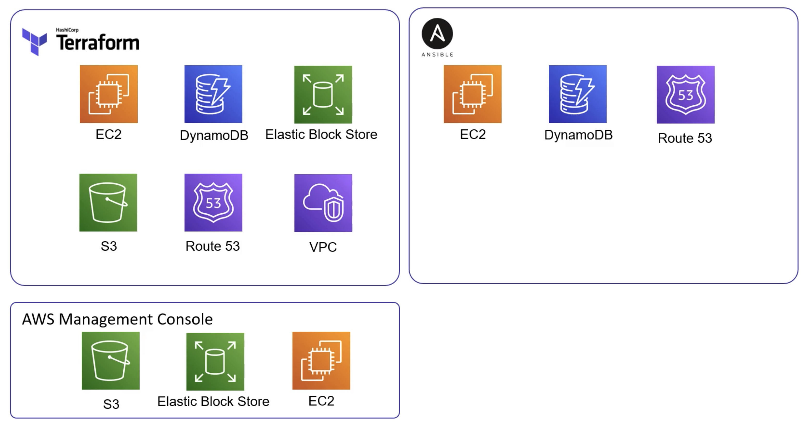
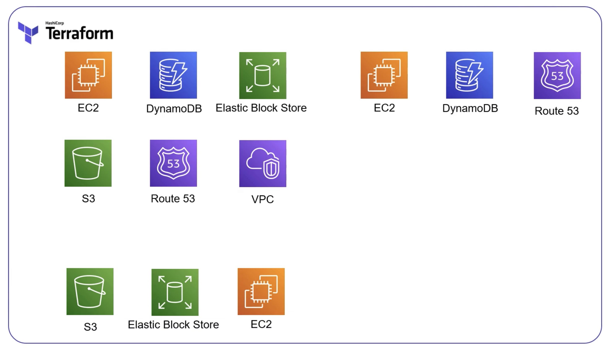

# Importing

Often you will not start from scratch or over time other resources have been provisioned by other means, and we end up with:



How do we get to?



Up until now we have used `data sources` - this helps Terraform access these resources, but it still does not manage them.
To `bring in` the unmanaged resource, we use the `import` command:
```bash
terraform import <resource_type>.<resource_name> <attribute>
```

Note that an `import` only updated the Terraform `state` and we would still need to manually update (add to) our Terraform resource files.