# Introduction

Before DevOps:

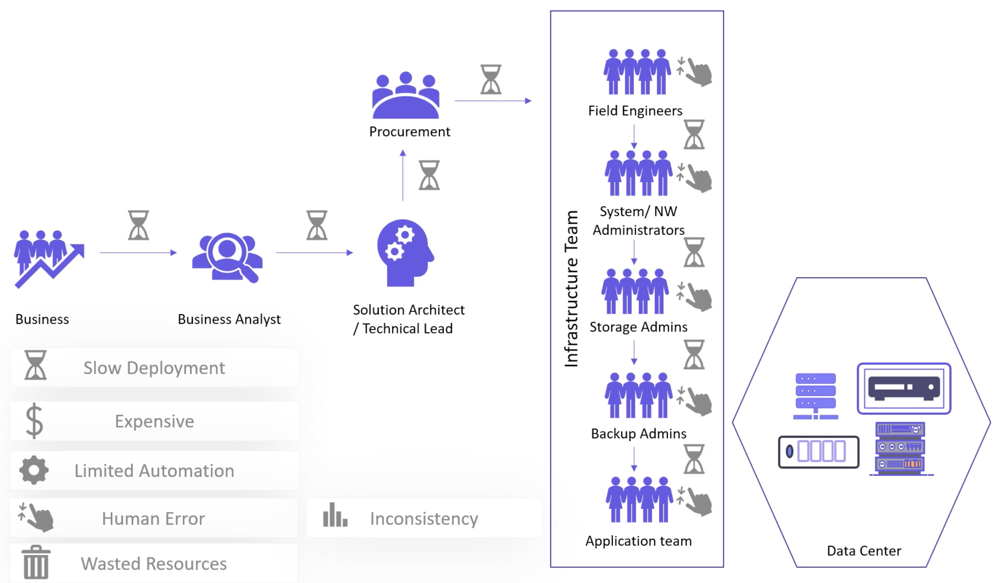

When the cloud came along, and provisioning could be set up via exposed APIs, everyone started to solve the next issue in a similarly.
Coding interactions with APIs (instead of through browser consoles) would be done in a custom way via shell scripts, Python etc.
Along came IaaC (Infrastructure as Code).

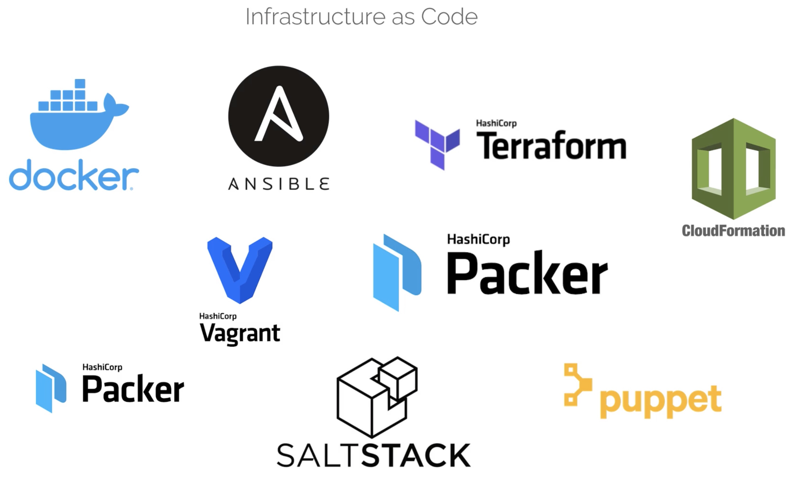

We can categorise these IaaC tools:

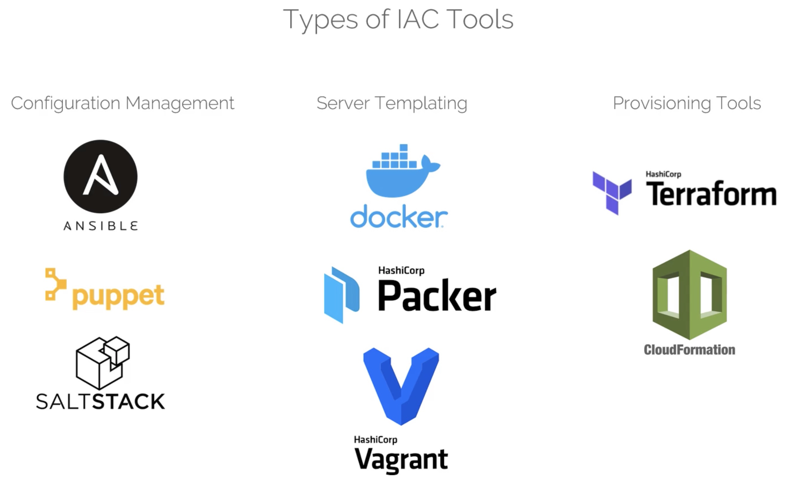

To summarise these tools:

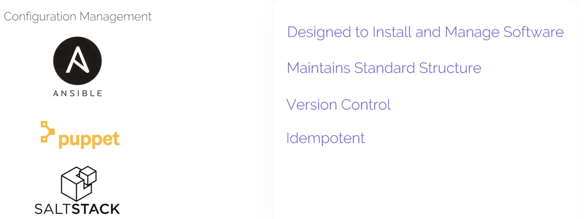

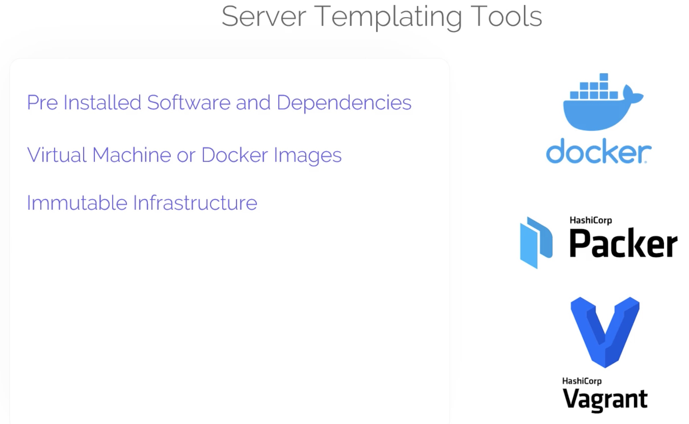

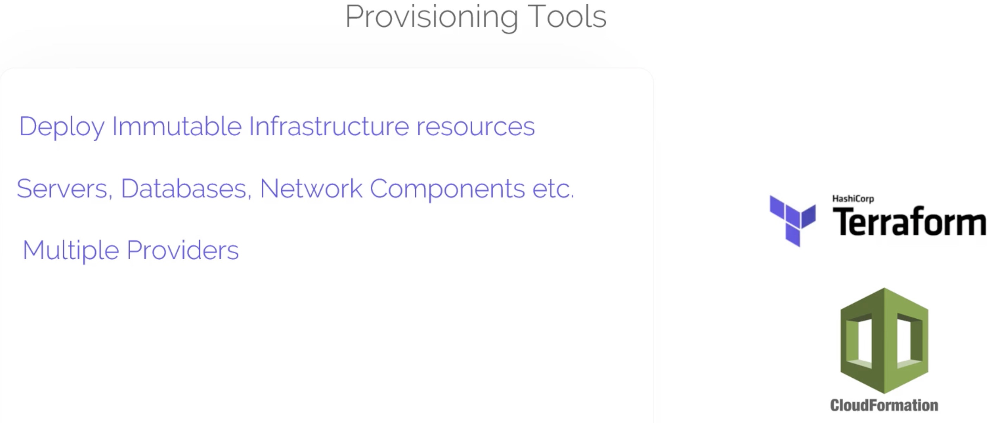

## Terraform

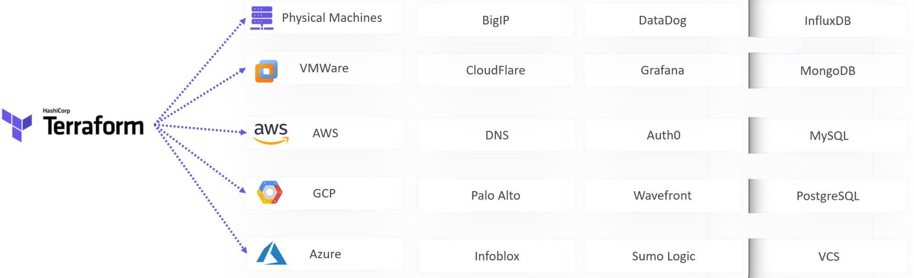

Terraform is declarative:

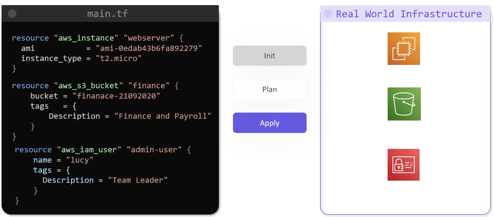

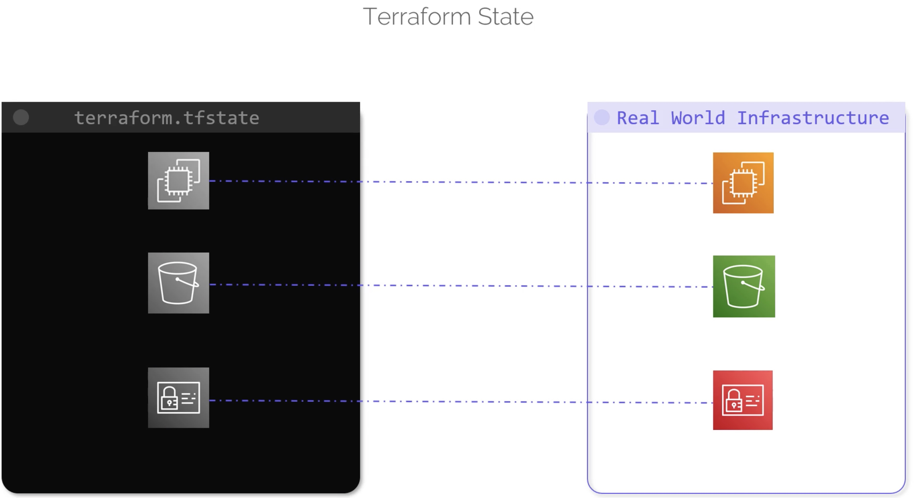

Just in case you missed the [setup](../../../docs/setup.md):

```bash
➜ brew install terraform

➜ terraform --version
Terraform v0.14.6
```

Simple example of a terraform `resource` - we shall create a local file using [local.tf](../src/terraform-local-file/local.tf):

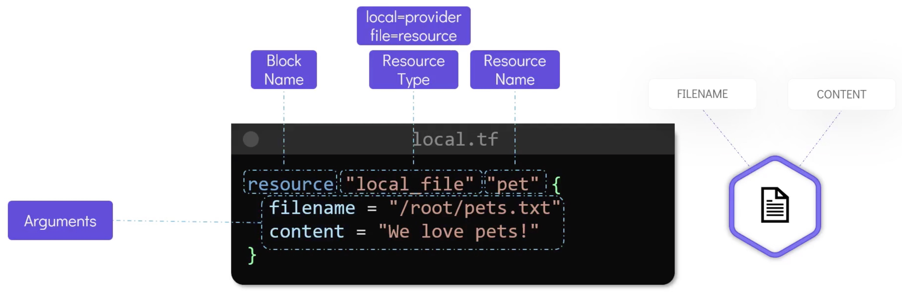

Example of provisioning an EC2 instance:

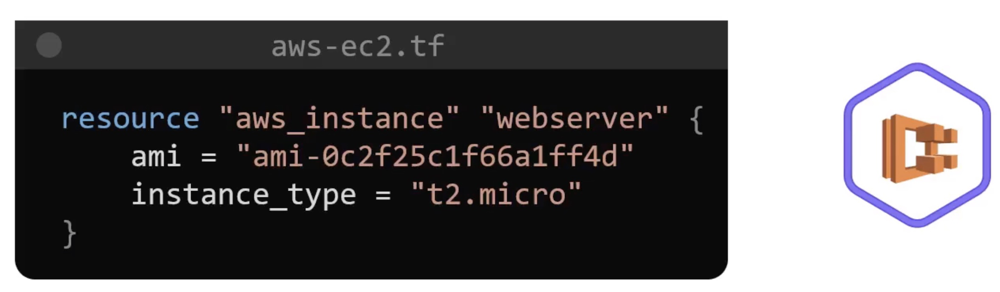

The steps we take are:
- Declare
- terraform init
- terraform plan (optional)
- terraform apply

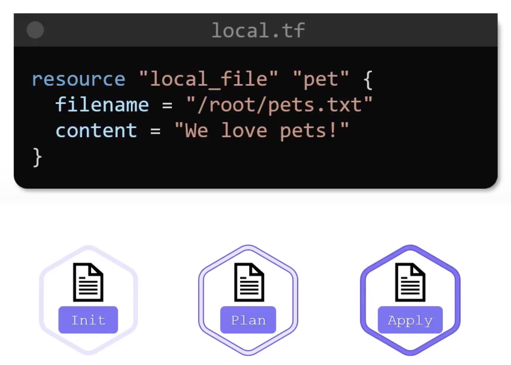

Once executed, and for more details (where the following command inspects the `state` file):

```bash
➜ terraform show
# local_file.pet:
resource "local_file" "pet" {
    content              = "We love pets!"
    directory_permission = "0777"
    file_permission      = "0777"
    filename             = "pets.txt"
    id                   = "cba595b7d9f94ba1107a46f3f731912d95fb3d2c"
}
```

Terraform suppports over 100 providers, including the local provider shown in the previous simple example.

Let's complete the simple example by updating it and finally deleting it.

To uupdate, we'll add `file_permission` to the `tf` file (though mind you, in source control it is already there):

```terraform
resource "local_file" "pet" {
  filename = "pets.txt"
  content = "We love pets!"
  file_permission = "0700"
}
```

Run:

```bash
➜ terraform plan
local_file.pet: Refreshing state... [id=cba595b7d9f94ba1107a46f3f731912d95fb3d2c]

An execution plan has been generated and is shown below.
Resource actions are indicated with the following symbols:
-/+ destroy and then create replacement

Terraform will perform the following actions:

  # local_file.pet must be replaced
-/+ resource "local_file" "pet" {
      ~ file_permission      = "0777" -> "0700" # forces replacement
      ~ id                   = "cba595b7d9f94ba1107a46f3f731912d95fb3d2c" -> (known after apply)
        # (3 unchanged attributes hidden)
    }
```

```bash
➜ terraform apply
```

Finally:

```bash
➜ terraform destroy

An execution plan has been generated and is shown below.
Resource actions are indicated with the following symbols:
  - destroy

Terraform will perform the following actions:

  # local_file.pet will be destroyed
  - resource "local_file" "pet" {
      - content              = "We love pets!" -> null
      - directory_permission = "0777" -> null
      - file_permission      = "0700" -> null
      - filename             = "pets.txt" -> null
      - id                   = "cba595b7d9f94ba1107a46f3f731912d95fb3d2c" -> null
    }
```