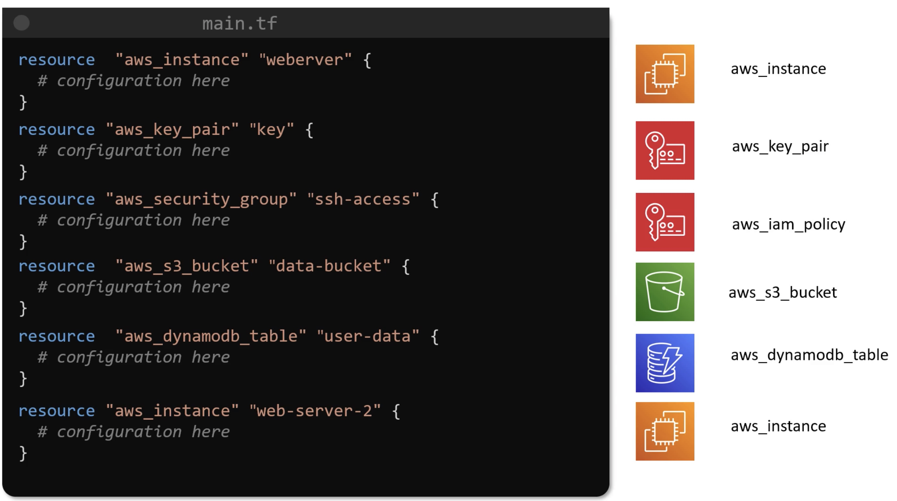
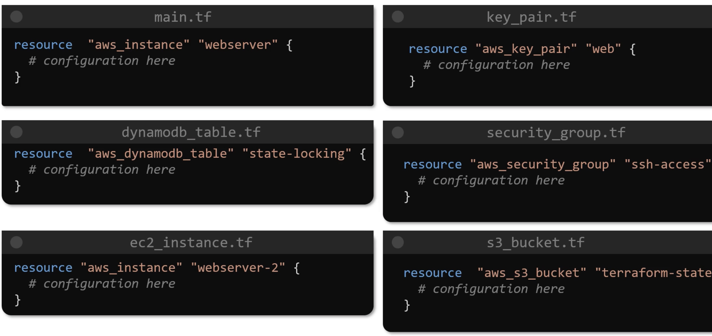
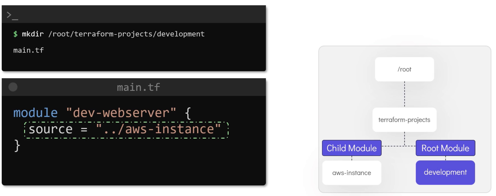

# Modules

Without modules things get a bit out of control:

Split up one large file and things will work the same way:

However, this approach still has disadvantages such as:
- complex configuration files
- duplicate config
- limited reusability
- increased risk

We address this shortcomings by making use of `modules`:

