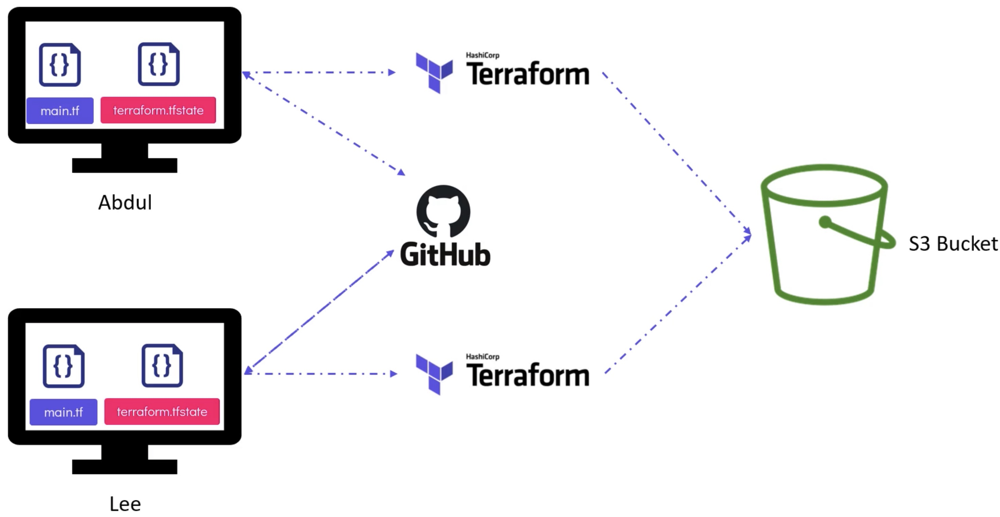
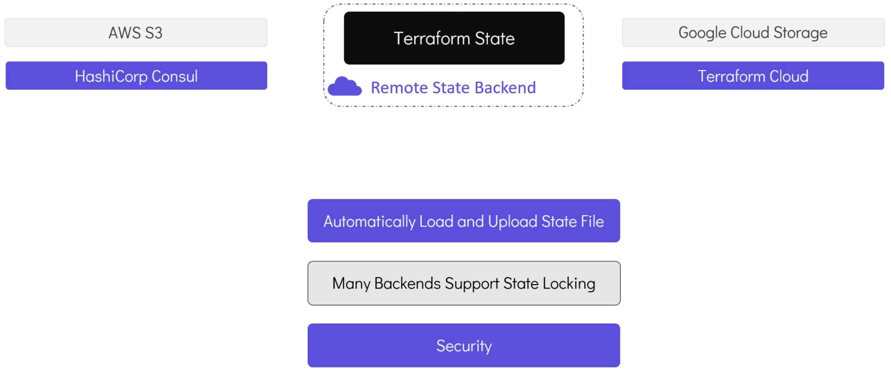
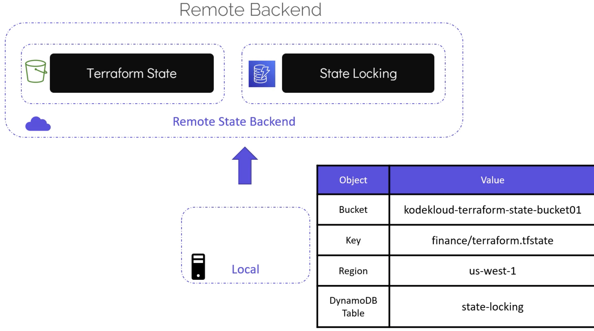

# Remote State

By default, the first time we run `terraform apply` the file `terraform.tfstate` is generated.
Not only is local state no good for collaboration, but sensitive data may be committed to git.



Local state is fine for an individual, but a team needs remote state:



## Remote Backends with S3 (and DynamoDB for locking)



We need to define a `backend` declaration within `terraform`.
This could be in the `main.tf` but a best practice is to separte into a `terraform.tf`:

```terraform
# terraform.tf

terraform {
  backend "s3" {
    bucket         = "kodekloud-terraform-state-bucket-01"
    key            = "finance/terraform.tfstate"
    region         = "us-west1"
    dynamodb_table = "state-locking"
  }
}
```

```terraform
# main.tf

resource "local_file" "pet" {
  filename = "/root/pets.txt"
  content = "We love pets"
}
```

After `terraform init` we can delete the local state:

```bash
rm -rf terraform.tfstate
```

## Terraform State Commands