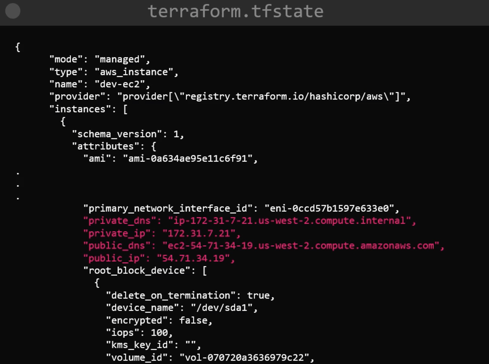

# State

Once `terraform apply` has been run at least once, we will have a file `terraform.tfstate`.

An example:

Regarding a team, we would want to share this state.
So instead of each developer relying on local state:

You could perist the state in a remote datastore:

WARNING - state file exposes sensitive data (another reason for saving safely on the cloud) e.g.

