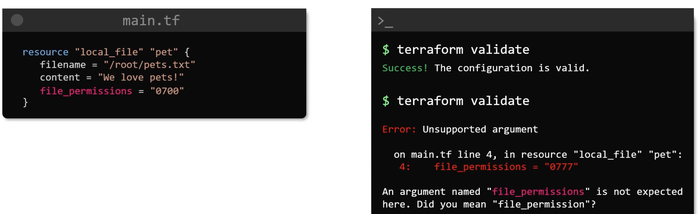
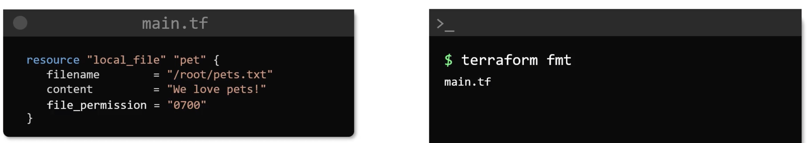
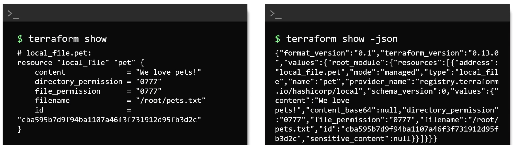
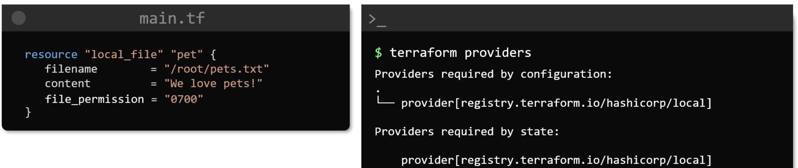
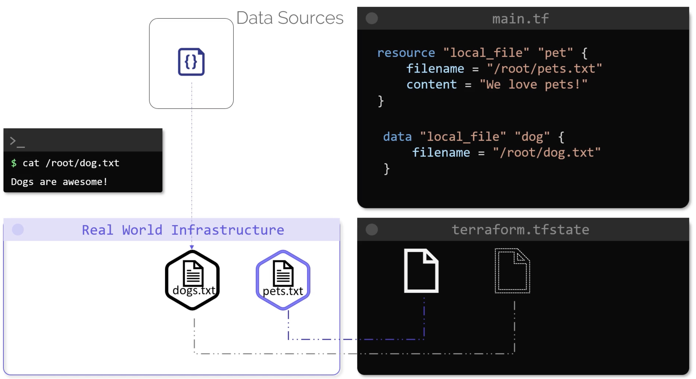
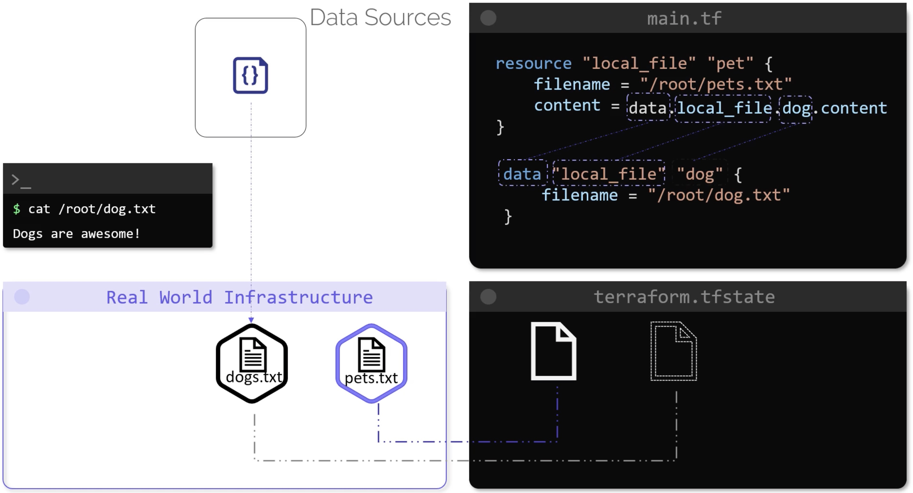
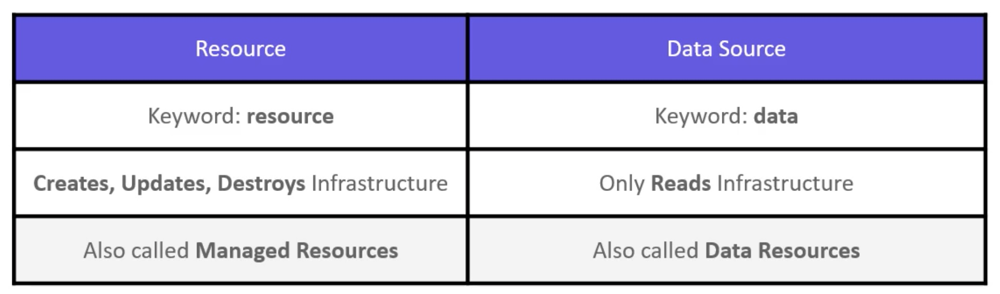

# Working with Terraform

## Commands

- validate



- fmt



- show



- providers



## Mutable vs Immutable

- Mutable

e.g. we have 3 web servers currently with nginx v1.17:
```
v1.17     v1.17     v1.17
```

we upgrade each in place, but along the way there is an error upgrading the last server:
```
v1.18     v1.18     v1.17
```

The error could have been due to a multitude of issues, but that is the nature of a `mutable` upgrade.

Let's go `immutable` and instead spin up brand new servers with v.1.18 and for each one successfully spun up, we destroy one of the old ones:

first a new server is added
```
v1.17     v1.17     v1.17     v1.18
```

looks good, so now we can destroy an old one
```
v1.17     v1.17     v1.18
```

and so on, until we reach
```
v1.18     v1.18     v1.18
```

This is how terraform works (immutable) - it essentially replaces instead of amending (upgrading in place).

By default, terraform will destroy and then create - but this life cycle can be changed.

## Life Cycle Rules

Instead of accepting the default of `destroy and then create` we can override:
```terraform
resource "local_file" "pet" {
  filename = "/root/pets.txt"
  content = "We love pets"
  file_permission = "0700"
  
  lifecycle {
    create_before_destroy = true
  }
}
```

And if you do not want a resouce destroyed when creating (upgrading) we can:
```terraform
resource "local_file" "pet" {
  filename = "/root/pets.txt"
  content = "We love pets"
  file_permission = "0700"
  
  lifecycle {
    prevent_destroy = true
  }
}
```

WATCH OUT with life cycle rules e.g. `create_before_destroy` a file! Well the file with name already exists.
When you run `terraform apply` it will look like your file has completely gone.
However, if you run the `apply` a 2nd time, the newly created file will suddently appear.

## Data Sources

Resources can be provisioned outside of Terraform's control e.g. Ansible, Puppet, manually etc.
Say a file `dogs.txt` was indeed created manually - Terraform can still "get involved":



Now what? Well, our original resource can now refer to the new data source and e.g. use its contents:



Comparing `resource` to `data source`:



## Meta Arguments

What if we wanted a resource to be essentially repeated e.g. create 3 similar files each differing only by name?
We could write a shell script e.g.
```bash
#!/bin/bash

for i in {1..3}
  do
    touch /root/pet${i}
  done  
```

Terraform has `count` and `for-each`.

So, the above script (with loop) can be (sort of) translated to the following terraform:

variables.tf
```terraform
variable "filename" {
  default = [
    "/root/pets.txt",
    "/root/dogs.txt",
    "/root/cats.txt"
  ]
}
```

main.tf
```terraform
resource "local_file" "pet" {
  count = 3
  filename = var.filename[count.index]
}
```

```bash
terraform init
terraform apply
```

```bash
ls /root
pets.txt
dogs.txt
cats.txt
```

However, we have hard coded the `count`, which would ignore any other file names we add to the array in variables.tf.
So we do the following:
```terraform
resource "local_file" "pet" {
  count = length(var.filename)
  filename = var.filename[count.index]
}
```

If we had a `map` or `set` we could replace the above by using `for_each`:
We can go one step further and improve this by using `for_each`:
```terraform
variable "filename" {
  type = set(string)
  
  default = [
    "/root/pets.txt",
    "/root/dogs.txt",
    "/root/cats.txt"
  ]
}
```

```terraform
resource "local_file" "pet" {
  for_each = var.filename
  filename = each.value
}
```

Or if we are stuck with a list, the convert said list to a set:
```terraform
resource "local_file" "pet" {
  for_each = toset(var.filename)
  filename = each.value
}
```

## Version Constraints

By default, plugins pull down latest versions. However, if so desired, we can specify a particular versions e.g.

```terraform
terraform {
  required_providers {
    local = {
      source = "hashicorp/local"
      version = "1.4.0"
    }
  }
}

resource "local_file" "pet" {
  filename = "/root/pet.txt"
  content = "We love pets"
}
```