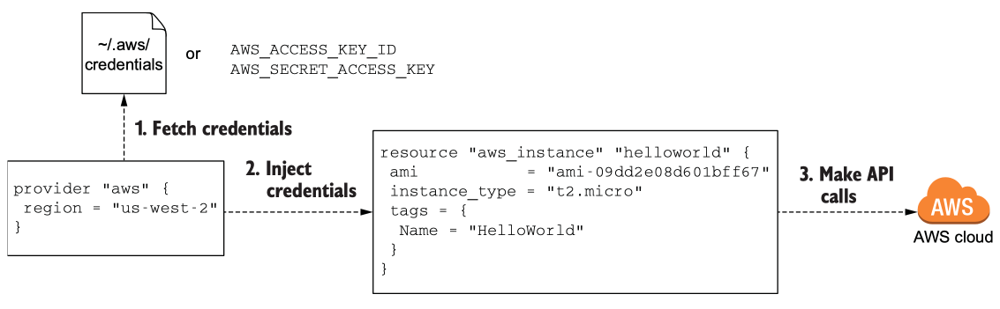
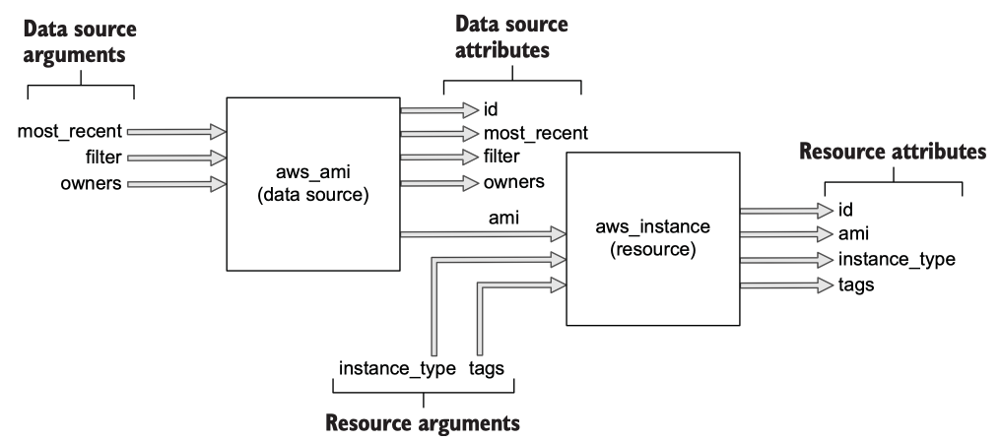
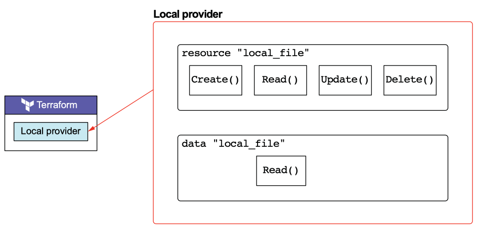
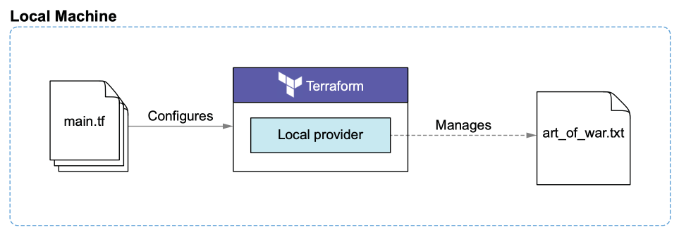
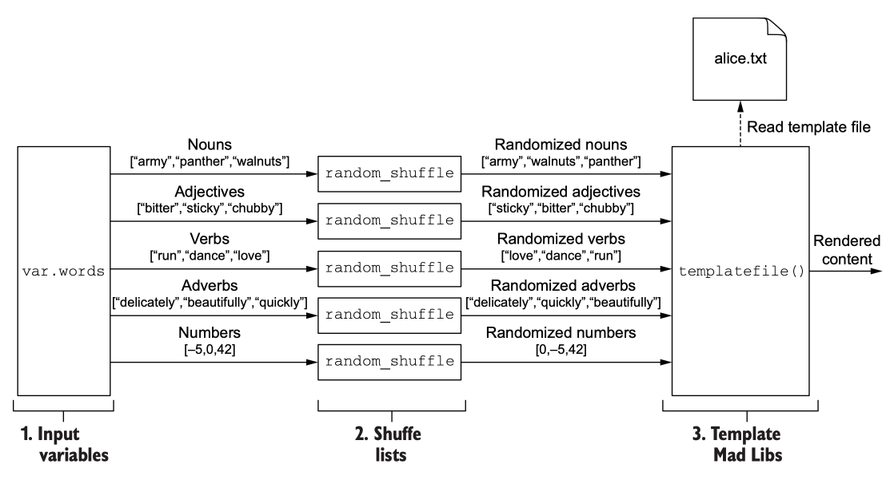

# Terraform

## 1. Getting Started

Terraform is:
- a provisioning tool
- easy to use
- free and open source
- declarative
- cloud-agnostic
- expressive and extensible

> Note - We write Terraform configurations - though there is a CDK version much like Pulumi.
>
> Also note - You extend Terraform by writing your own `provider`, not by writing new functions.

### 1.2

How the configured `provider` injects credentials into `aws_instance` when making API calls:


> We show the use of injecting variables into how our configuration works, firstly via a command line parameter then by the better command line file.

So, two ways to `apply` our Terraform configuration(s):
```shell
terraform apply -var profile="david"
```
Or
```shell
terraform apply -var-file=dev/prod.tfvars
```

e.g. these variable files per environment (which should not be checked into version control) may have simply:
```terraform
profile = "david"
```

### 1.3

How the output of the `aws_ami` data source will be chained to the input of the `aws_instance` resource.


## 2. Life Cycle of a Terraform Resource

Terraform manages resources through a `life cycle`, and so it manages state.
As well as remote/cloud resources, Terraform can also manage `local only resources` such as `creating private keys`, `self-signed certificates`, and `random IDs`.

All Terraform resources implement the resource schema interface.
The resource schema mandates, among other things, that resources define CRUD functions hooks, one each for Create(), Read(), Update(), and Delete().
Terraform invokes these hooks when certain conditions are met.

> NOTE - The two resources in the Local provider are a managed resource and an unmanaged data source.
> The managed resource implements full CRUD, while the data source only implements Read().



### 2.2



## 3. Functional Programming

Terraform embraces functional programming (to a degree) as it is declarative:

- Pure functions — Functions return the same value for the same arguments, never having any side effects.
- First-class and higher-order functions — Functions are treated like any other variables and can be saved, passed around, and used to create higher-order functions.
- Immutability — Data is never directly modified. Instead, new data structures are created each time data would change.

E.g.

Functional Javascript that multiples all even numbers in an array by 10 and adds the results together:
```javascript
const numList = [1, 2, 3, 4, 5, 6, 7, 8, 9, 10]

const result = numList
               .filter(n => n % 2 === 0)
               .map(a => a * 10)
               .reduce((a, b) => a + b)
```

and in Terraform:
```terraform
locals {
  numList = [0, 1, 2, 3, 4, 5, 6, 7, 8, 9, 10]
  result  = sum([for x in local.numList : 10 * x if x % 2 == 0])
}
```

### 3.1

This is what we want to achieve:


> Assigning variable values with the default argument is not a good idea because doing so does not facilitate code reuse.
> A better way to set variable values is with a variables definition file, which is any file ending in either `.tfvars` or `.tfvars.json`.

#### Output Values

We can return the result from say `templatefile()` to the user with an output value.
Output values are used to do two things:

- Pass values between modules
- Print values to the CLI