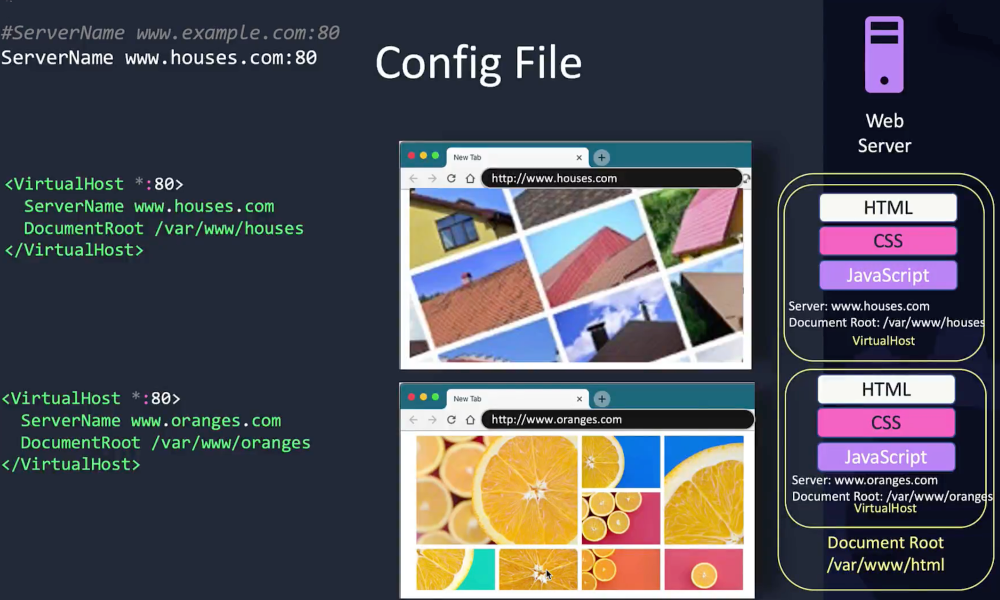
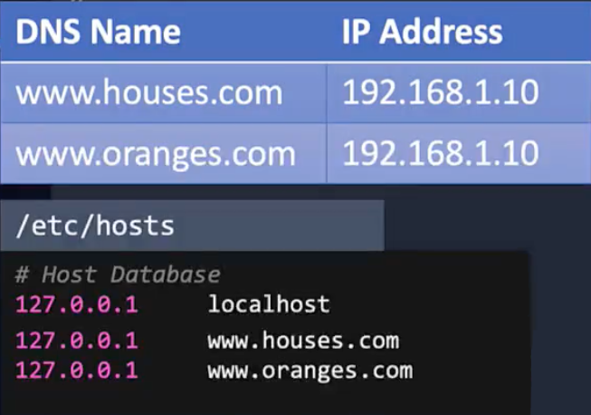
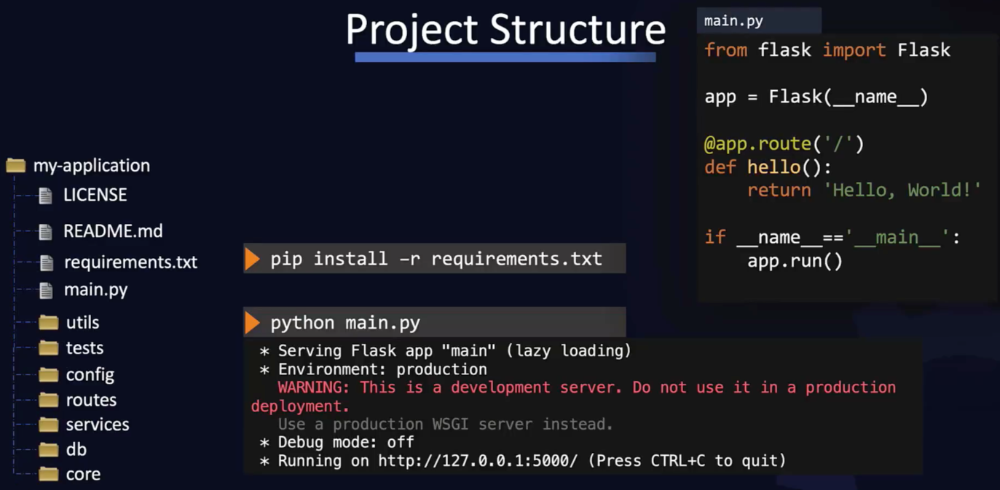
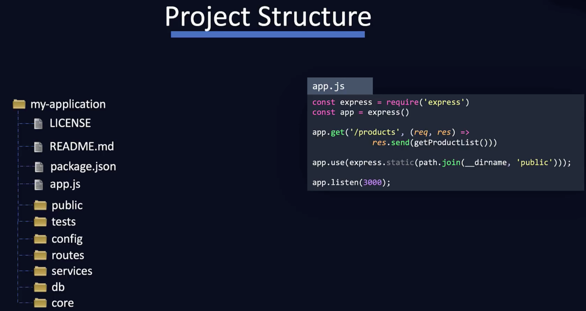
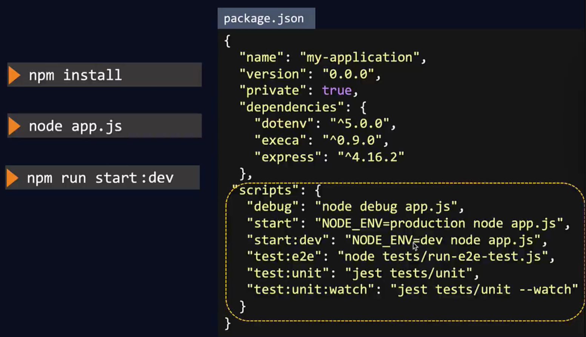
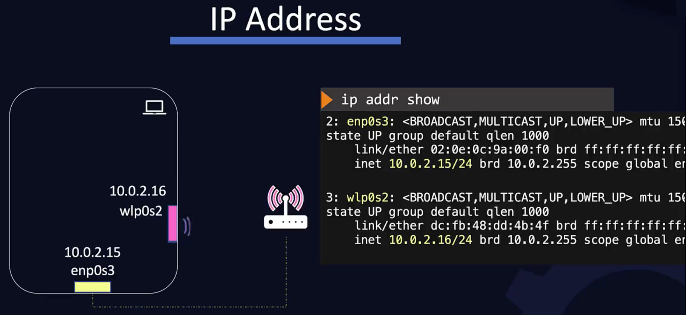
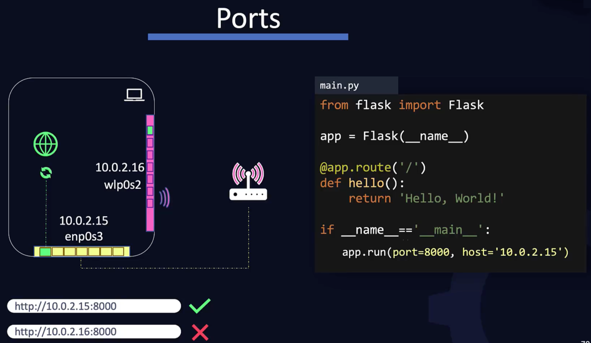

# Web Servers

## Apache Web Server

Used to serve static web content such as HTML, CSS and JavaScript. Often works in conjunction with an application server which has dynamic content e.g. backend functionality interacting with a database. On a Linux machine:

```bash
yum install -y httpd

service httpd start

# Check status of apache
service httpd status
```



---



## Python Flask

Typical Python Flask setup:



Using flask itself as an application server is fine for development, but for production we would use something else such as:

```bash
pip install gunicorn

gunicorn app:app
```

And we can load balance with say 3 workers:

```bash
ohup gunicorn app:app -w 3 &
```

where a total of 4 processes will actually run - the main and 3 workers:

```bash
ps -ef | grep gunicorn | grep -v grep
thor       178     1  0 14:03 ?        00:00:00 /usr/bin/python2 /usr/bin/gunicorn app:app -w 3
thor       183   178  0 14:03 ?        00:00:00 /usr/bin/python2 /usr/bin/gunicorn app:app -w 3
thor       184   178  0 14:03 ?        00:00:00 /usr/bin/python2 /usr/bin/gunicorn app:app -w 3
thor       185   178  0 14:03 ?        00:00:00 /usr/bin/python2 /usr/bin/gunicorn app:app -w 3
```

## NodeJS

Typical NodeJS / Express setup:



---



Again, just like Python, we can use NodeJS itself to boot the underlying web framework such as Express, but in production we should use something else, such as **pm2** which has a built-in load balancer e.g.

```bash
pm2 start app.js
```

Or for more instances such as 4:

```bash
pm2 start app.js -i 4
```

## IPs and Ports



---



But what if we want our application to be available on both IPs? To listen on all available interfaces, we must specify **0.0.0.0**:

```python
if __name__ == '__main__':
  app.run(port = 8000, hosts = '0.0.0.0')
```

And if we don't want to expose the app (yet), we can specify **host = '127.0.0.1'**, or simply omit because the default is this loopback localhost.